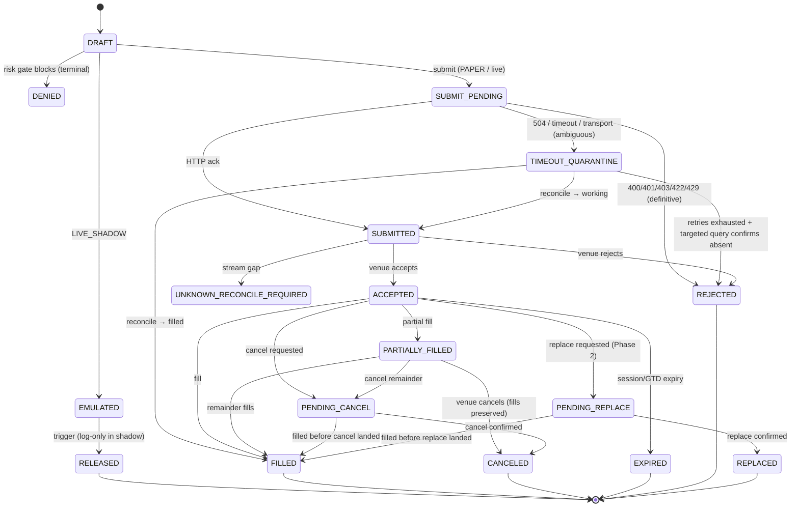

# Spine Execution Architecture — Implementation Spec (v2)

**Project:** Alpaca Clean-Sheet CAPI Option 2.5
**Status:** Draft for independent adversarial review, then implementation. Supersedes v1.
**Scope:** The safety-critical execution spine only. Liquidity intelligence, TCA, and
autonomous strategy signalling are out of scope (Phase 2+).
**Audience:** Claude Code (implementation), Codex/ChatGPT (independent review).

### Changelog v1 → v2
- **Overfill semantics corrected** (v1 misattributed a "reject-by-default" behaviour to Nautilus). See §5 INV-4.
- **Reconciliation defaults verified** against Nautilus source and inserted (§7).
- **Denial reason-code vocabulary expanded** with the verified `OrderDeniedReason` set (§5).
- **Event log & recovery** section added (§11) from the event-sourcing concept.
- **Test strategy / determinism** section added (§12) from DST.
- **Naming decided:** adopt Nautilus's `primary`/`spawned` convention (§4) — avoids the parent/child collision with contingent bracket/OCO legs.
- **Provenance annotations** added (§16) — which claims are source-verified vs docs vs to-confirm.

Standard-Alpaca-API only throughout — nothing here depends on Alpaca Elite (Smart Router,
DMA, VWAP/TWAP are unavailable and unused).

---

## 0. Non-negotiables (acceptance criteria)

1. No live trading in beta (`PAPER` or `LIVE_SHADOW` only). 2. Alpaca Paper only for beta.
3. FastAPI backend is the durable engine and source of truth. 4. Streamlit is a thin client —
observes and issues intents, never mutates state directly. 5. The UI never calls Alpaca — only the
Broker Adapter does. 6. The UI owns no strategy/risk/order/fill/position state. 7. All important
logic lives in the backend. 8. Submitted ≠ filled. 9. Only fill events change position quantity.
10. Kill switch blocks new order intent. 11. Browser-first workflow.

---

## 1. Adopted architectural principles

- **Single-writer core.** Exactly one logical loop mutates order/fill/position state. All network
  I/O runs on separate threads/executors that only *enqueue normalized events* into the single
  writer — structurally eliminating the concurrency-race class.
- **Event-sourced truth.** Append-only `ExecutionEvent` log is truth; primary/spawn/position are
  projections. Dual store (in-memory + SQLite) held to strict parity; in-memory keeps tests IO-free.
- **Crash-only, unified recovery.** Startup recovery and crash recovery share one path
  (reconciliation), so recovery is exercised every boot.
- **Fail-fast on bad data.** NaN/negative/out-of-range price/qty/timestamp halts or quarantines —
  never flows into a sizing or submission decision.
- **Cache-then-publish.** Write state before dispatching downstream, so no handler reads stale state.
- **Ports and adapters.** Engine is venue-agnostic; the Alpaca adapter is the only venue port.
- **Component health FSM.** Adapter/market-data carry `RUNNING`/`DEGRADED`/`FAULTED`; `DEGRADED`
  (stream flap, stale data) drives the kill switch to `Reducing`; `FAULTED` → controlled shutdown.

---

## 2. Module boundaries (spine)

Single-writer rule: the **Execution Engine** is the only writer of order state; the **Position
Service** is the only deriver of position; both act only on the append-only event log.

| # | Module | Owns | Does NOT own |
|---|--------|------|--------------|
| 1 | **Broker Adapter (Alpaca)** | Only code touching Alpaca REST/WS; submit/cancel/replace; order/position fetch; trade-update + market-data streams; status normalization → `ExecutionEvent`; `client_order_id` threading; rate-limit token bucket; connection-health tracking | Decision logic; state truth |
| 2 | **Execution Engine** (primary + spawn) | Primary/spawn state machines; `remaining_qty` accounting; single-active-spawn invariant; atomic submission-claim. Sole writer of order state | Risk decisions (→3); venue specifics (→1) |
| 3 | **Risk Gate Engine** | Pure pre-submit evaluation → `RiskDecision` with structured `reason_code` | State; submission. **No global bypass flag.** |
| 4 | **Kill Switch / Session Control** | `TradingState` (`Active`/`Halted`/`Reducing`); every submission routes through it | Anything else |
| 5 | **Reconciliation Engine** | Pure functions; startup mass-status + runtime open/position checks; inferred fills (deterministic ids); qty/avg-px tolerance gate | Normal-path state (→2) |
| 6 | **State Store** (in-mem + SQLite parity) | Append-only `ExecutionEvent` log; projections; snapshot+replay recovery | Decision logic |
| 7 | **Position Service** | Position derived **only** from deduped fill events | Order state |
| 8 | **Market Data Service** | Quote/trade/bar/LULD/status ingestion; per-symbol `LiquiditySnapshot` (`feed` + freshness + quality flag) | Trading decisions |
| 9 | **FastAPI API Layer** | Typed HTTP/WS contract via an RPC facade; enforces UI-observes-only | Engine internals (reached only via facade) |

**Phase-2 (interfaces defined, not built):** Liquidity Estimator, Spawn Sizer, Reprice Controller,
TCA Logger. Strategy Signal Layer deferrable — spine exits may be operator-triggered.

---

## 3. ID taxonomy & OMS

- **OMS type: NETTING** — one net position per symbol; long-only exit executor in the spine.
- **`client_order_id`** — deterministic, ≤ 48 chars (Alpaca hard limit): `x-{primary8}-{seq}-{SYM}-S`.
  `seq` = persisted **monotonic per-primary counter** (never reset). Retry of the *same* attempt reuses
  the id (idempotent — Alpaca rejects duplicate client_order_id). New attempt after cancel = new `seq`.
- **`venue_order_id`** — Alpaca order `id`, attached on ack.
- **`trade_id`** — fill dedup key; real fills use the venue trade id, reconciliation-inferred fills use
  a **deterministic** synthetic id (pure function of the logical event) so restart replays dedupe.

---

## 4. State model

Two coupled machines. The **spawn** is the venue-facing lifecycle (one disposable execution attempt);
the **primary** is the durable supervisor and source of truth.

> **Naming note (decided):** we use Nautilus's **primary / spawned** convention — the **primary** is the
> durable exit order, and **spawns** (spawned orders) are its disposable slice orders. We deliberately
> avoid **parent / child** because Nautilus and common OMS usage reserve those terms for contingent
> bracket/OCO legs, which this system does not use; adopting primary/spawned removes the collision rather
> than documenting around it.

Spawn status is driven by **max-status-reached + cumulative `filled_qty` from the latest authoritative
snapshot** (never naive delta application), so out-of-order/replayed events are idempotent and status
never regresses from a terminal.

**Primary states:** `CREATED` → `RISK_REVIEW` → `ACTIVE` → `SPAWN_WORKING` → `PARTIALLY_COMPLETED`
→ `COMPLETED` (terminal); plus `PAUSED` (resumable), `BLOCKED` (unresolved gate/ambiguity),
`CANCELED`, `FAILED`, `QUARANTINED`, `MANUAL_REVIEW_REQUIRED`.

---

## 5. Invariants (executable checks — property-test all of these)

- **INV-1 (fills only).** Only spawn fill events change `remaining_qty`.
  `remaining_qty = total_qty − Σ(deduped filled_qty)`. Cancel/reject/expire only release the reservation.
- **INV-2 (single active spawn).** ≤ 1 spawn per primary in a non-terminal state. `PENDING_CANCEL`,
  `PENDING_REPLACE`, `SUBMIT_PENDING`, `TIMEOUT_QUARANTINE`, `UNKNOWN_RECONCILE_REQUIRED` all count as
  active. No new spawn until the prior is terminal.
- **INV-3 (block on ambiguity).** While any spawn is `TIMEOUT_QUARANTINE`/`UNKNOWN_RECONCILE_REQUIRED`,
  the primary is `BLOCKED`; no new/replacement spawn until reconciliation resolves it.
- **INV-4 (no oversell — pre-submit *and* post-fill).**
  *Pre-submit:* every spawn submit qty ≤ `min(reconciled remaining_qty, current broker long qty)`.
  *Post-fill:* a venue **overfill** (cumulative filled > order/primary total) is possible outside our
  control — matching-engine races, minimum-lot fills, non-atomic multi-fills. On overfill → primary
  `QUARANTINED` + manual review + reconcile; do **not** silently accept the resulting short.
  *Design note:* this quarantine stance is **our** capital-preservation choice for a long-only paper
  exit executor. Nautilus itself *applies* the overfilling fill and accumulates the excess into an
  `overfill_qty` field rather than rejecting it; adopt that record-and-continue behaviour only if you
  deliberately choose to, and never for a path that could leave an unintended short.
- **INV-5 (fill dedup).** Fills keyed by `trade_id`; applying the same fill twice is a no-op. (Guard
  in the apply path; benign exact-replay skipped, noisy same-id/different-data replay logged + dropped.)
- **INV-6 (monotonic status).** Spawn status never regresses from a terminal/higher-ranked status.
- **INV-7 (reduce-only, quantity-aware).** A sell that would cross net position through flat into short
  is denied (always in `Reducing`; flagged in `Active`).
- **INV-8 (completion).** Primary → `COMPLETED` only when `remaining_qty ≤ 0` AND no spawn is non-terminal/ambiguous.
- **INV-9 (position ≠ acks).** A `SUBMITTED`/`ACCEPTED` event can never reach the Position Service.

**`RiskDecision.reason_code` vocabulary** (verified subset of Nautilus `OrderDeniedReason`, adapt to
Alpaca): `RATE_LIMIT_EXCEEDED`, `STREAM_RECONCILING`, `TRADING_HALTED`, `TRADING_STATE_REDUCING`,
`REDUCE_ONLY_WOULD_INCREASE_POSITION`, `POSITION_NOT_FOUND`, `INSTRUMENT_NOT_FOUND`,
`NOTIONAL_EXCEEDS_FREE_BALANCE`, `NOTIONAL_EXCEEDS_MAX_PER_ORDER`, `NOTIONAL_BELOW_MINIMUM`,
`QUANTITY_BELOW_MINIMUM`, `QUANTITY_EXCEEDS_MAXIMUM`, `INVALID_ORDER_SIDE`, `EXPIRE_TIME_IN_PAST`
— plus spine-specific: `STALE_MARKET_DATA`, `SPREAD_TOO_WIDE`, `SESSION_ORDER_TYPE_INVALID`,
`AMBIGUOUS_SPAWN_IN_FLIGHT`.

---

## 6. Order-outcome classification (adapter)

- **Confirmed** — venue acknowledged.
- **Denied (local)** — refused before submit left the boundary → `DENIED`, no `SUBMITTED` emitted.
- **Definitive reject** — for **create-order**, HTTP **400/401/403/422/429** prove non-acceptance
  (order never reached the book) → `REJECTED`.
- **Ambiguous** — timeouts, **504**, transport/WS-send failure, disconnect, parse failure after the
  request may have reached the venue → keep in-flight (`TIMEOUT_QUARANTINE`), do **not** resubmit,
  reconcile.

**In-flight timeout resolution (source-verified, `_resolve_inflight_order`).** After the in-flight
threshold: a never-acknowledged `SUBMITTED` → `REJECTED`; an in-flight `PENDING_CANCEL`/`PENDING_REPLACE`
→ `CANCELED`.

> **Deliberate divergence (decide consciously).** Nautilus resolves a timed-out `PENDING_CANCEL`
> *optimistically* to `CANCELED`, relying on continuous reconciliation to self-heal if the order actually
> fills later. This spine takes the **more conservative** path: keep such a spawn unresolved and the primary
> `BLOCKED` (INV-3) until the venue confirms, because an optimistic `CANCELED` that later fills is an
> oversell/short-flip path. Trade-off: the conservative choice can *stall* a primary if the venue never
> confirms (mitigate with an operator-visible "stuck reconciliation" alert + manual override). Keep the
> conservative default unless a stall becomes the bigger problem in practice.

---

## 7. Reconciliation spec

Unified recovery path (startup = crash recovery). **If startup reconciliation fails, trading is not enabled.**

**Verified Nautilus defaults** (`LiveExecEngineConfig`, source-checked) — sensible starting values:
`inflight_check_interval_ms = 2000`, `inflight_check_threshold_ms = 5000`, `open_check_threshold_ms = 5000`,
`position_check_threshold_ms = 5000`, `single_order_query_delay_ms = 100`, `reconciliation_startup_delay_secs = 10.0`.

**Procedure.** Fetch order-status/fill/position reports (external reality). Dedupe; generate events to
move cached orders to current state; infer `OrderFilled` for missing fills using deterministic ids;
surface unrecognized venue orders as **external/unmanaged** (never silently absorb); verify fills within
price/commission tolerance; match net position per symbol within precision.

**Runtime checks** (start only after startup reconciliation + startup delay): in-flight watch,
open-order poll, position poll.

**Cache-vs-venue resolution (source-verified against `nautilus_trader/live/execution_engine.py`).**
An open order in cache but absent from the venue's reports is resolved *only after* a **targeted
single-order query** (`GenerateOrderStatusReport` by `client_order_id`/`venue_order_id`) confirms absence
**and** `open_check_missing_retries` is exhausted — if the query finds it, reconcile from that report and
do not reject. Verified mapping:

| Cache status | Condition | Resolves to |
|---|---|---|
| `SUBMITTED` (in-flight, unacked) | past in-flight threshold | `REJECTED` |
| `PENDING_CANCEL`/`PENDING_REPLACE` (in-flight) | past in-flight threshold | `CANCELED` — *but see §6 divergence: we keep BLOCKED instead* |
| `ACCEPTED` | absent + query confirms + retries exhausted | `REJECTED` (`ORDER_NOT_FOUND_AT_VENUE`) |
| `PARTIALLY_FILLED` | absent + query confirms + retries exhausted | `CANCELED` (fills preserved) |
| any | `open_check_open_only` mode (venue returns open-only, can't distinguish closed from never-existed) | **no resolution — log only** |
| `FILLED`/closed | — | skipped (not open) |

**Safeguards (load-bearing):** targeted-query before any "not found → REJECTED"; recent-order protection
(skip reconciling orders touched within the ~5 s threshold); position-query-failure → skip this cycle,
**never** treat as flat; query throttling (respect the 200/min budget); **reconcile-after-reconnect**
(the trade-update stream has no replay — any reconnect triggers a REST mass-status reconcile; until parity,
`TradingState = Reducing`).

**Invariants:** position qty within precision; avg price within tolerance (default 0.01%); synthetic
fills preserve correct PnL; synthetic ids deterministic. Reconciliation orders prefer LIMIT at a
calculated price; MARKET only as last resort (capital-preservation default).

---

## 8. Kill switch / TradingState

`Active` (normal) / `Reducing` (deny exposure-increasing orders; allow reducing sells + cancels — the
default under stream degradation or pending reconciliation) / `Halted` (no new submissions; cancels still
allowed). **In-flight semantics:** the kill blocks *new intent*; an in-flight `SUBMIT_PENDING` resolves
first, then is canceled if it landed.

---

## 9. Adapter / SDK constraints (alpaca-py, source-verified)

- **Run the SDK off the event loop.** The REST retry is a blocking `time.sleep` (3 attempts × 3 s on
  `[429, 504]`, ignoring `Retry-After`). Call in a threadpool executor.
- **Proactive token bucket** for the 200/min trading budget; SDK retry is fallback only.
- **Submits:** deterministic `client_order_id` (Alpaca rejects duplicates → idempotent) AND route
  timeouts/504 to `TIMEOUT_QUARANTINE` → reconcile, rather than trusting the blind 504 retry.
- **Streaming is primary state.** Maintain order state from trade updates (no REST budget); track
  connection health; N reconnects/window → `DEGRADED` → `Reducing` → reconcile.
- **Enums (SDK source):** `OrderStatus` = 18 values incl. `HELD`, `PENDING_REVIEW`,
  `ACCEPTED_FOR_BIDDING`, `CALCULATED`. `TimeInForce` = `day/gtc/opg/cls/ioc/fok`; **extended-hours
  spawns = `limit` + (`day`|`gtc`) + `extended_hours=true`** (both valid; `opg`/`cls` auction-only).
  **Brackets/OCO unavailable in extended hours** → protective exits are standalone limit spawns.

---

## 10. API layer contract (FastAPI ↔ Streamlit)

- **RPC facade boundary (Freqtrade pattern).** Handlers depend on a facade that yields a service object
  and raises 503 if the engine isn't ready; handlers never touch engine internals — enforcing #5/#6/#7.
- **Typed Pydantic schemas** for all reads (positions, primaries, spawns, risk blocks, kill state,
  external orders) and commands (create-exit, pause, resume, cancel, kill on/off, override), each with a
  `type` discriminator.
- **Streamlit transport:** REST + typed schemas + short-interval polling. Do **not** build a persistent
  WS push layer for Streamlit; that's the upgrade path for a future cockpit.
- **Auth:** shared token / JWT minimum; command/kill endpoints are a sensitive control surface even in paper.

---

## 11. Event log & recovery (event-sourcing)

- **Every `ExecutionEvent` carries a monotonic `sequence` number + `ts_event` (venue) and `ts_init`
  (local) timestamps.** The log is replayable through the same execution path; `ts_init − ts_event`
  is your latency/staleness signal.
- **Snapshot + replay.** Persist order/position projection snapshots at a configurable interval;
  recovery replays only events since the last snapshot (bounds restart time).
- **Local log is the durable truth; the venue only verifies.** Persist *all* execution events locally —
  Alpaca's order history lookback is limited and the stream has no replay, so never depend on Alpaca to
  reconstruct history. Reconcile from local first, use the venue to verify and fill gaps.
- **Parity verifier.** A verifier replays the event log into a fresh projection and asserts it matches
  both the live in-memory store and SQLite — this is how the dual-store "strict parity" rule is *enforced*,
  not hoped for. Run it in CI and periodically at runtime.
- **`schema_version` on every event.** Replay is only valid within a schema version; a semantics change
  needs a migration path. (Nautilus certifies replay only for version-pinned builds.)

---

## 12. Test strategy (determinism + property tests)

The point of the single-writer core is that it makes the engine **deterministically replayable**, which
is what lets you test the §5 invariants exhaustively.

- **Determinism contract — push nondeterminism behind injectable seams.** No bare `datetime.now()`/
  `time.time()` in engine logic (inject a clock); a single explicit event-ingestion queue; insertion-
  ordered structures where iteration order matters; no unseeded RNG; deterministic ids (§3) — which are a
  *determinism requirement*, not just dedup.
- **Seed-driven property + soak tests of the invariants**, aimed at the two riskiest areas — concurrency
  and reconciliation. Drive thousands of seeds that randomly interleave fills, partial fills, cancels,
  reconnects, timeouts, and reconciliation cycles, asserting INV-1…INV-9 on every path. The hand-written
  hostile cases (oversell, fill-after-quarantine, replace-race) become named regression reproducers.
- **Persist every failing seed + trace as a replayable artifact** → a found bug is always reproducible
  (reproduce-don't-trust, mechanized).
- **Hygiene:** prefer a property test when an invariant spans a class of inputs; keep targeted unit tests
  for known venue pathologies and shrunk counterexamples; assertions only where a test can reach them;
  hand-written stubs over mocking frameworks; don't chase 100% coverage or test framework guarantees.
- **Scope boundary:** determinism holds *inside* the seam (engine + simulated adapter). Real Alpaca and
  real wall-clock are outside it — live-shadow soak against paper is a separate activity; don't conflate.

---

## 13. Data-quality gating

Paper/free = **IEX only** (~2.5–3% volume, wider spreads); full **SIP** needs Algo Trader Plus. The
`LiquiditySnapshot` carries `feed` + `quote_age_ms` + `trade_age_ms` + quality flag. Spine (paper): treat
quote sizes as untrustworthy; gates lean conservative / hold-to-RTH; fail-fast on NaN/stale/halted data.
**Phase-2 dependency:** participation/visible-bid sizing is only meaningful on SIP — SIP is a precondition
for the liquidity phase, not the spine.

---

## 14. Execution modes

`PAPER` → `LIVE_SHADOW` (emulated→released, log-only) → `LIVE_MICRO` → `LIVE_CONTROLLED` → `LIVE_PROD`.
**Beta = `PAPER` + `LIVE_SHADOW` only; all live modes disabled by config.** The ladder keeps the
architecture live-*ready* while beta stays paper-*first*.

---

## 15. Open decisions

- **D-P2 reprice policy.** Spine = cancel-then-recreate (await terminal; size replacement against
  reconciled remaining). Native replace is a Phase-2 option.
- **Kill-switch scope for autonomous reprice** (Phase 2).
- **SIP procurement** gating the liquidity phase.
- ~~Not-found reconciliation rows (§7)~~ — **RESOLVED** (source-verified §7 table).
- **PENDING_CANCEL resolution stance** (§6) — conservative-BLOCKED vs Nautilus optimistic-CANCELED; keep conservative unless stalls dominate.

---

## 16. Provenance (confidence annotations)

- **Source-verified (Nautilus/alpaca-py repos read directly):** OrderStatus & TimeInForce enums, TradingState,
  risk-gate flow, reconciliation defaults (§7), `RATE_LIMIT_EXCEEDED`/`STREAM_RECONCILING` reason codes,
  overfill applied-and-tracked semantics (§5 INV-4), stream no-replay, REST retry `[429,504]`/3/3.
- **Docs-verified (current Alpaca docs, cited in-thread):** paper fill limits, extended-hours limit+day/gtc,
  bracket-not-in-extended-hours, Elite gating, 200/min rate limit, IEX/SIP feed reality, 48-char client_order_id.
- **Now source-verified (this session):** the in-cache-but-absent-from-venue reconciliation rows and the
  in-flight timeout resolution (§6/§7), read from `nautilus_trader/live/execution_engine.py`.
- **To-confirm before coding:** exact
  Alpaca session-expiry timing for day-TIF spawns.

---

## 17. Review gate

Planning-seat (in-loop) adversarial pass reflected above. Per project discipline, an **independent
different-lineage adversarial review (Codex/ChatGPT)** must run against this document before Claude Code
implements — in-loop review has previously missed ADR-contradiction bugs. Reviewers focus on §5 (invariants),
§6 (classification), §7 (reconciliation), where oversell/short-flip risk concentrates.
