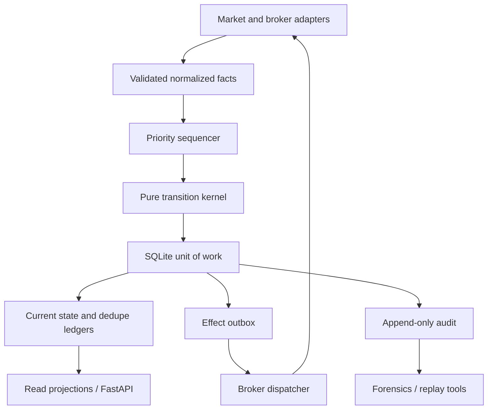

# Target architecture

## Architectural style

A modular monolith remains the lowest-complexity reliable shape for this beta. Fast-path and
slow-path work are separated by code and queues, not by deploying more services.

There is one capital-mutating path:

\[
(\text{Command or Fact},\ \text{Aggregate State},\ \text{Market State})
\rightarrow
(\text{New State},\ \text{Domain Events},\ \text{Broker Effects})
\]

SQLite, the API, the broker adapter, and the UI never reproduce that decision.

## Fast path and slow path

| Path | Inputs | Responsibilities | Prohibited work |
|---|---|---|---|
| Fast | Broker fills/order updates; fresh quotes/trades/depth; emergency operator command | Validate, sequence, reduce, commit actionable state, enqueue broker effect | Full-log scans, REST polling, UI formatting, strategy research |
| Slow | Startup/reconnect, periodic account reports, health checks, read projection, tape rotation | Reconcile, report health, verify invariants, serve cockpit | Making an unsequenced capital mutation |
| Entry/control | Operator-approved acquisition mandates | Admit new exposure only when health and limits permit | Delaying protection or reconciliation |

There are physically separate bounded mailboxes, not one shared priority queue:

1. **Broker mailbox:** reserved capacity for fills/order observations. Enqueue never waits behind
   market/control work. Overflow marks a stream gap through a dedicated health signal, enters
   `REDUCING`, and requires broker reconciliation; no absence is inferred from the lost interval.
   The callback sets a non-droppable process latch even if the queue is full. That latch can clear
   only after the adapter proves a fully paginated, overlapping recovery interval from the last
   committed broker-coverage watermark through a post-resubscription watermark. If the broker
   cannot prove that coverage, the account remains non-serving.
2. **Protection-market mailbox:** per-symbol bounded buffers. Quote updates may be latest-value
   coalesced only before trigger evaluation; an overflow invalidates the evidence chain and forces
   a fresh data baseline before a new effect.
3. **Control/entry mailbox:** approved commands, ordinary manual controls, strategy proposals,
   and UI-originated commands. It sheds/refuses new entry work first.

The sequencer drains broker, protection, reconciliation, and control work with weighted fairness.
Priority affects dequeue order; it cannot preempt a transaction already in progress. Therefore
transactions have a hard duration budget and contain no broker I/O, history fold, or report
construction. All mailboxes expose age/high-water/overflow metrics.

## State authority matrix

| State | Operational authority | Recovery authority | Audit role |
|---|---|---|---|
| Protection mandate and versioned parameters | SQLite current row/checkpoint | Same row, schema-version validated | Records approval and supersession |
| Position quantity | Unique, deduplicated canonical execution facts (`FILL`, `TRADE_CORRECT`, `TRADE_BUST`) applied atomically to current state | Unified execution-fact ledger plus broker parity report | Explains every delta and every revision of earlier fill economics |
| Broker order status | Reducer-owned `VenueAttempt` lifecycle informed by correlated broker observations; terminal state never regresses | Targeted query, open-order/fill reports, and accepted ambiguity/release contract | Preserves every observation and its provenance |
| Local order/effect lifecycle | SQLite current state + outbox | Outbox identity and broker reconciliation | Explains intent and outcome |
| Dispatch ever-claimed | Immutable `broker_effect_claims` occurrence | Same row; absence is checked for `NEVER_DISPATCHED` | Decision receipt explains but cannot override claim authority |
| High watermark/trailing state | Current protection aggregate | Versioned aggregate checkpoint; may be recomputed from retained normalized tape in tests | Records trigger/action snapshots |
| Current market | In-memory validated cache | Re-subscribe and establish freshness; never reconstructed from audit for live use | Action-causing snapshot is recorded |
| Broker execution-fact coverage | Versioned checkpoint watermark/interval | Fully paginated overlapping recovery plus post-subscription watermark | Records gap and closure evidence |
| Kill/buy-pause/health modes | SQLite operational row | Same row plus startup checks | Records operator and automatic transitions |
| Configuration | Immutable versioned configuration row | Exact version referenced by mandate | Prevents historical reinterpretation |
| UI state | Read-only projection | Rebuilt from current rows | No authority |
| General audit log | None on live path | Forensics only | Immutable chronology |

“Derived” does not mean “independently re-decided.” The transition kernel is the only place
where a source fact becomes new operational state.

## Runtime components

### 1. Normalized ports

- `MarketDataPort`: quotes, trades, optional depth, trading status, timestamps, feed identity.
- `BrokerExecutionPort`: submit, cancel, replace where certified, targeted order query, open
  orders, fills, positions, account status.
- `Clock`: event, wall, and monotonic time.
- `AuditSink` and `TapeSink`: non-authoritative outputs.

Every broker has a capability profile by asset, session, order type, time-in-force, replace
semantics, query limits, and market-data features. Unsupported capability combinations fail before
an effect is created.

### 2. Account engine

One sequencer owns a compact `AccountState` containing:

- `SafetyState`;
- `EnginePhase`: `BOOTSTRAPPING | RECONCILING | SERVING`;
- zero or more `SymbolAggregate` objects;
- broker connection/reconciliation state and the last proven execution-fact coverage;
- order-rate budgets;
- configuration version.

The account engine is single writer. A few held/acquiring symbols are the design target; no
sharding is required.

### 3. Symbol aggregate

Each symbol contains:

- fill-derived position plus orthogonal integrity/quarantine state;
- at most one acquisition mandate;
- immutable protection mandate;
- mutable protection supervisor state;
- at most one current exit execution goal;
- venue order attempts and ambiguity, where one local effect may own zero, one, or multiple
  concrete broker legs; only active or unresolved legs remain in the checkpoint, while immutable
  owner and terminal-closure ledgers retain historical ownership;
- per-effect-occurrence acceptance-set state: `OPEN` means another broker acceptance may still be
  undiscovered; `CLOSED` means adapter-specific exhaustive evidence is committed; `INVALIDATED`
  means later evidence disproved a retained closure proof and permanently blocks release in
  generation 1. The `broker_effects` row and its closure/invalidation fields are the sole persisted
  authority; the checkpoint does not duplicate this value;
- one symbol-scoped `may_execute` view consumed by every BUY/SELL/flatten/handoff gate;
- session/native-protection ownership;
- health flags.

Authorization, mutable progress, broker observations, and read projections are separate types.
The old all-purpose envelope is not carried forward.

### 4. Pure kernel

The kernel:

- accepts a typed command/fact and exact current state;
- validates sequence, ownership, session, health, and capability;
- applies a deterministic state transition;
- emits immutable domain events and stable broker effects;
- performs no I/O, sleeps, logging, clock reads, UUID generation, or broker SDK calls.

IDs and timestamps enter as command data. Money, price, and quantity use integer/fixed-point
units at the domain boundary.

`VenueObservation` is distinct from local `VenueAttempt` and transport-effect state. Every
observation carries immutable application-generation/broker/environment/account/order identity,
source, receive sequence/time,
venue event time when available, cumulative execution facts, and raw status. The reducer applies
an explicit legal-transition/precedence table: a delayed `SUBMITTED` observation cannot regress a
terminal `FILLED` attempt, while a new deduplicated `FILL`, `TRADE_CORRECT`, or `TRADE_BUST` fact
is still applied regardless of status arrival order. Corrections and busts are immutable linked
facts: they replace the current contribution of one exact root fill through its current
predecessor head; they never overwrite a prior fact or masquerade as an acknowledgement. Position
and basis are defined by substituting each root's current head at the original root-fill sequence
and applying the accepted ordered long-only average-cost fold. The correction/bust transition is
the atomic delta between old and new folds, not a naive subtraction from basis after later facts.

A valid correction/bust whose root has later economic facts is not fully folded inside the fast
transaction, but broker quantity truth is never delayed. The first sequenced transaction inserts
the canonical fact, advances the chain, applies the exact signed root-quantity delta, and commits
`BASIS_RECONCILIATION_PENDING` with basis unavailable. It immediately records
cancellation/reconciliation effects for every potentially live exposure-increasing BUY and any
owned SELL whose remaining quantity could exceed the new trustworthy long residual, blocks every
new BUY, and forces every positive long residual into `HARD_BAIL`. Actual broker outcomes remain
occurrence-tracked. While any conflicting venue leg or acceptance set is potentially live,
only cancel/query/reconcile may be claimed. After the ordinary `symbol_may_execute` uncertainty
gate passes, quantity-capped, basis-independent risk reduction under the existing
mandate/emergency guard may be claimed; no normal/entry effect or formula-derived trigger may use
stale basis. A slow worker computes basis from an immutable execution-chain snapshot
outside the write transaction. A second sequenced transaction must revalidate the exact high-water
and derived result before atomically restoring basis and its dependent protection values. Any
changed high-water retries from a new snapshot; any failed proof remains in this restricted
condition. M2 must prove this boundary and its budgets before implementation may depend on
non-tail corrections.

One submitted effect/client identity may resolve to multiple concrete broker order IDs. Every
creating client identity is nonempty, unique in its generation/Paper account, and deterministically
bound to `(application_generation, broker, environment, account, request occurrence)`. Each
`(broker, environment, account, broker_order_id)` is an immutable, exclusive `VenueLeg` owner bound
by a composite parent key to the exact effect, client binding, occurrence, symbol, and economic
scope. The checkpoint retains only active or unresolved legs and
their lifecycle independently; terminal legs move atomically to an immutable terminal-closure
ledger without losing their immutable owner. Each owner has one ordinal-1 closure root; every
successor references that owner's immediately prior ordinal, so the greatest ordinal is its one
current head. A second acceptance is never collapsed into a
mutable singular broker ID. Every potentially live leg blocks successor work until it is
individually broker-terminal or released under the exact ADR-012 operator contract.

Leg closure alone cannot close the parent occurrence. Every mutating effect starts with
`acceptance_set_state=OPEN`; that state is equivalent to
`may_have_undiscovered_acceptance=true`. It becomes `CLOSED` only when the adapter commits
occurrence-specific exhaustive evidence: either the original response is contractually complete,
or a targeted identity/scope query plus complete cursor/interval coverage enumerates every
acceptance for the occurrence. A locally canceled effect may instead close with
`NEVER_DISPATCHED` only when the immutable `broker_effect_claims` authority has no row for the
effect/generation; decision receipts do not prove absence. A query transport success, one not-found response, position parity,
or terminality of all currently known legs is not exhaustive evidence. While the set is `OPEN`,
the occurrence remains potentially live even if every discovered leg is terminal. A delayed
acceptance after `CLOSED` preserves that proof, appends contradiction evidence, changes the
canonical state to non-releasable `INVALIDATED`, and halts the symbol. A cross-owner broker ID,
cross-generation client identity, or scope mismatch is conflict evidence and always leaves the
symbol non-serving; it changes `CLOSED -> INVALIDATED` only when it disproves that occurrence's
retained closure proof. Otherwise the occurrence remains `OPEN` and blocked. `INVALIDATED` cannot
be re-opened or re-closed in generation 1. The exact persistence and proof fields are specified in
`04-persistence-and-cutover.md`.

The shared `symbol_may_execute(state, symbol)` function is the only classifier used at command
admission, broker-effect creation, and final dispatch claim. It includes working, cancel-pending,
submit/replace/cancel-unknown, accepted-submit recovery, and other broker-uncertain attempts across
acquisition, protection, manual flatten, emergency reduce, and handoff. It also includes every
effect occurrence whose acceptance set is `OPEN` or `INVALIDATED`, even when no concrete leg is
currently known. A safely local unclaimed BUY may be stood down atomically; any venue-uncertain leg
or non-`CLOSED` acceptance set blocks a new SELL.

### 5. SQLite unit of work

For each actionable transition, one transaction:

1. claims/deduplicates the input technically;
2. reads the current aggregate/effect version and canonical acceptance-set row;
3. invokes the pure reducer with the exact technical dedupe result as a typed fact;
4. persists the new current state and effect/attempt state;
5. inserts any new immutable execution fact and advances the unified execution chain;
6. inserts any new immutable venue-identity owner or next-ordinal terminal closure;
7. persists any acceptance-set closure or append-once invalidation evidence only in the canonical
   effect row;
8. for `ClaimEffect`, inserts the immutable dispatch-claim row before the effect-state edge;
9. appends the mandatory decision receipt;
10. inserts broker effects in the outbox.

The in-memory state is published only after commit. A database failure leaves the old state
active and creates no broker call only when rollback is definitive. A lost commit response or
failure between commit and cache publication is `COMMIT_PUBLICATION_UNKNOWN`: stop claims and
commands, discard the cache, reload the checkpoint/inbox/outbox, and complete startup
reconciliation before serving again. The outbox is polled; a wakeup is only an optimization.

### 6. Broker dispatcher and request arbiter

The dispatcher is I/O-only, not a second state writer:

1. The one account-wide broker-request arbiter selects work by the committed priority/sequence
   while preserving reserved capacity for emergency cancel, query, and reconciliation.
2. Only when an immediate broker-call slot is available, it submits `ClaimEffect(effect_id)`
   through the sequencer.
3. The reducer atomically rechecks `EnginePhase=SERVING`, the exact Alpaca/Paper/account/
   generation/endpoint/credential fence, kill/trading mode, mandate expiry, session, capability,
   symbol-wide potentially-live work, quantity, rate budget, generation-bound client/effect
   identity, and consumes the applicable mutating-request budget.
4. Only a committed `DISPATCH_CLAIMED` response authorizes the immediate network call.
5. Broker acknowledgement/rejection/timeout returns as a normalized fact through the sequencer.

Kill versus claim is ordered by the single writer. If kill wins, the reducer transitions the
unclaimed effect to `CANCELED_BEFORE_DISPATCH`; if claim wins, the request may have crossed the
venue and kill follows the accepted in-flight cancel/reconciliation behavior.
The claim transaction inserts one immutable `broker_effect_claims` row before changing the effect
state; that row cannot be cleared by later effect-row corruption and permanently disqualifies
`NEVER_DISPATCHED`.

Non-mutating broker queries use the same arbiter and adapter rate profile but do not masquerade as
broker effects. A sequenced `ClaimBrokerQuery` consumes the shared query/request budget
immediately before I/O and is permitted during `RECONCILING`; it creates no venue-order owner.
Entry/reprice work cannot consume the reserved reconciliation/cancel capacity. The M4 conformance
suite measures the broker's actual shared and endpoint-specific limits; until then the
conservative profile is binding.

Transport-effect lifecycle and `VenueAttempt` lifecycle are different. A cancel request being
acknowledged means only that the cancel request was received; the attempt remains
`CANCEL_PENDING` and potentially live until a correlated broker-terminal fact arrives. The same
rule applies to replace. `DISPATCH_CLAIMED` is never blindly resent after restart; the stable
request identity and immutable economic scope are queried and reconciled.

### 7. Read/control plane

FastAPI reads current projections and submits typed operator commands. Streamlit remains a thin
client. Signal Seat is disabled in the reset beta. AI research, dashboards, metrics, and tape
recording are outside the capital-mutating lane and may fail without stopping protection.

### 8. Process ownership and startup fence

Generation 1 is one process on one local host and a non-network filesystem. Before opening the
execution database or starting any adapter task, the process acquires a process-lifetime
OS advisory lock keyed by the canonical `(broker, environment, account_key)` in a fixed local
runtime directory; lock metadata records the exact database path. A second database path for the
same paper account therefore does not create a second owner. Failure to acquire it exits without
broker I/O. SQLite transaction serialization is not treated as writer ownership.

After acquiring the lock, startup commits `BOOTSTRAPPING`/safe mode before any dispatcher or
command-serving task exists, then enters `RECONCILING`. Queries needed for reconciliation may run
through the request arbiter; mutating effect claims remain denied. Only a committed parity result,
closed stream-gap coverage, canonical classification of every surviving effect acceptance set, and
revalidation of every surviving `REQUESTED` effect permit account-level `SERVING`. Any persisted
`OPEN`/`INVALIDATED` quarantine remains in `symbol_may_execute=false` and can never release its
symbol. A takeover can occur
only after the operating system releases the prior process lock, and it always repeats this full
sequence; there is no TTL lease or warm dual-writer failover.

The process lock fences only reset-generation processes. Before the reset process can acquire
broker authority, cutover must separately disable and verify disabled every legacy service,
scheduled task, launcher, and automatic restart path for the account; isolate legacy credentials
and writable databases; inventory every legacy claimed/in-flight/outcome-unknown request; and
prove exhaustive occurrence closure plus overlapping order/execution coverage through a
post-disable watermark. A flat/no-open snapshot alone is insufficient. The supervisor fence first
names exact Alpaca broker, Paper environment and REST/stream origins, account identity, reset
generation, database, deployment, mode, and recognized query-credential fingerprint in
`RECONCILIATION_ONLY`; only after those proofs and later adapter gates may it atomically grant
`PAPER_MUTATION_ELIGIBLE`. Checkpoint, inbox, effect, immutable claim, execution, owner, closure,
and receipt rows all bind to the singleton application generation. The reset process refuses
broker I/O unless every external-fence field matches; a live endpoint/credential can never match.
The cutover and post-first-effect rollback prohibition are normative in
`04-persistence-and-cutover.md` and `15-proposed-adr-reset-scope.md`.

## Performance rules

- No full-history fold or global event scan on any fast-path event.
- Terminal venue legs are absent from the serialized checkpoint; exact owner and unique
  greatest-ordinal closure-head lookup is indexed, so per-event work does not grow with historical
  order count.
- Per-event domain work is \(O(1)\) in historical length and at most \(O(d)\) in current depth
  levels, where \(d\) is explicitly capped. The initial receipt/quarantine of a non-tail
  correction is included; its separately gated slow reconstruction is excluded from the serving
  fast path and cannot emit an effect.
- Trail and bar state update incrementally; no \(O(n^2)\) recomputation.
- No blocking broker SDK call on the event loop.
- Market observations that cause no durable state transition update the bounded in-memory cache.
  A confirmed protection-state edge or an increase in the tick-rounded trail is committed before
  it gains authority. The persisted trail never loosens after restart; hot high-watermark changes
  that do not change the rounded trail need not be written.
- The tape recorder is bounded and independently supervised.
- A broker effect is claimed only when its rate slot and call worker are immediately available;
  it is never left claimed behind an outbound queue.

Initial paper-beta budgets on the deployment machine:

| Metric | Gate |
|---|---:|
| Pure kernel p99 | ≤ 5 ms |
| Valid fact → committed effect p99 | ≤ 20 ms |
| Fast-path queue age p99 | ≤ 25 ms under the agreed symbol/load profile |
| Any event-loop blocking segment | < 50 ms |
| History-length sensitivity | No material slope when audit history grows 10× |

These are local processing budgets, not promises about broker, feed, or exchange latency. Optimize
Python only after repeatable profiling violates one.

## Ratified R2 serial acquisition-generation amendment - 2026-08-05

ADR-020 R2 eab0c18cc08539a0c2b1dbc6d61f6d2a0ff359d38b71e8d659cb1ff620513653 and ADR-021 R2
b2527dc5285137ef829211b293411e03168458d34b9d3dce96d04b521394c30c replace only the previously
unspecified same-symbol successor route. A PositionScope may have serial AcquisitionGenerationId
values but never concurrent LIVE generations. One bounded SymbolAcquisitionController carries the
current generation/head, immutable controller-lifetime EmergencyRecoveryCompatibility, and one
active protection/broker authority. Direct immutable root/effect/owner-to-generation indexes and a
generation current-economics head route retired facts; they are not a retired-history collection and
no live transition scans audit or venue history.

A successor requires exact flat/CLOSED/clear/no-live-work predecessor conditions, an exact
predecessor controller head, a distinct complete dual-mandate binding, equal compatibility, and a
distinct ADR-023 market stream after the predecessor is non-serving. The controller never accepts
caller-shaped authority, policy arbitration, ownership transfer, or market-stream reset/reuse.
This is documentation of accepted architecture only; it does not activate or implement a work
order.

## Failure-domain rules

- Signal Seat is not mounted or loaded.
- Tape/optional audit-export failure raises an alert but does not reinterpret state.
- Market-data loss freezes new entries and preserves a known resting protective order.
- Broker stream loss sets `REDUCING`, blocks new attempts, and starts reconciliation.
- SQLite commit failure produces no broker effect.
- Commit/publication uncertainty stops the writer and reloads; stale in-memory state never
  continues.
- A second process cannot acquire execution ownership.
- A corrupt optional subsystem cannot make order/fill/position state unopenable.
- Startup enables commands only after schema, state, outbox, immutable-claim, broker-order,
  execution-chain, and position checks pass, every acceptance set is either `CLOSED` or retained as
  an execution-blocking `OPEN`/`INVALIDATED` quarantine, no basis repair is pending, and every
  checkpoint/unresolved-effect owner resolves through an exact indexed active-leg or terminal-head
  lookup without loading terminal history into live state. Acceptance state is loaded from
  `broker_effects`; any checkpoint-shaped or in-memory disagreement is discarded and leaves the
  process non-serving until the canonical binding verifies.
- A broker/environment/account/origin/credential-fingerprint fence mismatch performs no broker I/O;
  final effect claim repeats the exact Alpaca Paper comparison.
- Normal restart verifies the indexed checkpoint/last-chain binding and broker parity; it does not
  claim a history-wide refold. Full ordered-root/hash audit is a separately measured non-serving
  M2/cutover/repair gate whose mismatch halts.
