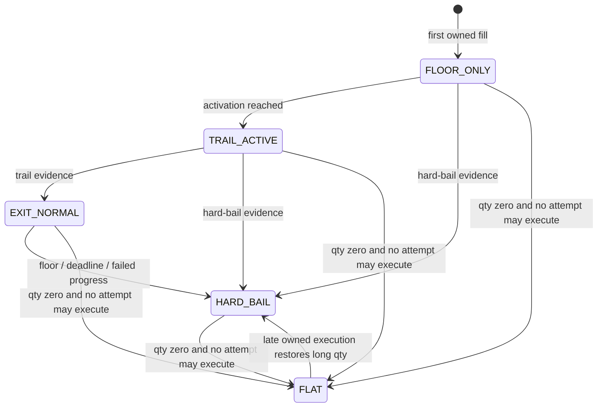
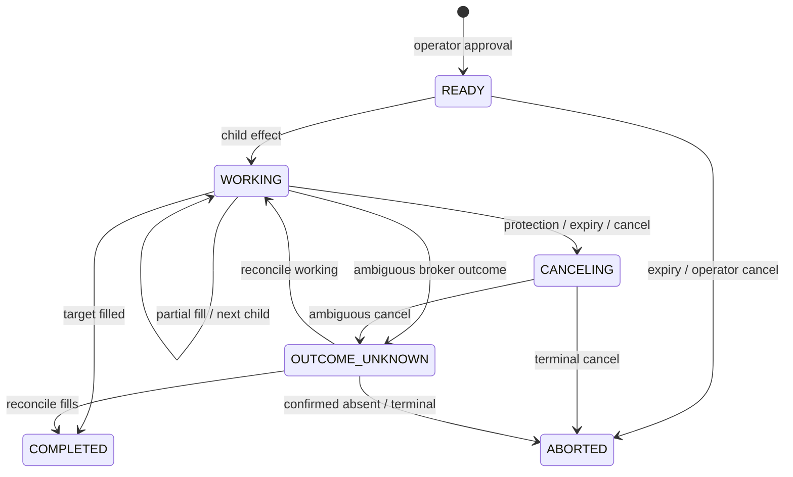

# Domain specification

This is the first complete behavioral baseline for the revised engine. Values marked “initial
default” are paper-beta calibration points, not claims of optimal execution and not authority for
live trading.

## Separation of responsibilities

| Component | Decides | Does not decide |
|---|---|---|
| Acquisition supervisor | Whether an approved BUY goal remains active | Child price/size |
| Position protection supervisor | Protection state, trigger, urgency, remaining SELL goal | Broker syntax or child price |
| Liquidity executor | Child side, size, price stage, cancel/reprice timing | Whether a position should be protected |
| Capability arbiter | Whether a broker/session/effect combination is legal | Trading policy |
| Broker adapter | Translation, I/O, and normalized observations | Domain state |

The BUY and SELL paths share the liquidity executor but do not share their supervisory state
machines.

## Position protection supervisor



Broker/data degradation is an orthogonal health mode, not another copy of this state machine:
`HEALTHY`, `DATA_DEGRADED`, `BROKER_AMBIGUOUS`, `RECONCILING`,
`POSITION_MISMATCH`, or `OVERFILL_QUARANTINE`.

### State meaning

| State | Meaning |
|---|---|
| `FLOOR_ONLY` | Protection is armed immediately after the first deduplicated fill; hybrid profit trail has not activated. |
| `TRAIL_ACTIVE` | Favorable movement crossed the activation gate; the trail ratchets and never loosens. |
| `EXIT_NORMAL` | Trail triggered; execute a controlled liquidity-aware SELL. |
| `HARD_BAIL` | Emergency escalation is sticky until flat; relax participation/passivity within the separate emergency execution guard. |
| `FLAT` | Quantity is already fill-derived zero and no unresolved attempt may execute. A fill may establish zero; a later correlated terminal order fact may complete the edge without changing quantity. `FLAT` retains the owning mandate and prior exit provenance needed to handle a later first-occurrence owned execution fact; it is not permission to leave restored long quantity unprotected. |

An external/unmanaged broker position discovered at initial cutover is not converted into local
quantity. It creates `POSITION_MISMATCH`, blocks all new effects, and requires the paper account
to be flattened outside the reset engine. Opening-inventory adoption is a future explicit
fact/ADR, not an implicit exception to fill-only quantity. A later mismatch involving a position
already owned by the reset fill chain follows the accepted `REDUCING` and smaller-trustworthy-long
rules; it does not create opening inventory.

Broker-authoritative fills are never rejected or clamped merely because they reveal an overfill.
They update the raw fill-derived quantity, including a negative quantity, and set
`OVERFILL_QUARANTINE`. Authorized residual SELL quantity becomes zero, autonomous work stops, and
the exact broker fact remains visible. Malformed local/synthetic fills are rejected before
mutation; same-ID/different-economics broker facts enter fill-conflict reconciliation.

### Execution corrections and busts

Canonical economic truth is an immutable fill-family of `FILL`, `TRADE_CORRECT`, and
`TRADE_BUST` execution facts. This preserves the rule that only canonical execution/fill facts,
never submit, accept, cancel, replace, status, or release facts, may change raw position or cost
basis.

Every fact has a unique broker source-event ID and exact
broker/environment/account/order/symbol/side scope.
A correction or bust additionally carries the exact predecessor fact ID and root `FILL` ID:

- `FILL` has positive absolute quantity and price and begins one root lineage;
- `TRADE_CORRECT` has positive revised absolute quantity and price for that root; and
- `TRADE_BUST` has revised absolute quantity zero.

Corrections and busts are replacements, not new positive fills and not mutable edits. Only a
broker-authoritative fact whose predecessor is the current effective head of a broker-authoritative
`FILL` root and whose complete scope matches may replace that root contribution. The reducer atomically removes
the predecessor-head economics and applies the revised absolute economics while retaining every
immutable fact. Canonical position and basis are the ordered effective-root fold: substitute the
new head at the root `FILL`'s original sequence and reapply the accepted long-only average-cost
rule from `app/position.py`. The committed transition uses the delta between the prior and revised
folds. It must not subtract an old root directly from a current basis already affected by later
facts. An exact source-event replay is a no-op; changed payload under the same source-event ID is a
conflict.

If later economic facts make the basis refold non-local, the valid correction/bust still applies
its exact signed root-quantity delta in the first transaction and advances the canonical chain.
The same transition sets `BASIS_RECONCILIATION_PENDING`, makes basis unavailable, and records
cancellation/reconciliation effects for every potentially live exposure-increasing BUY and any
owned SELL that can exceed the new trustworthy long residual. It blocks new BUYs and forces every
positive long residual into `HARD_BAIL`; actual broker outcomes remain occurrence-
tracked. Stale basis cannot drive a trigger, normal exit, sizing, or display. While any conflicting
venue leg or acceptance set remains potentially live, only cancel/query/reconcile may be claimed.
After the ordinary symbol-wide uncertainty gate passes, quantity-capped, basis-independent risk
reduction under the retained mandate/emergency guard is eligible. Snapshot staleness, arithmetic
disagreement, or incomplete lineage leaves that restricted condition in force.

A missing predecessor, stale or branched predecessor, changed root/scope, or out-of-order
correction/bust produces reconciliation-required integrity, makes the symbol non-serving, and
causes zero economic mutation until exact lineage is established. It is never guessed into the
current head; cancellation/reconciliation is requested for existing potentially live work because
its safe residual is unknown. If a valid broker-authoritative replacement reveals a negative position or other
overfill, its exact economics are applied and `OVERFILL_QUARANTINE` becomes permanent. A
`HUMAN_ATTESTED` fact remains a capacity-capped `FILL`; it cannot be the direct root of a
correction/bust. Later broker evidence that overlaps its cumulative interval is retained in
reconciliation until exact leg-level mapping proves how to avoid double counting; local human
evidence never corrects or busts a broker execution.

For example, `BUY 10 @ 100` followed by a valid bust contributes zero, not 10 or 20. A valid
correction of that fill to `BUY 7 @ 101` leaves quantity 7 and revises the root basis to 707.
If `SELL 5` follows the original BUY before that correction arrives, the revised ordered fold is
`BUY 7 @ 101; SELL 5`, leaving quantity 2 and basis 202; a naive current-state subtract/add result
of 207 is forbidden. Encoding either replacement as another positive fill is forbidden.

### Hard-bail semantics

The mandate stores:

- immutable `hard_bail_rule` parameters: loss fraction, the
  `FILL_DERIVED_LONG_AVERAGE_COST` reference, and tighten-only behavior;
- immutable `trail_activation_rule` parameters: favorable gain and the same reference method;
- `normal_execution_guard`;
- `emergency_execution_guard`;
- trigger-evidence policy;
- configuration version.

`PositionProtectionState`, not the mandate, owns the derived
`armed_hard_bail_trigger_price`, current `trail_activation_price`, high watermark, ratcheted
trail, and policy state. After each accepted canonical economic execution fact, raw quantity
updates first. Cost basis either updates in the same transition or becomes explicitly unavailable
under `BASIS_RECONCILIATION_PENDING`; no formula consumes it until exact restoration. While an
exact-basis long position remains, the reducer derives a hard-bail candidate from
the approved rule and sets the armed trigger to the first candidate or
`max(previous_armed_trigger, candidate)`; later economics may tighten but never loosen it. While
the state is `FLOOR_ONLY`, the activation price is recomputed from the current fill-derived long
average cost. Once `TRAIL_ACTIVE`, later basis changes never deactivate the trail.

Mandate validation requires `0 < loss_fraction < 1` and `approved_gain > 0`. Derived-price
arithmetic is exact before one final tick conversion. The hard-bail loss candidate
is rounded upward to the least valid tick at or above the exact formula result that remains
strictly below the current long average cost; this favors earlier protection rather than a looser
lower trigger. The favorable activation candidate is rounded upward to the least valid tick at or
above its exact result, so trail authority is not granted below the approved gain. Comparisons and
`max` use one compatible scale after conversion. If the incompatibility is found during mandate
admission, the mandate is refused. If an authoritative broker execution fact exposes it later, the
fact and its exact economic delta still commit first; only derived-price authority is withheld and
any positive long residual remains restricted/non-serving `HARD_BAIL`. No fact is rejected,
clamped, or delayed, and no old candidate is silently reused.

Crossing the derived `armed_hard_bail_trigger_price` changes supervisor state. It does not prohibit a SELL limit
below that value. The emergency guard is expressed relative to current validated executable
liquidity—for example maximum ticks/basis points through the valid bid or the lowest certified
visible depth level—not as a static “never sell below” price.

No software can guarantee a minimum fill during a gap, halt, outage, absent liquidity, or broker
failure. The cockpit and audit language must say “trigger” and “execution guard,” never
“guaranteed floor.”

### Trigger evidence

An observation is eligible only when:

- symbol and venue mapping are exact;
- prices are positive, finite, tick-valid, and the quote is not crossed;
- it carries a stable source-occurrence identity and feed sequence/time does not regress;
- quote/trade age is inside the configured session threshold;
- halt/session status permits action;
- step-deviation screening either accepts the observation or recognizes a halt/reopen gap.

Initial evidence rule for both trail and hard bail:

- two **distinct**, consecutive eligible best-bid source occurrences at or below the trigger.
  The second must have a strictly greater source sequence when one exists; otherwise it must have
  a different adapter-stable source-occurrence ID that is not derived from local receive time; **or**
- one eligible trade at or below the trigger plus an eligible best bid at or below it within
  the corroboration window, with distinct retained source-occurrence identities.

The aggregate retains the counted evidence identities. An exact replay, including one delivered
again after restart with a new local receive time, is an evidence no-op and cannot supply the
second observation. Hard-bail evidence is evaluated first. A single suspect print cannot create a SELL. A valid
reopen quote after a halt starts a fresh two-quote branch without comparing step deviation through
the halted gap; it does not satisfy the two-observation rule by itself. The exact age and
corroboration windows are versioned configuration and calibrated in paper replay.

### Hybrid trailing profit protection

For a long position, maintain an executable high watermark from eligible best bids:

\[
H_t = \max(H_{t-1}, \operatorname{bid}_t)
\]

While protection is `FLOOR_ONLY`, the favorable activation price is:

\[
A_t = \operatorname{average\_cost}_t (1+g)
\]

where the current average cost is derived after the latest accepted economic execution fact and
`g` is the immutable mandate gain. Eligible favorable evidence at/above `A_t` activates the trail.
Activation is sticky; a later fill, correction, or bust does not demote `TRAIL_ACTIVE`.

After activation, calculate independently:

\[
T_{\text{pct}} = H_t (1-p)
\]

\[
T_{\text{atr}} = H_t - k \cdot ATR_t
\]

\[
T_{\text{structure}} = \text{latest confirmed structure level, if available}
\]

The ratcheted trail is:

\[
T_t = \max(T_{t-1}, T_{\text{pct}}, T_{\text{atr}}, T_{\text{structure}})
\]

Unavailable ATR or structure components are omitted; they never inject zero or stale values.
Bars and ATR update incrementally from validated completed trade bars. The high watermark and
ratchet persist in the current aggregate.

Initial defaults:

| Parameter | Paper-beta default |
|---|---:|
| Hard-bail loss from fill-derived average cost | 8% |
| Trail activation gain | 7.5% |
| Percent trail distance \(p\) | 8% |
| Chandelier multiple \(k\) | 2.5 ATR |
| ATR period | 14 completed bars |
| Structure component | Implemented as a plug-in; disabled until replay-calibrated |
| Partial-profit tranche | Disabled |

If additional fills, corrections, or busts from the same approved acquisition change average
cost, raw position updates first and exact derived protection values follow only when basis is
available. `BASIS_RECONCILIATION_PENDING` forces sticky `HARD_BAIL`/restricted risk reduction and
does not reuse a stale formula candidate. After restoration, a recalculated hard-bail candidate
may tighten but never loosen the already-armed trigger. A later unrelated acquisition requires a
new mandate.

## Acquisition supervisor

An operator-approved acquisition mandate contains:

- symbol/account and BUY side;
- maximum total quantity and notional;
- maximum entry price;
- allowed sessions/order types;
- expiry;
- participation/fixed child caps;
- cancel/reprice budget;
- stable mandate ID and configuration version.
- an immutable reference to a complete, human-approved `ProtectionMandate`, including hard-bail
  and activation formulas, normal/emergency guards, evidence policy, and the same configuration
  version.

No BUY effect may be created or claimed without that protection authority. The first fill
instantiates `FLOOR_ONLY` and derives its first armed trigger and activation price from the
referenced mandate plus the just-applied fill-derived average cost; the reducer never invents
protection parameters.



The first deduplicated BUY fill immediately creates or updates `FLOOR_ONLY`; protection does not
wait for acquisition completion.

If either `EXIT_NORMAL` or `HARD_BAIL` requires an exit while a BUY attempt may still execute:

1. stop creating BUY effects;
2. request cancellation using the existing stable identity;
3. reconcile an ambiguous cancel;
4. enter the orthogonal `EXIT_WAITING_BUY_RESOLUTION(policy_state)` condition and do not create a
   new SELL while the BUY outcome is unknown;
5. size protection from the resulting authoritative fills.

This delay is not claimed to be bounded. It may require targeted reconciliation and the accepted
operator-attested recovery/release process. The durable condition exposes elapsed exposure, BUY
identity/scope, last query evidence, and a critical alert. It is an irreducible consequence of
preventing a late BUY from reopening a position after an emergency SELL.

`EXIT_WAITING_BUY_RESOLUTION(policy_state)` is an orthogonal execution-ownership condition, not a
sixth protection-policy state. An `EXIT_NORMAL` trigger remains `EXIT_NORMAL` and retains the
normal guard; a `HARD_BAIL` trigger remains sticky `HARD_BAIL` and retains emergency urgency and
guard. Waiting alone never promotes normal authority into emergency authority. The symbol-wide
execution gate prevents a successor SELL until every BUY venue leg is closed and the canonical
parent occurrence acceptance set is exactly `CLOSED`. Known-leg terminality cannot release the wait
while `broker_effects.acceptance_set_state` is `OPEN` or `INVALIDATED`; quarantine is a
non-serving block, never an alternative release authority.

`FLAT` does not erase owned economic lineage. If a new first-occurrence owned BUY `FILL`, or a
valid correction/bust replacement, restores positive long quantity after `FLAT`, the reducer
applies the economics first and atomically returns protection to `HARD_BAIL` under the original
mandate, recomputes the residual, and emits a critical alert. If any venue leg may still execute,
the orthogonal BUY-resolution wait also applies. The system never returns to unarmed
`FLOOR_ONLY`, invents a new mandate, or leaves the restored position silently flat. A late
broker-authoritative fact that instead produces negative quantity follows permanent overfill
quarantine.

## Side-symmetric liquidity executor

The executor receives:

```text
ExecutionGoal(
  side,
  remaining_quantity,
  urgency,
  price_guard,
  deadline,
  session,
  mandate_id,
  health_constraints
)
```

and a validated `LiquiditySnapshot`:

- best bid/ask and sizes when available;
- capped depth levels when certified;
- last trade and recent validated volume;
- quote/trade age and source;
- spread/tick size;
- session/halt status;
- own working order.

### Price stages

| Stage | BUY | SELL |
|---|---|---|
| `PASSIVE` | Join bid | Join ask |
| `IMPROVE` | Bid + one or bounded ticks | Ask − one or bounded ticks |
| `CROSS` | Take ask | Take bid |
| `SWEEP` | Walk certified asks up to BUY guard | Walk certified bids down to emergency SELL guard |

Every candidate is tick-rounded and capability-checked. Outside RTH, no market-order fallback is
allowed. If required data is unavailable, the executor uses the explicitly approved top-of-book
fallback or emits no new effect; it never silently substitutes a market order.

Child quantity is the minimum of:

- authoritative residual;
- approved fixed child cap;
- displayed-size participation cap when size quality is certified;
- recent-volume participation cap when available and valid;
- account/symbol risk cap.

Without trustworthy size/depth, the fixed child cap is binding. `HARD_BAIL` may relax
participation and passivity, but never residual, reduce-only, broker capability, or effect-identity
rails.

### Reprice policy

Reprice only when all are true:

- current attempt is confirmed live and owned;
- quote change exceeds hysteresis;
- minimum cooldown elapsed;
- expected price/fill benefit justifies another broker request;
- rate and lifetime budgets remain;
- no broker outcome is ambiguous.

Default transport is cancel-confirm-then-new. A broker-native replace is enabled only after the
adapter conformance suite proves its identity, partial-fill, timeout, and restart semantics.
At most one potentially live attempt exists for a mandate, but one submitted effect may be
discovered as multiple concrete venue legs. Every leg remains owned independently.

The transport effect and venue attempt have separate lifecycles. In particular:

- a submit acknowledgement is not necessarily a broker-authoritative working state;
- a cancel acknowledgement moves the attempt to/stays `CANCEL_PENDING`;
- a replace acknowledgement does not by itself prove the predecessor terminal;
- only correlated venue order/fill reports drive attempt working/terminal states;
- delayed/out-of-order status observations cannot regress a higher/terminal state;
- new canonical economic execution facts are always processed through their exact lineage rules
  even when their accompanying status is late.

### Multiple venue acceptances

A stable generation-bound client/effect identity is a reconciliation key, not proof that the broker
created only one order. Every creating identity is nonempty, unique for its application-generation/
Paper account, and derived from the canonical generation/broker/environment/account/occurrence
tuple. Targeted reconciliation may discover zero, one, or multiple concrete acceptances.

- Each concrete `(broker, environment, account, broker_order_id)` is immutably bound by one
  composite parent key to the originating application generation, effect, request occurrence,
  client ID/binding, symbol, side, quantity, price/order type, TIF, and session scope.
- One effect may own multiple such legs; one broker order ID may never be rebound to another
  effect.
- Every nonterminal or unresolved leg contributes to the same symbol-wide `symbol_may_execute`
  block.
- Cumulative fills and terminal evidence are tracked per leg. Resolving one leg never releases
  another.
- A cross-owner identity or economic-scope conflict enters `BROKER_AMBIGUOUS`/`needs_review`; it
  is not coalesced for convenience.

### ADR-012 operator recovery

Automatic reconciliation never invents a fill or releases an unknown leg merely because a query
is old. The preserved operator path has two separate commands:

1. `IngestHumanAttestedFill` adds missing economic truth for one exact venue leg. It carries
   `source=OPERATOR`, `authority=HUMAN_ATTESTED`, actor, reason, evidence reference, immutable
   claim occurrence, and exact incremental/cumulative quantity. It uses a stable source-fill ID
   and the ordinary fill-only position transition, but cannot use the ADR-001
   broker-authoritative overfill exception: it must remain inside the immutable order capacity
   and cannot drive a long-only position negative.
2. `ReleaseVenueLeg` is non-economic. It re-reads exact leg/effect/mandate ownership, requires
   broker-terminal evidence and cumulative venue quantity, and proves equality with canonical
   fills attributed to that leg. It then permits only
   `NEEDS_REVIEW -> OPERATOR_RECONCILED` for that occurrence.

Both commands are idempotent on an exact full-payload retry and conflict on changed identity,
economics, actor, reason, or evidence. Release changes no position, clears no ADR-001 quarantine,
does not release sibling legs or other unknown predicates, and cannot create a replacement effect
in the same transition. If fill parity cannot be proved, release is refused. If later
broker-authoritative evidence covers an already human-attested cumulative interval, leg-level
cumulative accounting prevents a second economic delta and enters reconciliation on any
economics mismatch.

Single-flight is symbol-scoped, not merely mandate-scoped. Every acquisition, protection,
flatten, emergency-reduce, and handoff command consumes the same pure `symbol_may_execute` result
at admission, effect creation, and final claim.

### Urgency

Initial authority inputs:

- supervisor state (`HARD_BAIL` dominates);
- elapsed time and deadline;
- residual exposure;
- partial-fill progress;
- current spread and order age;
- session/time-to-close;
- data confidence;
- broker ambiguity and remaining request budget.

Price velocity, order-book imbalance, and predictive models may be logged experimentally but do
not increase authority in the first beta.

## RTH/native protection handoff

Protection ownership is explicit:

`LOCAL_EMULATED`, `HANDOFF_TO_NATIVE`, `NATIVE_CONFIRMED`,
`HANDOFF_TO_LOCAL`, or `OWNERSHIP_AMBIGUOUS`.

Handoff to native:

1. block new same-symbol entry and exit effects;
2. cancel any local venue attempt and await terminal/reconcile;
3. ingest all deduplicated fills, re-establish broker order/position parity, and recompute the
   current residual;
4. atomically claim no more than that residual under the symbol-wide execution gate;
5. submit the broker-native RTH protection with a stable identity;
6. declare `NATIVE_CONFIRMED` only after exact identity/scope validation and a
   broker-authoritative working/accepted status—not the HTTP acknowledgement alone.

Handoff to local:

1. start local observation in non-submitting mode;
2. cancel native protection;
3. await terminal or reconcile ambiguity;
4. recompute residual from fills;
5. allow local effects for only that residual.

Any timeout, scope mismatch, late fill, or conflicting status enters `OWNERSHIP_AMBIGUOUS`,
blocks entries/new attempts, and reconciles under the accepted unknown-outcome contract.

There is no honest zero-gap guarantee across independent broker calls. The acceptance goal is a
measured, bounded, alarmed gap with no double-sell. Until this state machine passes paper fault
tests, the revised engine may run one protection mode for the entire test session instead of
performing a live handoff.

## Trading mode and command authority

The accepted kill/manual-control semantics remain binding:

| Mode | Submit/replace | Cancel/query/reconcile | Ordinary flatten | Emergency reduce |
|---|---|---|---|---|
| `ACTIVE` | Allowed only through normal mandate/risk/symbol gates | Allowed | Allowed through full preemption gates | Not needed |
| `REDUCING` | Exposure-increasing denied; quantity-capped reduce-only SELL may be allowed | Allowed | Allowed through full preemption gates | Not needed |
| `HALTED` or kill active | Denied, including a new protective/hard-bail SELL | Allowed | Denied | Allowed only with an explicit audited one-shot grant |

An emergency-reduce grant is immutable, account/symbol/session scoped, quantity capped to the
smaller reconciled/fill-derived long position, carried by the command, consumed only on a
successful claimed effect, and never inferred from ambient durable state. It does not bypass a
venue-uncertain same-symbol attempt.

Manual flatten is not a generic replacement:

1. The sequencer atomically stands down safely local unclaimed same-symbol entry work.
2. A known, cancellable venue BUY is canceled and must become terminal.
3. `SUBMIT_CLAIMED`, submit/cancel/replace unknown, accepted-submit recovery, or any other
   same-symbol potentially live attempt blocks flatten; it is not blindly canceled.
4. Position and symbol-wide exposure are re-read at final effect claim.
5. The SELL is reduce-only and capped to the smaller trustworthy residual.
6. In `HALTED`, only the scoped emergency-reduce grant authorizes the command.

## Safety precedence

| Condition | Required action |
|---|---|
| Canonical `FILL`/`TRADE_CORRECT`/`TRADE_BUST` | Validate exact lineage; update effective economics and position first; then recompute goals. A non-tail replacement stays pending/non-serving until its high-water-checked slow refold commits. A lineage gap/conflict makes the symbol non-serving with zero guessed mutation. |
| Hard-bail evidence | Override normal trail/profit logic |
| Broker outcome unknown | Preserve ownership, block new attempt, reconcile |
| Feed stale with known resting protection | Leave known order unless its approved disposition says cancel; block new entries |
| Feed stale with no known protection | Enter degraded alarm; no guessed-price order |
| Kill switch / `HALTED` | Block every new submit/replace/ordinary flatten; allow cancel/query/reconcile; emergency reduce requires its scoped grant |
| Manual flatten | Follow the explicit preemption/uncertainty contract above; never treat it as a generic replacement |
| Owned runtime position mismatch | `REDUCING`; use the smaller trustworthy long quantity; reconcile |
| Initial/unmanaged position | `HALTED`; no reset-engine effect; resolve outside the reset engine |
| Optional subsystem failure | Disable that subsystem; protection continues |

## Falsifiable domain obligations

The reference model and later simulator must kill at least these counterexamples:

1. Replaying one below-trigger quote with the same source occurrence must not satisfy the
   two-quote trigger branch, including across restart.
2. `BUY 10 @ 100` followed by a valid bust must contribute zero; correcting it to
   `BUY 7 @ 101` must leave quantity 7 and basis 707. Treating either as another positive fill
   must fail.
3. A correction whose predecessor is missing, stale, branched, out of order, or scope-conflicting
   must make the symbol non-serving and leave economics unchanged.
4. A normal trail exit waiting on BUY resolution must retain `EXIT_NORMAL` and the normal guard;
   changing it to `HARD_BAIL` without hard-bail evidence must fail.
5. A late owned BUY fill after `FLAT` must restore positive quantity and `HARD_BAIL` protection in
   one transition; a mutant that leaves policy state `FLAT` must fail.
6. `BUY 10 @ 100; SELL 5; CORRECT the BUY root to 7 @ 101` must produce the ordered-fold quantity
   2/basis 202. A concurrent fact must invalidate a stale slow-path candidate with zero partial
   mutation.
7. Hard-bail and activation candidates must use the specified exact-arithmetic-then-upward-tick
   rule. Rounding a hard-bail trigger downward or activating below the approved gain must fail.
8. With an owned live SELL 10, correcting long quantity 10 to 7 or busting it to zero must apply
   raw quantity immediately and commit cancellation/reconciliation intent for the oversized SELL;
   a racing fill still applies and can quarantine a negative result. The same intent is committed
   for every potentially live exposure-increasing BUY. No replacement SELL may claim until the
   ordinary symbol-wide uncertainty gate passes, and any late fill retains the hard-bail rules.
9. While a positive long has `BASIS_RECONCILIATION_PENDING`, kill/`HALTED` without a scoped
   one-shot grant must emit no new reduction SELL; an `OPEN`/`INVALIDATED` BUY parent permits only
   cancel/query/reconcile; and manual flatten must still pass uncertainty and final-claim residual
   checks without consulting stale basis.
10. An authoritative broker fill/correction/bust that exposes incompatible scale/tick data must
    still commit its exact economic delta. The derived formula remains unavailable and the positive
    long remains restricted `HARD_BAIL`; a mutant that rejects the broker fact must fail.
