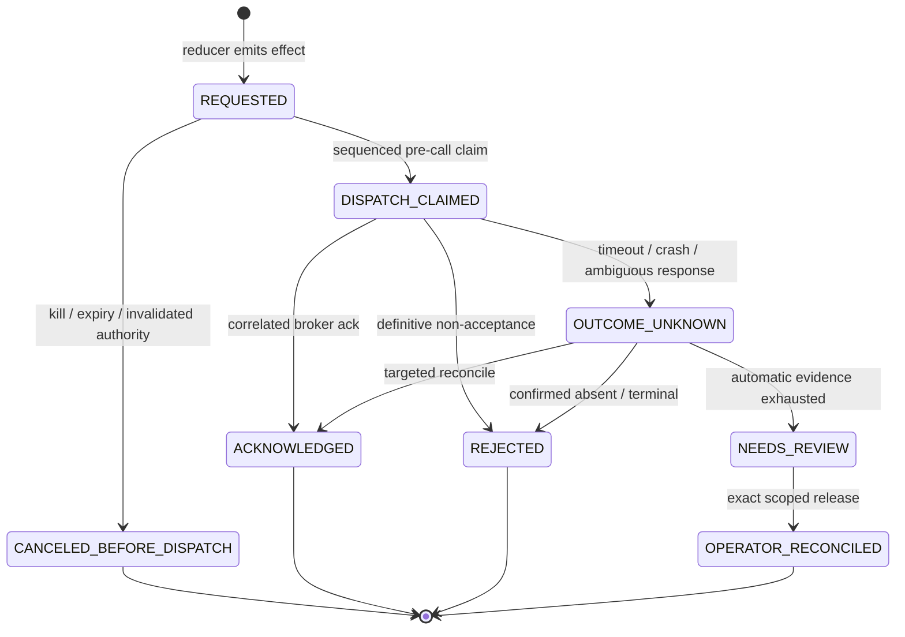

# Persistence and cutover

## Persistence model

The beta uses current-state persistence with narrow immutable ledgers, not universal event
sourcing.

### Minimal schema

| Table | Purpose | Authority |
|---|---|---|
| `schema_meta` | Schema/application compatibility | Startup gate |
| `config_versions` | Immutable policy/capability configuration | Mandates reference exact version |
| `engine_checkpoint` | Versioned serialized `AccountState`, bound to an exact unified execution-fact-chain high-water | Current local operational state; contains only active/unresolved venue legs |
| `inbox` | Dedup of commands and authoritative broker facts | Input idempotency |
| `execution_facts` | Immutable canonical `FILL`, `TRADE_CORRECT`, and `TRADE_BUST` facts linked by root/predecessor identity | Source of local position and cost-basis deltas |
| `broker_effects` | Transactional outbox, dispatch lifecycle, and occurrence-level acceptance-set closure/invalidation | Local broker-intent ownership; anything except `CLOSED` remains non-releasable |
| `broker_effect_claims` | Immutable first committed dispatch-claim occurrence | Monotonic proof that `NEVER_DISPATCHED` is impossible after a claim |
| `venue_identity_owners` | Immutable one-to-many concrete broker acceptances | Broker-ID exclusivity and recovery ownership |
| `venue_terminal_closures` | Immutable terminal/release heads for owners no longer in the checkpoint | Bounded checkpoint with permanent lifecycle closure evidence |
| `decision_receipts` | Mandatory append-only transition explanation | Transactional evidence, never a control input |

The first implementation stores one small, schema-versioned account aggregate in
`engine_checkpoint`. A few symbols and orders are the target; serializing this bounded state is
simpler than maintaining many independently projected tables. Narrow relational ledgers provide
the uniqueness and lookup constraints that JSON alone cannot.

Do not add a table merely to make the schema look conventional. Normalize a field later only if
a measured query, constraint, or retention need requires it.

### Proposed generation-1 DDL

This is the exact schema shape submitted for architecture approval. M2 may adjust names or add an
index only through a work-order amendment; a new authority-bearing column/table requires a fresh
schema decision. R1 has assessed this text statically only. It makes no claim that the DDL has
been executed, parser-validated, migration-tested, or proved operationally correct; those remain
future M2 obligations under separate authorization.

```sql
PRAGMA foreign_keys = ON;

CREATE TABLE schema_meta (
    singleton_id INTEGER PRIMARY KEY CHECK (singleton_id = 1),
    schema_generation INTEGER NOT NULL CHECK (schema_generation = 1),
    application_generation TEXT NOT NULL UNIQUE,
    created_at TEXT NOT NULL
);

CREATE TABLE config_versions (
    version_id TEXT PRIMARY KEY,
    schema_version INTEGER NOT NULL CHECK (schema_version >= 1),
    payload_json TEXT NOT NULL,
    payload_sha256 TEXT NOT NULL UNIQUE,
    created_at TEXT NOT NULL
);

CREATE TABLE engine_checkpoint (
    account_key TEXT PRIMARY KEY,
    application_generation TEXT NOT NULL
        REFERENCES schema_meta(application_generation),
    aggregate_version INTEGER NOT NULL CHECK (aggregate_version >= 0),
    state_schema_version INTEGER NOT NULL CHECK (state_schema_version >= 1),
    state_json TEXT NOT NULL,
    state_sha256 TEXT NOT NULL,
    last_execution_sequence INTEGER NOT NULL CHECK (last_execution_sequence >= 0),
    execution_chain_sha256 TEXT NOT NULL,
    config_version_id TEXT NOT NULL
        REFERENCES config_versions(version_id),
    updated_at TEXT NOT NULL
);

CREATE TABLE inbox (
    input_id TEXT PRIMARY KEY,
    application_generation TEXT NOT NULL
        REFERENCES schema_meta(application_generation),
    input_kind TEXT NOT NULL,
    payload_json TEXT NOT NULL,
    payload_sha256 TEXT NOT NULL,
    disposition TEXT NOT NULL
        CHECK (disposition IN (
            'APPLIED',
            'REFUSED',
            'CONFLICT',
            'RECONCILIATION_PENDING'
        )),
    resulting_aggregate_version INTEGER,
    outcome_json TEXT NOT NULL,
    received_at TEXT NOT NULL
);

CREATE TABLE execution_facts (
    execution_fact_key TEXT PRIMARY KEY,
    application_generation TEXT NOT NULL
        REFERENCES schema_meta(application_generation),
    execution_sequence INTEGER NOT NULL CHECK (execution_sequence > 0),
    fact_kind TEXT NOT NULL
        CHECK (fact_kind IN ('FILL', 'TRADE_CORRECT', 'TRADE_BUST')),
    broker TEXT NOT NULL CHECK (broker = 'ALPACA'),
    environment TEXT NOT NULL CHECK (environment = 'PAPER'),
    account_key TEXT NOT NULL,
    source_event_id TEXT NOT NULL,
    root_fill_id TEXT NOT NULL,
    predecessor_source_event_id TEXT,
    client_order_id TEXT,
    broker_order_id TEXT,
    symbol TEXT NOT NULL,
    side TEXT NOT NULL CHECK (side IN ('BUY', 'SELL')),
    quantity_units INTEGER NOT NULL CHECK (quantity_units >= 0),
    cumulative_quantity_units INTEGER
        CHECK (
            cumulative_quantity_units IS NULL
            OR cumulative_quantity_units >= quantity_units
        ),
    price_units INTEGER,
    price_scale INTEGER,
    event_at TEXT NOT NULL,
    received_at TEXT NOT NULL,
    event_source TEXT NOT NULL
        CHECK (event_source IN ('BROKER', 'OPERATOR')),
    event_authority TEXT NOT NULL
        CHECK (event_authority IN (
            'BROKER_AUTHORITATIVE',
            'HUMAN_ATTESTED'
        )),
    actor TEXT,
    reason TEXT,
    evidence_ref TEXT,
    claim_occurrence_id TEXT,
    economic_sha256 TEXT NOT NULL,
    payload_sha256 TEXT NOT NULL,
    prior_chain_sha256 TEXT NOT NULL,
    chain_sha256 TEXT NOT NULL,
    CHECK (
        (
            fact_kind = 'FILL'
            AND quantity_units > 0
            AND price_units IS NOT NULL
            AND price_units > 0
            AND price_scale IS NOT NULL
            AND price_scale > 0
            AND predecessor_source_event_id IS NULL
            AND root_fill_id = source_event_id
        )
        OR
        (
            fact_kind = 'TRADE_CORRECT'
            AND quantity_units > 0
            AND price_units IS NOT NULL
            AND price_units > 0
            AND price_scale IS NOT NULL
            AND price_scale > 0
            AND predecessor_source_event_id IS NOT NULL
        )
        OR
        (
            fact_kind = 'TRADE_BUST'
            AND quantity_units = 0
            AND price_units IS NULL
            AND price_scale IS NULL
            AND predecessor_source_event_id IS NOT NULL
        )
    ),
    CHECK (
        (
            event_source = 'BROKER'
            AND event_authority = 'BROKER_AUTHORITATIVE'
            AND actor IS NULL
            AND reason IS NULL
            AND evidence_ref IS NULL
        )
        OR
        (
            fact_kind = 'FILL'
            AND
            event_source = 'OPERATOR'
            AND event_authority = 'HUMAN_ATTESTED'
            AND actor IS NOT NULL
            AND length(trim(actor)) > 0
            AND reason IS NOT NULL
            AND length(trim(reason)) > 0
            AND evidence_ref IS NOT NULL
            AND length(trim(evidence_ref)) > 0
            AND broker_order_id IS NOT NULL
            AND claim_occurrence_id IS NOT NULL
            AND cumulative_quantity_units IS NOT NULL
        )
    ),
    UNIQUE (account_key, execution_sequence),
    UNIQUE (broker, environment, account_key, source_event_id),
    UNIQUE (broker, environment, account_key, predecessor_source_event_id),
    FOREIGN KEY (broker, environment, account_key, root_fill_id)
        REFERENCES execution_facts(broker, environment, account_key, source_event_id),
    FOREIGN KEY (broker, environment, account_key, predecessor_source_event_id)
        REFERENCES execution_facts(broker, environment, account_key, source_event_id)
);

CREATE TABLE broker_effects (
    effect_id TEXT PRIMARY KEY,
    application_generation TEXT NOT NULL
        REFERENCES schema_meta(application_generation),
    effect_sequence INTEGER NOT NULL UNIQUE
        CHECK (effect_sequence > 0),
    broker TEXT NOT NULL CHECK (broker = 'ALPACA'),
    environment TEXT NOT NULL CHECK (environment = 'PAPER'),
    account_key TEXT NOT NULL,
    symbol TEXT NOT NULL,
    mandate_id TEXT NOT NULL,
    request_occurrence_id TEXT NOT NULL UNIQUE,
    effect_kind TEXT NOT NULL
        CHECK (effect_kind IN ('SUBMIT', 'CANCEL', 'REPLACE')),
    priority_class TEXT NOT NULL
        CHECK (priority_class IN (
            'EMERGENCY',
            'RECONCILIATION',
            'PROTECTION',
            'ENTRY'
        )),
    priority_rank INTEGER NOT NULL
        CHECK (
            (priority_class = 'EMERGENCY' AND priority_rank = 0)
            OR (priority_class = 'RECONCILIATION' AND priority_rank = 1)
            OR (priority_class = 'PROTECTION' AND priority_rank = 2)
            OR (priority_class = 'ENTRY' AND priority_rank = 3)
        ),
    state TEXT NOT NULL
        CHECK (state IN (
            'REQUESTED',
            'CANCELED_BEFORE_DISPATCH',
            'DISPATCH_CLAIMED',
            'ACKNOWLEDGED',
            'REJECTED',
            'OUTCOME_UNKNOWN',
            'NEEDS_REVIEW',
            'OPERATOR_RECONCILED'
        )),
    client_order_id TEXT,
    client_identity_binding_sha256 TEXT,
    payload_json TEXT NOT NULL,
    payload_sha256 TEXT NOT NULL,
    economic_scope_sha256 TEXT NOT NULL,
    acceptance_set_state TEXT NOT NULL
        CHECK (acceptance_set_state IN ('OPEN', 'CLOSED', 'INVALIDATED')),
    acceptance_proof_kind TEXT
        CHECK (
            acceptance_proof_kind IS NULL
            OR acceptance_proof_kind IN (
                'NEVER_DISPATCHED',
                'CONTRACT_COMPLETE_RESPONSE',
                'COVERED_RECONCILIATION'
            )
        ),
    acceptance_proof_json TEXT,
    acceptance_proof_sha256 TEXT,
    acceptance_set_closed_at TEXT,
    acceptance_invalidation_event_id TEXT,
    acceptance_invalidation_json TEXT,
    acceptance_invalidation_sha256 TEXT,
    acceptance_invalidated_at TEXT,
    requested_aggregate_version INTEGER NOT NULL
        CHECK (requested_aggregate_version >= 0),
    created_at TEXT NOT NULL,
    resolved_at TEXT,
    last_error_code TEXT,
    CHECK (
        (
            effect_kind IN ('SUBMIT', 'REPLACE')
            AND client_order_id IS NOT NULL
            AND length(trim(client_order_id)) > 0
            AND client_identity_binding_sha256 IS NOT NULL
        )
        OR
        (
            effect_kind = 'CANCEL'
            AND client_order_id IS NULL
            AND client_identity_binding_sha256 IS NULL
        )
    ),
    CHECK (
        (
            acceptance_set_state = 'OPEN'
            AND acceptance_proof_kind IS NULL
            AND acceptance_proof_json IS NULL
            AND acceptance_proof_sha256 IS NULL
            AND acceptance_set_closed_at IS NULL
            AND acceptance_invalidation_event_id IS NULL
            AND acceptance_invalidation_json IS NULL
            AND acceptance_invalidation_sha256 IS NULL
            AND acceptance_invalidated_at IS NULL
        )
        OR
        (
            acceptance_set_state = 'CLOSED'
            AND acceptance_proof_kind IS NOT NULL
            AND acceptance_proof_json IS NOT NULL
            AND acceptance_proof_sha256 IS NOT NULL
            AND acceptance_set_closed_at IS NOT NULL
            AND acceptance_invalidation_event_id IS NULL
            AND acceptance_invalidation_json IS NULL
            AND acceptance_invalidation_sha256 IS NULL
            AND acceptance_invalidated_at IS NULL
        )
        OR
        (
            acceptance_set_state = 'INVALIDATED'
            AND acceptance_proof_kind IS NOT NULL
            AND acceptance_proof_json IS NOT NULL
            AND acceptance_proof_sha256 IS NOT NULL
            AND acceptance_set_closed_at IS NOT NULL
            AND acceptance_invalidation_event_id IS NOT NULL
            AND acceptance_invalidation_json IS NOT NULL
            AND acceptance_invalidation_sha256 IS NOT NULL
            AND acceptance_invalidated_at IS NOT NULL
        )
    ),
    CHECK (
        acceptance_proof_kind <> 'NEVER_DISPATCHED'
        OR state = 'CANCELED_BEFORE_DISPATCH'
    ),
    UNIQUE (broker, environment, account_key, acceptance_invalidation_event_id),
    UNIQUE (effect_id, application_generation),
    UNIQUE (
        effect_id,
        application_generation,
        broker,
        environment,
        account_key,
        symbol,
        request_occurrence_id,
        client_order_id,
        economic_scope_sha256,
        client_identity_binding_sha256
    )
);

CREATE TABLE broker_effect_claims (
    effect_id TEXT PRIMARY KEY,
    application_generation TEXT NOT NULL,
    claim_sequence INTEGER NOT NULL UNIQUE CHECK (claim_sequence > 0),
    claimed_at TEXT NOT NULL,
    FOREIGN KEY (effect_id, application_generation)
        REFERENCES broker_effects(effect_id, application_generation)
);

CREATE TRIGGER broker_effects_initial_acceptance_open
BEFORE INSERT ON broker_effects
WHEN NEW.acceptance_set_state <> 'OPEN'
  OR NEW.state <> 'REQUESTED'
BEGIN
    SELECT RAISE(ABORT, 'new effect must be REQUESTED with acceptance OPEN');
END;

CREATE TRIGGER broker_effect_claims_insert_guard
BEFORE INSERT ON broker_effect_claims
WHEN NOT EXISTS (
    SELECT 1
    FROM broker_effects AS effect
    WHERE effect.effect_id = NEW.effect_id
      AND effect.application_generation = NEW.application_generation
      AND effect.state = 'REQUESTED'
      AND effect.acceptance_set_state = 'OPEN'
)
BEGIN
    SELECT RAISE(ABORT, 'dispatch claim requires one open requested effect');
END;

CREATE TRIGGER broker_effect_claims_no_update
BEFORE UPDATE ON broker_effect_claims
BEGIN
    SELECT RAISE(ABORT, 'dispatch claim facts are immutable');
END;

CREATE TRIGGER broker_effect_claims_no_delete
BEFORE DELETE ON broker_effect_claims
BEGIN
    SELECT RAISE(ABORT, 'dispatch claim facts are immutable');
END;

CREATE TRIGGER broker_effects_claimed_state_guard
BEFORE UPDATE OF state ON broker_effects
WHEN NEW.state IN (
        'DISPATCH_CLAIMED',
        'ACKNOWLEDGED',
        'REJECTED',
        'OUTCOME_UNKNOWN',
        'NEEDS_REVIEW',
        'OPERATOR_RECONCILED'
     )
 AND NOT EXISTS (
     SELECT 1
     FROM broker_effect_claims AS claim
     WHERE claim.effect_id = NEW.effect_id
       AND claim.application_generation = NEW.application_generation
 )
BEGIN
    SELECT RAISE(ABORT, 'claimed-or-later effect state requires immutable claim');
END;

CREATE TRIGGER broker_effects_never_dispatched_guard
BEFORE UPDATE OF acceptance_set_state, acceptance_proof_kind ON broker_effects
WHEN NEW.acceptance_set_state = 'CLOSED'
 AND NEW.acceptance_proof_kind = 'NEVER_DISPATCHED'
 AND EXISTS (
     SELECT 1
     FROM broker_effect_claims AS claim
     WHERE claim.effect_id = NEW.effect_id
       AND claim.application_generation = NEW.application_generation
 )
BEGIN
    SELECT RAISE(ABORT, 'claimed effect cannot prove NEVER_DISPATCHED');
END;

CREATE TRIGGER broker_effects_acceptance_state_guard
BEFORE UPDATE OF acceptance_set_state ON broker_effects
WHEN NOT (
    OLD.acceptance_set_state = NEW.acceptance_set_state
    OR (
        OLD.acceptance_set_state = 'OPEN'
        AND NEW.acceptance_set_state = 'CLOSED'
    )
    OR (
        OLD.acceptance_set_state = 'CLOSED'
        AND NEW.acceptance_set_state = 'INVALIDATED'
    )
)
BEGIN
    SELECT RAISE(ABORT, 'illegal acceptance-set transition');
END;

CREATE TRIGGER broker_effects_acceptance_proof_immutable
BEFORE UPDATE OF acceptance_proof_kind, acceptance_proof_json,
    acceptance_proof_sha256, acceptance_set_closed_at ON broker_effects
WHEN OLD.acceptance_set_state IN ('CLOSED', 'INVALIDATED')
 AND (
     NEW.acceptance_proof_kind IS NOT OLD.acceptance_proof_kind
     OR NEW.acceptance_proof_json IS NOT OLD.acceptance_proof_json
     OR NEW.acceptance_proof_sha256 IS NOT OLD.acceptance_proof_sha256
     OR NEW.acceptance_set_closed_at IS NOT OLD.acceptance_set_closed_at
 )
BEGIN
    SELECT RAISE(ABORT, 'acceptance closure proof is immutable');
END;

CREATE TRIGGER broker_effects_acceptance_invalidation_immutable
BEFORE UPDATE OF acceptance_invalidation_event_id, acceptance_invalidation_json,
    acceptance_invalidation_sha256, acceptance_invalidated_at ON broker_effects
WHEN (
       NEW.acceptance_invalidation_event_id IS NOT OLD.acceptance_invalidation_event_id
       OR NEW.acceptance_invalidation_json IS NOT OLD.acceptance_invalidation_json
       OR NEW.acceptance_invalidation_sha256 IS NOT OLD.acceptance_invalidation_sha256
       OR NEW.acceptance_invalidated_at IS NOT OLD.acceptance_invalidated_at
     )
 AND NOT (
     OLD.acceptance_set_state = 'CLOSED'
     AND NEW.acceptance_set_state = 'INVALIDATED'
     AND OLD.acceptance_invalidation_event_id IS NULL
     AND OLD.acceptance_invalidation_json IS NULL
     AND OLD.acceptance_invalidation_sha256 IS NULL
     AND OLD.acceptance_invalidated_at IS NULL
 )
BEGIN
    SELECT RAISE(ABORT, 'acceptance invalidation evidence is append-once');
END;

CREATE TABLE venue_identity_owners (
    broker TEXT NOT NULL CHECK (broker = 'ALPACA'),
    environment TEXT NOT NULL CHECK (environment = 'PAPER'),
    account_key TEXT NOT NULL,
    broker_order_id TEXT NOT NULL,
    effect_id TEXT NOT NULL,
    application_generation TEXT NOT NULL
        REFERENCES schema_meta(application_generation),
    symbol TEXT NOT NULL,
    client_order_id TEXT NOT NULL,
    request_occurrence_id TEXT NOT NULL,
    economic_scope_sha256 TEXT NOT NULL,
    client_identity_binding_sha256 TEXT NOT NULL,
    discovered_at TEXT NOT NULL,
    PRIMARY KEY (broker, environment, account_key, broker_order_id),
    UNIQUE (effect_id, broker_order_id),
    UNIQUE (
        broker,
        environment,
        account_key,
        broker_order_id,
        effect_id,
        application_generation
    ),
    FOREIGN KEY (
        effect_id,
        application_generation,
        broker,
        environment,
        account_key,
        symbol,
        request_occurrence_id,
        client_order_id,
        economic_scope_sha256,
        client_identity_binding_sha256
    ) REFERENCES broker_effects(
        effect_id,
        application_generation,
        broker,
        environment,
        account_key,
        symbol,
        request_occurrence_id,
        client_order_id,
        economic_scope_sha256,
        client_identity_binding_sha256
    )
);

CREATE TABLE venue_terminal_closures (
    closure_id TEXT PRIMARY KEY,
    application_generation TEXT NOT NULL
        REFERENCES schema_meta(application_generation),
    broker TEXT NOT NULL CHECK (broker = 'ALPACA'),
    environment TEXT NOT NULL CHECK (environment = 'PAPER'),
    account_key TEXT NOT NULL,
    broker_order_id TEXT NOT NULL,
    closure_sequence INTEGER NOT NULL UNIQUE CHECK (closure_sequence > 0),
    closure_ordinal INTEGER NOT NULL CHECK (closure_ordinal > 0),
    predecessor_closure_id TEXT,
    predecessor_closure_ordinal INTEGER,
    effect_id TEXT NOT NULL
        REFERENCES broker_effects(effect_id),
    closure_kind TEXT NOT NULL
        CHECK (closure_kind IN ('BROKER_TERMINAL', 'OPERATOR_RECONCILED')),
    terminal_state TEXT NOT NULL,
    cumulative_quantity_units INTEGER NOT NULL
        CHECK (cumulative_quantity_units >= 0),
    terminal_source_event_id TEXT NOT NULL,
    terminal_payload_sha256 TEXT NOT NULL,
    closure_evidence_json TEXT NOT NULL,
    closure_evidence_sha256 TEXT NOT NULL,
    closed_at TEXT NOT NULL,
    CHECK (
        (
            closure_ordinal = 1
            AND predecessor_closure_id IS NULL
            AND predecessor_closure_ordinal IS NULL
        )
        OR
        (
            closure_ordinal > 1
            AND predecessor_closure_id IS NOT NULL
            AND predecessor_closure_ordinal = closure_ordinal - 1
        )
    ),
    UNIQUE (broker, environment, account_key, terminal_source_event_id),
    UNIQUE (broker, environment, account_key, broker_order_id, closure_ordinal),
    UNIQUE (
        broker,
        environment,
        account_key,
        broker_order_id,
        closure_id,
        closure_ordinal,
        application_generation
    ),
    UNIQUE (predecessor_closure_id),
    FOREIGN KEY (
        broker,
        environment,
        account_key,
        broker_order_id,
        effect_id,
        application_generation
    )
        REFERENCES venue_identity_owners(
            broker,
            environment,
            account_key,
            broker_order_id,
            effect_id,
            application_generation
        ),
    FOREIGN KEY (
        broker,
        environment,
        account_key,
        broker_order_id,
        predecessor_closure_id,
        predecessor_closure_ordinal,
        application_generation
    ) REFERENCES venue_terminal_closures(
        broker,
        environment,
        account_key,
        broker_order_id,
        closure_id,
        closure_ordinal,
        application_generation
    )
);

CREATE TABLE decision_receipts (
    sequence INTEGER PRIMARY KEY AUTOINCREMENT,
    event_id TEXT NOT NULL UNIQUE,
    application_generation TEXT NOT NULL
        REFERENCES schema_meta(application_generation),
    account_key TEXT NOT NULL,
    symbol TEXT,
    aggregate_version INTEGER NOT NULL CHECK (aggregate_version >= 0),
    event_type TEXT NOT NULL,
    event_at TEXT NOT NULL,
    received_at TEXT NOT NULL,
    causation_id TEXT,
    correlation_id TEXT,
    payload_json TEXT NOT NULL,
    payload_sha256 TEXT NOT NULL
);

CREATE INDEX idx_effects_dispatch
    ON broker_effects(state, priority_rank, effect_sequence);
CREATE INDEX idx_effects_acceptance_state
    ON broker_effects(application_generation, account_key, symbol, acceptance_set_state);
CREATE UNIQUE INDEX idx_effects_creating_client_order
    ON broker_effects(
        application_generation,
        broker,
        environment,
        account_key,
        client_order_id
    )
    WHERE effect_kind IN ('SUBMIT', 'REPLACE');
CREATE INDEX idx_execution_client_order
    ON execution_facts(broker, environment, account_key, client_order_id);
CREATE INDEX idx_execution_broker_order
    ON execution_facts(broker, environment, account_key, broker_order_id);
CREATE INDEX idx_execution_root
    ON execution_facts(broker, environment, account_key, root_fill_id, execution_sequence);
CREATE INDEX idx_venue_owners_effect
    ON venue_identity_owners(effect_id);
CREATE INDEX idx_venue_closures_effect
    ON venue_terminal_closures(effect_id);
CREATE INDEX idx_venue_closures_owner_sequence
    ON venue_terminal_closures(
        broker,
        environment,
        account_key,
        broker_order_id,
        closure_ordinal DESC
    );
CREATE INDEX idx_receipts_account_sequence
    ON decision_receipts(account_key, sequence);
CREATE INDEX idx_receipts_symbol_sequence
    ON decision_receipts(account_key, symbol, sequence);
```

M2 must prove that:

- `state_sha256` and every payload hash are checked before use;
- `inbox.payload_json` and its hash are immutable after first receipt; only the disposition/outcome
  may advance from `RECONCILIATION_PENDING` to `APPLIED` for that exact input after high-water
  revalidation;
- each checkpoint, inbox input, execution fact, broker effect, immutable dispatch claim, venue
  owner, terminal closure, and receipt carries or transitively references the singleton
  `schema_meta.application_generation`; claim and startup transitions reject any row/generation
  mismatch;
- RFC 3339 timestamps and JSON validity are validated by the repository boundary;
- SQLite is opened in WAL mode with the selected durability setting explicitly tested;
- the execution-fact insert, venue-owner/terminal-closure insert, acceptance-set
  closure/invalidation, immutable first dispatch claim when applicable, checkpoint update, inbox
  outcome, decision receipts, and effect inserts are one transaction;
- the checkpoint's `(last_execution_sequence, execution_chain_sha256)` exactly matches the
  immutable unified execution chain. Position and cost basis equal an ordered effective-root
  fold: substitute each root's current execution-fact head at that root `FILL`'s original
  execution sequence, then apply the already-accepted long-only average-cost rule from
  `app/position.py`. The atomic correction/bust delta is the new fold minus the prior fold; a
  naive subtraction/addition against current basis after later dependent facts is forbidden. The
  only temporary exception is explicit `BASIS_RECONCILIATION_PENDING`: raw quantity must already
  equal the exact signed effective-root total, basis is unavailable rather than stale, and normal
  authority remains denied;
- each economic commit establishes the checkpoint/fact invariant inductively in one transaction.
  Normal restart validates `state_sha256`, schema/application generation, the indexed last
  execution sequence/chain hash, pending-basis state, active owners, and broker parity; it does not
  refold all historical roots. A full ordered-root/hash audit is a separately measured non-serving
  M2/cutover/repair operation. Any audit mismatch halts, and a pending-basis checkpoint cannot
  regain normal authority before its high-water-checked restoration;
- a valid non-tail correction/bust first inserts the canonical fact, advances the chain, applies
  exact raw-quantity delta, and commits a pending/restricted inbox outcome. It may emit only
  cancellation/reconciliation effects for every potentially live exposure-increasing BUY or newly
  oversized SELL. Actual broker outcomes remain occurrence-tracked. Only after the ordinary
  symbol-wide uncertainty gate passes may it emit quantity-capped basis-independent protection;
  an unresolved potentially live leg/set cannot be bypassed. `inbox.payload_json` retains the
  complete normalized immutable
  fact and `payload_sha256` binding needed for crash recovery. Basis reconstruction runs outside
  the write transaction over an immutable chain snapshot; a later sequenced transaction
  revalidates the exact high-water and atomically restores basis/checkpoint. Stale snapshots retry
  and no stale-basis candidate can authorize normal `SERVING`;
- a `TRADE_CORRECT` or `TRADE_BUST` is broker-authoritative, references the current predecessor
  head of one exact existing broker-authoritative root, matches its
  broker/environment/account/order/symbol/side scope, cannot branch, and atomically removes the
  predecessor contribution before applying the revision. A correction/bust that could overlap a
  `HUMAN_ATTESTED` cumulative interval remains reconciliation evidence until the exact leg-level
  mapping is proved; it cannot directly rewrite or replace an operator-attested root;
- a missing, branched, out-of-order, root-conflicting, or scope-conflicting adjustment is retained
  as conflict evidence, enters reconciliation, and cannot authorize `SERVING`;
- the versioned checkpoint schema requires `EnginePhase`, per-leg `VenueAttempt` state, broker
  execution-fact coverage, and account-wide request budgets. It does not duplicate durable
  acceptance-set state: `broker_effects.acceptance_set_state` and its closure/invalidation fields
  are the sole persisted authority. `INVALIDATED` preserves the disproved closure proof plus
  append-once contradiction evidence and is permanently non-releasable in generation 1. Any
  in-memory view is reloaded from those rows; a mismatch or non-unique binding halts startup and
  serving;
- every owner has exactly one active/unresolved checkpoint leg or one current immutable
  terminal-closure head, never both. Closure ordinal 1 is the only root for an owner; every later
  ordinal must reference that same owner's immediately preceding ordinal; predecessor uniqueness
  forbids branching; the greatest ordinal is therefore the only current head. A late terminal
  `FILL`, `TRADE_CORRECT`, or `TRADE_BUST` that changes that leg's effective/cumulative economics
  appends a new linked closure head instead of rewriting history; every mapping preserves exact
  effect occurrence/scope and parity with canonical execution facts. The owner-to-effect composite
  foreign key binds broker, Paper environment, account, symbol, occurrence, client identity,
  generation binding, and economic scope; the ordinal index supplies the head without scanning
  history;
- `acceptance_set_state=CLOSED` is permitted only with `NEVER_DISPATCHED`, an adapter-certified
  complete response, or a targeted occurrence query plus complete cursor/interval coverage.
  `NEVER_DISPATCHED` additionally requires the canonical effect to be
  `CANCELED_BEFORE_DISPATCH` and the immutable `broker_effect_claims` authority to contain no row
  for that effect/generation. Claim insert precedes the effect-state edge in the same transaction;
  claim rows cannot be updated or deleted. Decision receipts are explanatory only and are not used
  to infer claim absence. All known legs being terminal, one not-found response, or net position
  parity is insufficient;
- every `SUBMIT` or `REPLACE` has one nonempty broker-visible `client_order_id` deterministically
  namespaced by canonical `(application_generation, broker, environment, account_key,
  request_occurrence_id)` and bound to that tuple's canonical SHA-256. The creating ID is unique
  for the application generation/account; `CANCEL` targets an existing identity through its
  immutable payload and cannot create an owner. Adapter normalization refuses a missing, duplicate,
  non-generation-bound, or cross-generation-colliding identity;
- a late acceptance after `CLOSED` atomically changes only `CLOSED -> INVALIDATED`, retains the
  immutable closure proof, appends exact contradiction evidence, and blocks every same-symbol
  successor. Generation 1 never changes `INVALIDATED` back to `OPEN` or `CLOSED`; recovery requires
  a separately reviewed repair/new generation;
- human-attested `FILL` facts retain distinct authority/evidence, can create no correction/bust,
  and cannot pass the broker-authoritative overfill branch;
- no Signal Seat table or initialization path exists in generation 1.

Mandatory counterexample gates:

1. **Delayed sibling acceptance:** leg A terminalizes while the occurrence acceptance set is
   `OPEN`; a successor remains denied, and a later-discovered live leg B binds to the same effect
   without overlapping capital authority.
2. **Economic revision:** BUY 10 receives a correction to BUY 7 and then a bust; the immutable
   chain retains all three facts while checkpoint quantity/cost basis becomes 7 and then 0 exactly
   once across duplicate delivery and restart.
3. **History growth:** after at least 100,000 terminal legs, the checkpoint contains no terminal
   leg and transition/restart work is measured against active-set size, while indexed owner/closure
   lookup still resolves a late fill exactly.
4. **Legacy resurrection:** after reset `SERVING` and after its first broker effect, restarting each
   legacy launcher or pointing it at another database cannot obtain a broker credential or become
   the active account generation.
5. **Terminal-chain fork:** two ordinal-1 closures for one owner, an ordinal gap, a cross-owner
   predecessor, and two successors for one predecessor are each refused. A valid successor uses
   the prior greatest ordinal, and indexed greatest-ordinal lookup returns exactly one head.
6. **False never-dispatched proof:** once `DISPATCH_CLAIMED` has committed, clearing a timestamp,
    moving to `CANCELED_BEFORE_DISPATCH`, or presenting `NEVER_DISPATCHED` cannot close the
    acceptance set. The immutable `broker_effect_claims` row survives effect-row field corruption,
    and the relational trigger forces reconciliation instead. Decision receipts are not consulted.
7. **Acceptance-authority divergence:** a stale in-memory or checkpoint-shaped acceptance value
   cannot override `broker_effects`; startup and transitions reload the sole persisted authority,
   and any binding mismatch remains non-serving.
8. **Non-tail correction race:** apply the correction's exact quantity, derive revised basis,
   append another economic fact before the basis-restoration commit, and present the stale
   candidate. High-water comparison refuses only the stale basis candidate; all canonical facts
   and raw quantity remain exact, and restricted protection stays active until a fresh snapshot
   restores basis.
9. **Pending-correction restart:** crash after `RECONCILIATION_PENDING` commits. Restart reloads
   the exact normalized input from hash-verified `inbox.payload_json`; it neither refetches a
   substitute broker fact nor treats decision receipts as control authority.
10. **Terminal economic revision:** compact a terminal leg, then receive a fill correction/bust
    that changes its effective cumulative economics. The next closure ordinal records the revised
    parity; ADR-012 release cannot use the stale predecessor head.
11. **Live-order correction safety:** with long quantity 10 and an owned live SELL 10, correct the
    BUY root to 7 and then bust it. Raw quantity changes immediately; cancellation/reconciliation
    intent for the now-oversized SELL commits, stale basis authorizes nothing, and any fill racing
    cancellation is applied exactly and quarantines a negative result. An upward correction forces
    `HARD_BAIL`; a basis-independent exact-residual SELL remains blocked until the ordinary
    symbol-wide uncertainty gate proves no conflicting potentially live leg or acceptance set.
12. **Acceptance proof invalidated:** close one occurrence with a complete proof, then discover a
    scope-matching late acceptance. The immutable closure proof remains, append-once contradiction
    evidence changes the canonical state to `INVALIDATED`, and no successor or re-close is legal in
    generation 1.
13. **Creating-identity collision:** a `SUBMIT`/`REPLACE` with null/blank client identity, a duplicate
    in the same generation/account, and an identity whose binding omits/changes application
    generation are each refused. An old-generation client identity cannot bind a reset owner.
14. **Owner-scope substitution:** mutate an owner to another Paper account, symbol, request
    occurrence, client identity/binding, or economic-scope hash while retaining its effect ID. The
    composite parent foreign key refuses every split-authority row.
15. **Pending basis under kill/manual control:** while basis is pending and positive quantity
    remains, `HALTED` without a scoped one-shot grant emits no reduction SELL; an open BUY parent
    allows only cancel/query/reconcile; and manual flatten cannot bypass uncertainty or final-claim
    residual revalidation.
16. **Paper fence mismatch:** substitute a live endpoint, non-Paper environment, different account,
    or unrecognized credential fingerprint at startup and final claim. The external fence refuses
    broker I/O and no mutating effect can claim.

Failure of any gate blocks the dependent milestone; it is not converted to a manual operating
procedure. The domain predicates are defined in `02-target-architecture.md`; the accepted scope
and rollback boundary are repeated in the proposed current-state-kernel and reset-scope ADRs.

## Transaction protocol

For an actionable input, the command processor:

1. Begin an immediate SQLite transaction.
2. Read/insert the `inbox` identity, complete normalized `payload_json`, and its SHA-256, then determine the technical result:
   `UNSEEN`, `EXACT_DUPLICATE`, or `IDENTITY_CONFLICT`.
3. Read the current checkpoint/effect version and exact unified execution-chain high-water.
4. Invoke the pure reducer *inside the transaction* with that typed technical result and current
   state. The repository does not decide its economic consequence.
5. Insert new execution facts, if any, under a unique
   broker/environment/account/source-event identity and advance the unified chain. For every valid
   correction/bust, prove the referenced broker-authoritative predecessor is still the current head
   and apply its exact signed root-quantity delta immediately. If an exact ordered basis fold is
   locally available, commit it too. Otherwise set basis unavailable and
   `BASIS_RECONCILIATION_PENDING`; never subtract predecessor economics naively from a basis
   already changed by later facts.
6. Replace the checkpoint with `version + 1` and the exact new execution-chain high-water.
7. Insert any new immutable concrete venue-identity owner only through the full effect/generation/
   broker/environment/account/symbol/occurrence/client-binding/economic-scope foreign key; when a
   leg closes, remove only its active checkpoint representation and append ordinal 1 of its
   immutable terminal-closure chain.
   A later canonical `FILL`, `TRADE_CORRECT`, or `TRADE_BUST` affecting that terminal owner
   appends the immediately successive ordinal with revised effective/cumulative economics; it
   never rewrites an earlier closure or creates another root.
8. Persist any `OPEN -> CLOSED` edge and exact proof only in canonical `broker_effects`. A
   `NEVER_DISPATCHED` edge also proves the effect was canceled locally and has no immutable claim
   row. A late acceptance after closure preserves that proof and records only
   `CLOSED -> INVALIDATED` plus append-once contradiction evidence. No checkpoint copy, leg
   terminality edge, or decision receipt implies occurrence-level closure or claim absence.
9. Append mandatory decision receipts.
10. Insert/update stable broker effects and checkpoint-owned active/unresolved venue-attempt state
    from the same reducer transition.
11. Record the canonical outcome/result reference in `inbox`.
12. Commit.
13. Publish the new in-memory state and wake I/O tasks.

For `ClaimEffect`, the same transaction first inserts the one immutable
`broker_effect_claims` row while the effect is `REQUESTED/OPEN`, then changes the effect to
`DISPATCH_CLAIMED`, consumes the budget, writes the receipt/checkpoint, and commits. The network
call occurs only afterward. If any write fails, neither claim authority nor the state edge exists;
after a committed claim, no effect-row edit can manufacture `NEVER_DISPATCHED`.

For a valid non-tail correction/bust, the initial transaction records
`RECONCILIATION_PENDING`, its complete normalized hash-bound payload, the canonical execution
fact/chain advance, exact raw-quantity delta, unavailable basis, restricted integrity, and a
receipt. It atomically records the cancellation/reconciliation effects for every potentially live
exposure-increasing BUY plus any potentially oversized SELL; actual broker outcomes remain tracked
through their own occurrence acceptance sets. While any conflicting leg/set remains potentially
live, only cancel/query/reconcile may be claimed. After the ordinary symbol-wide uncertainty gate
passes, it may authorize quantity-capped, basis-independent protection under the retained
emergency guard. On restart,
the inbox/fact payload—not a decision receipt or guessed refetch—is the recovery input. The slow
path computes an ordered effective-root basis candidate from an immutable
`(last_execution_sequence, execution_chain_sha256)` snapshot without
holding the write transaction. The final sequenced transaction repeats steps 3 through 13 only if
that exact high-water and all lineage/scope facts still match. A stale basis candidate is
discarded and recomputed; it never reverses an already-canonical quantity delta or partially
updates dependent protection values.

On a duplicate input:

- same identity and same payload hash → return the previously recorded outcome;
- same identity and different payload → retain the original and enter typed conflict/reconciliation;
- never apply the economic effect twice.

If the indexed checkpoint/execution-chain high-water, state hash, application generation, or an
offline ordered-root audit disagrees, trading is `HALTED` and no automated repair is attempted.
The immutable execution-fact ledger, evaluated by substituting each root fill's current head at
the original root sequence and folding the resulting ordered facts, is the economic source; the
checkpoint is its transactionally maintained materialization plus other state. Normal restart
does not claim to re-prove every historical row. Recovery requires a separately reviewed repair or
restoration from a verified backup, never choosing whichever copy is convenient.

A commit exception is not assumed to mean rollback. If commit success cannot be distinguished
from failure, or committed state cannot be published to the in-process cache, the writer enters
`COMMIT_PUBLICATION_UNKNOWN`, stops commands and effect claims, discards the cache, and reloads
checkpoint/inbox/effects under the startup reconciliation barrier. It may terminate and restart;
it may not continue at the pre-commit version. Dispatcher polling, not a one-shot wakeup, ensures
a committed effect is eventually rediscovered.

## Effect/outbox lifecycle



The dispatcher never writes these states directly. It requests a claim through the sequencer and
calls the broker only after the reducer's committed claim response. Kill, expiry, quantity,
session, capability, `EnginePhase=SERVING`, account-wide rate budget, and symbol-wide
potentially-live work are rechecked in that claim transition. The arbiter requests the claim only
when a call slot is immediately available; entry/reprice traffic cannot consume reserved
emergency cancel/query/reconciliation capacity.

A process restart with `DISPATCH_CLAIMED` sends a typed recovery fact through the reducer, which
converts it to `OUTCOME_UNKNOWN`; it does not call the broker again. This deliberately prefers a
safe reconciliation stall to duplicate exposure.

Cancel and replace each have their own deterministic effect identity. Native replace remains
disabled until an adapter-specific test proves old/new order ownership through acknowledgement,
partial fill, ambiguity, and restart.

Effect completion never implies venue-attempt completion. An acknowledged cancel leaves the
attempt `CANCEL_PENDING`; only a correlated broker-terminal order/fill fact releases symbol-wide
single-flight ownership.

`broker_effects` deliberately has no singular broker-order field. An effect may produce zero, one,
or multiple immutable `venue_identity_owners` rows. The checkpoint stores a separate active or
unresolved `VenueAttempt` leg for each such current row; a closed leg is represented by its owner
plus the unique greatest ordinal of an immutable linked `venue_terminal_closures` chain instead.
Ordinal 1 is the sole root; every later row references the same owner's immediately prior ordinal,
and predecessor uniqueness prevents branching. A delayed canonical `FILL`, `TRADE_CORRECT`, or
`TRADE_BUST` for a terminal owner appends the next ordinal carrying revised
effective/cumulative economics.
Every leg is reconciled and terminalized independently; a cross-owner broker ID or changed scope
is conflict evidence and never overwrites the first owner. An individual leg release does not
terminalize the effect or free sibling ownership.

Every created mutating effect begins with canonical
`broker_effects.acceptance_set_state=OPEN`. The checkpoint contains no durable duplicate. This is an
occurrence-level potentially-live predicate even when no concrete leg has yet been found or all
known legs have terminal closures. It becomes `CLOSED` only through a committed
`NEVER_DISPATCHED`, `CONTRACT_COMPLETE_RESPONSE`, or `COVERED_RECONCILIATION` proof.
`NEVER_DISPATCHED` is legal only for `CANCELED_BEFORE_DISPATCH` when the immutable
`broker_effect_claims` table has no row for that effect/generation. Decision receipts never prove
absence. `COVERED_RECONCILIATION` requires a targeted exact-occurrence query plus complete
cursor/interval coverage. One successful query, one not-found response, position parity, or
terminality of every known leg does not prove closure. A late new acceptance after closure
atomically preserves the closure proof, appends contradiction evidence, and changes the canonical
state to permanently non-releasable `INVALIDATED`; it cannot silently re-open or re-close.
Effect-level `OPERATOR_RECONCILED` is permitted only when every concrete leg for that exact effect
occurrence is broker-terminal or occurrence-scoped operator-reconciled **and** the acceptance set
is `CLOSED`.

### Unknown-outcome closure

Every mutating request stores immutable application-generation/broker/Paper-environment/account/
symbol/side/quantity/price/order-type/TIF/session scope, deterministic request occurrence,
generation-bound client/effect identity, and any venue identity.

- Query transport failure is not absence.
- One stale or lagging report is not absence.
- A targeted query and broker reports are correlated to the exact occurrence and scope.
- Any contradictory identity/scope remains `OUTCOME_UNKNOWN`.
- Accepted-submit uncertainty and `needs_review` remain symbol-wide potentially-live exposure.
- An `OPEN` acceptance set remains potentially live after every currently known leg closes; ADR-012
  releases one exact leg and cannot certify that no sibling acceptance remains undiscovered.
- An `INVALIDATED` acceptance set retains a disproved proof and blocks the symbol permanently in
  generation 1; operator leg release cannot convert it back to `CLOSED`.
- Automatic release follows only the already accepted ADR-002/ADR-012 evidence contract.
- Otherwise the exact leg enters `NEEDS_REVIEW`.
- If venue executions are missing locally, the operator must first submit a separate
  `HUMAN_ATTESTED` fill command with actor/reason/evidence and exact leg/cumulative scope.
  Human-attested fills are capacity-capped and cannot invoke the broker-authoritative overfill
  exception.
- The non-economic release then requires exact occurrence/scope, broker-terminal state, and
  equality between cumulative venue quantity and canonical fills attributed to that leg. It
  changes only that leg to `OPERATOR_RECONCILED`, clears no sibling/quarantine, and creates no new
  attempt in the same transition.

## Audit and replay

Three artifacts have different jobs:

1. **Current state** answers what the engine may do now.
2. **Decision receipts** are mandatory evidence written with the transition.
3. **Replay tapes** drive the pure kernel and broker simulator in testing/forensics.

Decision receipts are never scanned to calculate a live rate limit, current trail, or protection
state. Failure to write a mandatory receipt means the entire transition rolls back and no broker
effect is authorized; this is honestly an execution-storage failure. Optional receipt export,
verbose telemetry, and market tapes are separate failure domains. Replay is semantic:

```text
same normalized inputs
+ same configuration version
+ same injected time/IDs
=> same state/effect trace
```

Byte-identical logging is not required where non-semantic metadata differs. The verifier compares
state, effects, invariant outcomes, and approved metadata exclusions.

The market recorder remains a separate bounded NDJSON or columnar artifact. A recorder failure
cannot corrupt or block the execution database.

## Startup

Generation 1 uses one process, one local host, and a non-network filesystem. Before opening the
execution database or starting any adapter task, acquire a process-lifetime OS advisory lock
keyed by canonical `(broker, environment, account_key)` in a fixed local runtime directory; its
metadata records the exact database path. Failure to acquire it exits without broker I/O. There
is no TTL lease. A takeover begins only after the operating system releases the prior process lock
and must run the full sequence below.

The OS lock coordinates reset-generation processes; it does not prove an old launcher is disabled.
Before any broker query or mutating call, startup also reads and verifies the supervisor-owned
account-generation activation fence produced by clean cutover. The comparison includes canonical
broker=`ALPACA`, environment=`PAPER`, exact Paper REST/stream base origins, account identity,
application generation, database path, executable/deployment identity, mode, and the supervisor-
recognized credential-handle fingerprint; it never stores a credential secret in the database or
packet. A missing/mismatched field, live endpoint/credential, enabled legacy restart path, or grant
still reachable by a legacy build keeps the process in `BOOTSTRAPPING` and performs no broker I/O.

Runtime phases are `BOOTSTRAPPING -> RECONCILING -> SERVING`:

1. Check schema/application compatibility and load/validate the checkpoint.
2. Before starting the dispatcher or command API, commit and verify `BOOTSTRAPPING` plus the safe
   trading mode. A checkpoint that previously said `ACTIVE` does not bypass this edge.
3. Verify `state_sha256`, singleton application-generation bindings, the indexed last execution
   sequence/chain hash, any `BASIS_RECONCILIATION_PENDING` input, and every
   checkpoint/unresolved-effect owner through indexed active-leg-or-terminal-closure-head lookups.
   Do not scan or refold terminal/economic history into live state during normal restart. Full
   ordered-root/hash audit is an explicit non-serving M2/cutover/repair operation.
4. Enter and commit `RECONCILING`; classify claimed/unknown effects. No mutating effect can be
   claimed in either non-serving phase.
5. Establish broker connectivity and subscribe to streams.
6. Fetch open orders, positions, account state, and the complete paginated execution-fact
   interval overlapping the last committed broker-coverage watermark.
7. Dedupe/apply every `FILL`, `TRADE_CORRECT`, `TRADE_BUST`, and order observation, then obtain a
   post-subscription watermark and
   prove the interval has no page/cursor gap. “Recent fills” without a coverage proof is
   insufficient.
8. Reconcile known orders/legs by generation-bound deterministic identity, prove every releasable
   effect's occurrence-level acceptance set `CLOSED`, retain every `OPEN`/`INVALIDATED` occurrence
   in a persisted symbol-wide execution quarantine, and surface external/unmanaged orders/positions.
9. Revalidate every surviving `REQUESTED` effect against current mandates, phase, mode, session,
   capability, quantity, rate, and symbol ownership.
10. Commit account-level `SERVING` and permit a normal effect claim only when position/order parity,
    execution-fact coverage, indexed checkpoint/chain binding, owner/closure integrity, no pending
    basis repair, and all ambiguity checks pass for that scope. Any `OPEN`/`INVALIDATED` acceptance
    set remains in `symbol_may_execute=false` and cannot release same-symbol work. Otherwise remain
    `RECONCILING`, `REDUCING`, or `HALTED`.

The adapter conformance contract defines its recoverable cursor or overlapping time/sequence
window, pagination termination, retention horizon, and source dedupe. If Alpaca Paper cannot
prove complete coverage for a gap, the beta remains attended/live-shadow and does not infer
absence from parity alone; offsetting missing fills are possible.

A malformed historical decision receipt is not loaded to calculate current state. A mandatory
receipt write failure rolls back its transition. An execution-state/execution-chain integrity failure
blocks commands for the account and remains operator-visible.

## Clean cutover

Direct compatibility with the old SQLite databases and historical event logs is not required.

### Cutover procedure

1. Freeze `master` and the R6 evidence branch at named SHAs.
2. Inventory, disable, and verify disabled every legacy backend, worker, service, scheduled task,
   launcher, watchdog, and automatic restart path capable of reaching the account. Merely stopping
   a current process is insufficient.
3. Revoke or isolate every legacy broker credential and make each legacy database/log path
   read-only to legacy launchers. Record supervisor/service-manager evidence for both controls,
   the last possible legacy network-egress time, and every durable legacy claimed, in-flight,
   retryable, or outcome-unknown mutating request and deterministic identity/scope.
4. Create a new database path with an explicit new schema/application generation. All generation-
   bearing rows must reference the singleton `schema_meta.application_generation`.
5. Commit a supervisor-owned fence in `RECONCILIATION_ONLY` mode naming exact broker=`ALPACA`,
   environment=`PAPER`, Paper REST/stream base origins, account identity, `application_generation`,
   database path, executable/deployment identity, and query-only credential-handle fingerprint.
   This mode permits broker reads through the reset arbiter but no submit, cancel, or replace. A
   live origin/credential or any field mismatch refuses broker I/O. Legacy builds cannot satisfy
   the reset OS lock by choosing another database.
6. Through the reset reconciliation path, prove a fully paginated overlapping order and execution
   interval from before the recorded last possible legacy egress through a post-disable broker
   watermark. Target every legacy claimed/in-flight/outcome-unknown occurrence by deterministic
   identity and scope; prove its acceptance set exhaustively closed and every discovered leg
   terminal. One lagging report, flat position, or no currently open order is insufficient. If a
   legacy occurrence or coverage interval cannot be enumerated, cutover remains non-serving.
7. Require a flat Alpaca Paper account with no open or unknown order after that post-disable
   coverage proof. If not flat/empty, stop; do not adopt or flatten through the reset engine.
8. Capture the final broker report, coverage/acceptance proofs, and old database/log manifest with
   hashes, then archive old databases/logs read-only without transforming them into the new schema.
9. Run startup reconciliation and the initial non-serving full ordered-root/hash audit.
10. If any order, position, coverage gap, or legacy occurrence ambiguity exists, classify it as
    external/unmanaged, remain halted, and return to step 6 after it is resolved outside the reset
    engine. Generation 1 has no opening-inventory or adoption fact.
11. Start in `LIVE_SHADOW`/paper observation mode under `RECONCILIATION_ONLY`.
12. Enable paper broker effects only after the foundation and adapter gates pass and a final
    pre-effect check re-verifies every fence field, Paper endpoint and recognized credential
    fingerprint, disabled legacy launchers, isolated legacy credentials, post-disable legacy
    occurrence closure, flat/no-open-order evidence, execution coverage, and all reset acceptance
    sets. The supervisor then atomically changes the exact generation/Paper-account grant from
    `RECONCILIATION_ONLY` to `PAPER_MUTATION_ELIGIBLE`; no other generation or environment receives
    a mutating credential grant. Every final effect claim repeats this exact fence comparison.

### Rollback

Rollback always stops the reset process and preserves its database and generation-fence evidence.
Before the first reset-generation mutating effect or execution fact, returning to an old build is
permitted only through the same cutover controls above: the reset credential grant is revoked, the
old generation is deliberately reactivated in the supervisor fence, no reset process/effect or
open/unknown order exists, every reset claimed/in-flight/outcome-unknown occurrence is exhaustively
closed through a post-disable watermark, and the account is flat with complete execution coverage.

After the first reset-generation mutating effect or execution fact, an old build may not regain
broker-facing authority. Re-entry requires a separately reviewed flat recutover proving no open or
unknown order, exhaustive closure of every prior-generation claimed/in-flight/outcome-unknown
occurrence through a post-disable watermark, complete execution-fact coverage,
account/order/position parity, and exact selected generation/datastore identity. Until that gate is approved, rollback means stop reset broker I/O,
preserve the reset database, and limit the old build to read-only observation. There is no
bidirectional migration, stale-economic-authority fallback, or mixed-version writer.

The required failure tests restart each legacy launcher after the reset process enters `SERVING`,
exercise pre-first-effect and post-first-effect rollback, and prove that neither an alternate
database path nor an old credential can create a second capital-mutating authority. These tests
are part of the M2 startup/cutover gate and cross-reference the ownership rules in
`02-target-architecture.md`, the proposed current-state-kernel ADR, and the reset-scope ADR.

This is intentionally simpler than N-1 schema compatibility. Paper-only posture and the authorized
fresh datastore make that trade appropriate.

## Ratified R2 M2 contract-only amendment - 2026-08-05

When separately authorized, M2 must persist immutable acquisition-generation identity, complete
binding, predecessor, status, and direct current-economics head; exact root/effect/owner-to-generation
uniqueness; and one bounded SymbolAcquisitionController record per scope. One atomic unit of work
must apply a fact/current-head/controller-currentness/preemption/effect change together. Durable
constraints must refuse two LIVE generations, ambiguous bindings, incompatible successor authority,
or a mismatched controller head. Restart must validate direct-index totality and currentness and
become non-serving on any inconsistency; it must not reconstruct authority by scanning history.

This is the M2 persistence contract implied by ratified ADR-020 R2
eab0c18cc08539a0c2b1dbc6d61f6d2a0ff359d38b71e8d659cb1ff620513653 and ADR-021 R2
b2527dc5285137ef829211b293411e03168458d34b9d3dce96d04b521394c30c. It authorizes no DDL,
schema, database, migration, or runtime work. The prior prohibited R1 DDL incident remains
inadmissible for any schema or operational conclusion.

## Retention

- Keep old databases/logs and the R6 branch until the revised paper beta completes its first soak
  milestone.
- Keep shrunk failure traces indefinitely as regression fixtures.
- Bound routine market tapes by size/time and record a manifest.
- Keep execution facts, broker effects, owner/terminal-closure ledgers, operator commands, and
  protection transitions for the paper campaign.
- Do not promise indefinite raw-feed retention until licensing and storage policy are selected.
