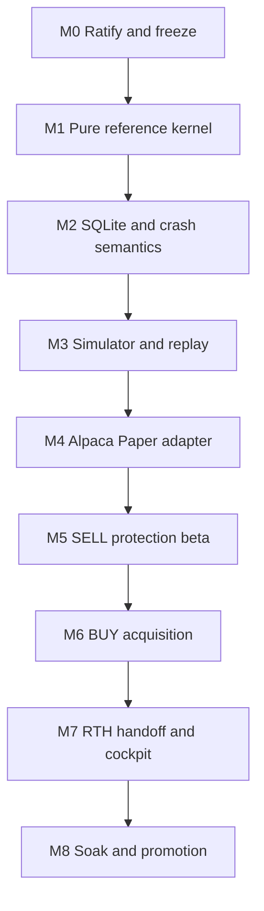

# Revised roadmap

The roadmap is a dependency graph, not a date promise. A milestone advances only when its
behavioral gate passes; a green test count alone is not advancement.

## Milestone sequence

No milestone is allowed to pull forward a later feature because the files happen to be nearby.

## M0 — Ratify, freeze, and create the reset lane

Deliver:

- one accepted superseding ADR set;
- frozen master/R6 evidence SHAs;
- new reset branch from master;
- current packet copied into the canonical planning record;
- old implementation explicitly read-only;
- no production behavior change.

Gate:

- one human response approves the exact unchanged R1 manifest/archive digests using the procedure
  in `10-ratification.md`. An edit is not approval: it returns the packet to planning, focused
  review, manifest regeneration, and archive rehash;
- architecture and fresh-database decisions are recorded;
- the cross-generation cutover/rollback contract names both generations and makes old-build broker
  rollback illegal after the first reset effect or execution fact, absent a separately reviewed
  flat/no-open-order re-cutover. It also requires exhaustive closure of every prior-generation
  claimed/in-flight/outcome-unknown occurrence through post-disable overlapping broker coverage,
  so a latent old submit cannot surface after activation. The external fence also names exact
  Alpaca/Paper/account/base origins and recognized credential fingerprint, and rejects any live
  endpoint/credential (`AR-03` -> `PA-03`); M0 records this fence but activates neither generation;
- the runtime baseline preserves operator-ratified D-7(a): Python 3.11 and 3.12 are supported,
  Python 3.12 remains the development default, and production code may not require 3.12-only
  syntax. Before `RESET-WO-01` activation, the reset branch must carry the Python 3.11 syntax gate
  and pass both 3.11 and 3.12 CI legs. This preserves existing human authority; it does not adopt
  R6 implementation code;
- no unresolved P0 in the design war-game.

## M1 — Pure reference kernel

Build:

- fixed-point value types;
- typed facts, commands, domain events, and broker effects;
- compact `AccountState` and `SymbolAggregate`;
- effect/outcome state machine;
- position-protection state machine, including the trigger/guard split;
- deterministic reducer;
- executable reference model and Hypothesis rule-based state machine.

Required work-order split:

1. Value/identity vocabulary and fill→position→integrity/quarantine.
2. **Venue ownership and recovery lifecycle:** venue attempts versus transport effects,
   one-to-many concrete acceptances, ADR-012 human-fill/release separation, and unknown outcomes.
3. Trading modes, manual controls, request budgets, and symbol-wide admission/final-claim
   authority.
4. Position protection and hybrid trailing.
5. Acquisition integration and cross-side preemption.

Exclude:

- SQLite;
- broker SDK;
- FastAPI/Streamlit;
- live loops;
- RTH handoff implementation;
- predictive liquidity logic.

Core properties:

- duplicate fills are economic no-ops;
- raw position changes only through first-occurrence canonical execution facts; `TRADE_CORRECT`
  and `TRADE_BUST` are immutable, predecessor-linked revisions of a broker-authoritative `FILL`,
  never an in-place rewrite or free-standing position authority. Overlap with human-attested
  cumulative evidence remains reconciliation-required. Each revision substitutes its root head
  at the original root sequence and applies the old-to-new ordered average-cost fold delta
  (`AR-04` -> `PA-04`);
- a valid non-tail correction immediately adds the canonical fact and exact raw-quantity delta,
  makes basis unavailable under `BASIS_RECONCILIATION_PENDING`, commits
  cancellation/reconciliation intent for every potentially live exposure-increasing BUY and newly
  oversized SELL, and forces every positive long residual into restricted `HARD_BAIL`; actual broker
  outcomes remain occurrence-tracked, the ordinary uncertainty gate still blocks a replacement
  SELL, and only a slow snapshot derivation plus high-water revalidation may restore basis/formula
  authority;
- no non-execution fact changes quantity; acknowledgements and status are quantity-neutral;
- broker-authoritative overfills may make raw quantity negative and must set permanent
  `OVERFILL_QUARANTINE`; authorized residual never goes below zero;
- no new attempt while any outcome may be live/unknown;
- every concrete acceptance for one effect retains independent ownership;
- terminalizing one discovered venue leg does not close its request occurrence; successor work
  remains blocked until every known leg is terminal/released and a coverage-backed,
  canonical `broker_effects.acceptance_set_state=CLOSED` proves that no latent second acceptance remains
  (`AR-02` -> `PA-02`). `broker_effects` is the sole persisted authority; a
  `NEVER_DISPATCHED` proof additionally requires a locally canceled effect with no immutable
  `broker_effect_claims` row. A late acceptance preserves the proof and moves only to permanently
  non-releasable `INVALIDATED`;
- every creating client identity is nonempty, unique to the application-generation/Paper account,
  and generation-bound; every venue owner is composite-key-bound to exact effect/account/symbol/
  occurrence/client/economic scope;
- terminal venue legs leave bounded checkpoint state only after an immutable closure-ledger fact;
  one ordinal-1 root and same-owner immediate-predecessor ordinals make the greatest ordinal the
  unique head. The checkpoint retains active/unresolved legs and restart proves closure from that
  ledger rather than forgetting or forking history (`AR-05` -> `PA-05`);
- operator release is non-economic and requires exact cumulative leg-fill parity;
- later broker evidence cannot double-count an attested cumulative interval;
- `HARD_BAIL` is sticky until flat;
- trail never decreases;
- a hard-bail SELL candidate may be below the trigger but not outside its independent guard;
- trigger corroboration consumes distinct, deduplicated, strictly advancing occurrences; duplicate
  delivery of one quote cannot satisfy two-observation evidence (`AR-06` -> `PA-06`);
- hard-bail authority retains the immutable versioned formula/rule and fill-derived inputs beside
  the mutable armed trigger; recomputation may tighten but never loosen that armed value
  (`AR-07` -> `PA-06`);
- hard-bail and favorable-activation formulas use exact arithmetic followed by the specified
  upward valid-tick conversion; an incompatible/non-representable tick refuses formula authority,
  never an authoritative broker execution fact;
- BUY-resolution waiting is orthogonal to policy: `EXIT_WAITING_BUY_RESOLUTION(policy_state)`
  retains `EXIT_NORMAL` versus `HARD_BAIL` and cannot promote normal exit without hard-bail
  evidence; it also cannot release while the parent occurrence acceptance set is `OPEN` or
  `INVALIDATED`
  (`AR-08` -> `PA-06`);
- a correlated late BUY fill after `FLAT` applies its economic delta and re-enters a protected
  `HARD_BAIL`/critical state rather than leaving nonzero quantity unprotected (`AR-09` -> `PA-06`);
- optional UI/analytics failure cannot mutate protection state.

Gate:

- example scenarios plus generated histories;
- named state-machine tests reproduce `AR-02` and `AR-04` through `AR-09` in
  `07-war-game.md` and fail when any paired `PA-02`/`PA-04`/`PA-05`/`PA-06` rule is mutated away;
- the AR-04 oracle covers an interleaved SELL and rejects naive post-hoc basis subtraction;
- formula examples kill downward hard-bail rounding and premature activation rounding;
- a broker fact exposing incompatible tick/scale still mutates economics exactly while formula
  authority remains unavailable;
- composed pending-basis histories cover kill/no-grant, `OPEN`/`INVALIDATED` BUY ownership, and
  manual-flatten final-claim gates;
- a named restart property covers human-attested cumulative fill followed by matching and
  mismatching broker-authoritative evidence;
- every mutant in the above properties is killed;
- no I/O in the domain package;
- no duplicated transition logic in tests.

Expected size: five bounded work orders, not one broad “engine” ticket.

## M2 — SQLite and crash semantics

Build:

- exact approved schema;
- one SQLite unit of work;
- immutable predecessor-linked `FILL`/`TRADE_CORRECT`/`TRADE_BUST` execution facts;
- checkpoint/inbox/execution-fact/venue-owner/outbox/immutable-dispatch-claim/decision-receipt
  transaction;
- occurrence-level `acceptance_set_state=OPEN|CLOSED|INVALIDATED`, immutable closure proof, and
  append-once invalidation evidence stored canonically in `broker_effects`, not duplicated in the
  checkpoint;
- durable `RECONCILIATION_PENDING` inbox state with full normalized payload, an already-canonical
  correction/bust and raw-quantity delta, unavailable basis, and high-water-checked restoration;
- active/unresolved venue legs in the bounded checkpoint plus an immutable terminal-leg closure
  ledger with one root and a non-branching same-owner ordinal chain;
- pre-call immutable `broker_effect_claims` insert followed by the effect-state edge;
- startup conversion of stranded claims to `OUTCOME_UNKNOWN`;
- schema and state integrity checks;
- process-lifetime single-owner lock and fail-closed takeover;
- `BOOTSTRAPPING -> RECONCILING -> SERVING` dispatch fence;
- commit/publication-unknown halt/reload behavior;
- one outbound request arbiter with committed priority/sequence and reserved emergency capacity.
- generation-bound broker-visible creating identities and a durable application-generation/
  Alpaca/Paper/account/origin/credential-fingerprint fence carried through startup, final claims,
  effects, and execution facts so cross-generation rollback or live-endpoint substitution cannot
  create another broker authority.

Fault points:

- before/after input claim;
- after fill insert;
- after checkpoint write;
- after outbox insert;
- before/after commit;
- after successful commit but before cache publication/wakeup;
- after dispatch claim but before call;
- after broker acceptance but before local acknowledgement.

Gate:

- every fault yields old-complete or new-complete durable state, never a hybrid;
- correction/bust restart and reordered-duplicate histories reproduce one predecessor-linked
  ordered effective-root result with no in-place rewrite or naive post-hoc basis subtraction
  (`AR-04` / `PA-04`);
- a fact racing slow-path basis reconstruction invalidates only the stale basis candidate; all
  canonical quantity facts remain applied and restricted protection remains in force;
- correction/bust quantity shrink with a live SELL immediately commits cancellation/reconciliation
  intent for any oversized remainder; every positive residual while basis is pending—including
  after a shrink or growth—remains restricted `HARD_BAIL`, while a new basis-independent reduction
  remains subject to the ordinary potentially-live-work gate rather than bypassing venue
  uncertainty;
- no restart path blindly resends a claimed effect;
- a second process cannot become a writer or dispatcher;
- stale `REQUESTED` effects cannot dispatch before serving/parity;
- one effect may retain and independently close multiple concrete broker acceptances;
- closing one terminal leg cannot set `broker_effects.acceptance_set_state=CLOSED` while a latent/known sibling can
  still execute, and compaction/restart retains the immutable closure proof without unbounding the
  checkpoint (`AR-02`, `AR-05` / `PA-02`, `PA-05`);
- once a dispatch claim commits, `NEVER_DISPATCHED` cannot be manufactured by changing effect
  state or clearing a timestamp; the immutable claim row remains and the occurrence stays blocked;
- a late acceptance after `CLOSED` retains the proof, appends invalidation evidence, and becomes
  non-releasable `INVALIDATED`; no in-generation re-close exists;
- null/duplicate/cross-generation creating-client identities and owner account/symbol/occurrence/
  scope substitutions are refused;
- duplicate ordinal-1 closures, ordinal gaps, cross-owner predecessors, and closure branches are
  refused; indexed greatest-ordinal lookup yields exactly one head per terminal owner;
- an in-memory or checkpoint-shaped acceptance value cannot override the canonical effect row;
  any mismatch prevents `SERVING`;
- after the first reset effect or execution fact, an old build cannot reacquire broker authority;
  return to it requires a reviewed flat/no-open-order re-cutover plus exhaustive closure of every
  prior-generation occurrence through post-disable coverage (`AR-03` / `PA-03`);
- a legacy submit that timed out before disable and appears only after a lagging flat/no-open
  report keeps the reset fence in `RECONCILIATION_ONLY`; no mutating grant exists until its exact
  occurrence and the post-disable interval are closed;
- a live endpoint/credential, different Paper account, or any supervisor-fence field mismatch
  refuses startup broker I/O and final effect claim;
- malformed historical decision receipts cannot change current state; inability to write the
  mandatory receipt rolls back the whole transition and emits no broker effect;
- history length has no material effect on serving fast-transition or normal-startup latency.
  Non-tail correction reconstruction and the full ordered-root/hash audit are measured separately,
  remain non-serving, and cannot emit a broker effect.

Expected size: two or three work orders.

## M3 — Scripted broker and semantic replay

Build:

- deterministic broker simulator;
- normalized input tape;
- virtual clock;
- semantic trace comparator;
- permanent shrunk regression corpus.

Minimum scenario histories:

1. Partial fill → cancel request → late fill → terminal cancel.
2. Submit timeout where the order landed.
3. Submit timeout where the order never landed.
4. Cancel timeout with a fill during ambiguity.
5. Trail trigger → normal exit → hard-bail escalation.
6. Crash at every durable/network boundary and recover.
7. Stale/crossed/phantom data near each trigger.
8. Position mismatch and external order on startup.
9. Every review-amendment counterexample `AR-02` through `AR-09` in
   `07-war-game.md#reset-packet-r1-review-amendment-counterexamples`.

Gate:

- same inputs/configuration produce the same state/effect trace;
- each named AR/PA history fails under its stated mutant and passes under the accepted disposition;
- the simulator never directly mutates engine state;
- every scenario asserts capital invariants at every step.

Expected size: two work orders.

## M4 — Alpaca Paper adapter and reconciliation

Build:

- adapt, do not blindly transplant, applicable current Alpaca code;
- formal capability profile;
- market/order/fill normalization;
- deterministic identity correlation;
- startup and reconnect reports;
- targeted query and complete execution-fact recovery coverage contract;
- adapter test matrix derived from Nautilus/LEAN patterns;
- blocking SDK calls off the event loop.

Sequence:

1. Offline contract tests.
2. Read-only paper account/report tests.
3. Tiny paper submit/cancel/fill tests.
4. Disconnect/restart/ambiguity tests.

Human gate:

- one explicit approval before credentials or outbound Alpaca Paper calls.

Gate:

- adapter results match the kernel vocabulary;
- adapter startup and final claim verify exact Alpaca Paper REST/stream origins, account, mode,
  generation, and recognized credential fingerprint; live/mismatched values perform no broker I/O;
- creating client identities are nonempty, broker-visible, unique in the generation/Paper account,
  and generation-bound; null/duplicate/cross-generation collision cases remain non-serving;
- adapter normalization emits immutable predecessor-linked corrections/busts rather than rewriting
  prior fills (`AR-04` / `PA-04`);
- request-rate limits and extended-hours combinations are measured, not assumed;
- cursor/overlap/pagination tests prove every fill across disconnect, crash, and queue overflow or
  keep the engine non-serving;
- targeted query plus paginated order/execution coverage is the only adapter evidence allowed to
  close an occurrence-level acceptance set; one terminal order is insufficient (`AR-02` /
  `PA-02`);
- one account-wide arbiter preserves measured request capacity for cancel/query/reconciliation
  over entry/reprice;
- paper reconnect does not create a duplicate effect;
- broker position mismatch blocks new exposure.

Expected size: two or three work orders plus soak time.

## M5 — SELL protection simulator and live-shadow

Build:

- event-driven market cache;
- incremental bars/ATR/high-watermark;
- trigger corroboration;
- hybrid trail;
- liquidity-aware SELL stages;
- hard-bail escalation;
- data/broker degraded-state precedence;
- minimal protection cockpit and alerts.

Start with:

- top-of-book data and conservative fixed child cap;
- local emulation for the whole controlled test session;
- one account and a very small symbol count;
- simulated owned fills and read-only/live-shadow Alpaca data.

Depth-aware sizing remains advisory until feed quality is certified.

Gate:

- no 15-second polling dependency;
- local performance budgets pass on the deployment machine;
- fault-injected simulator scenarios pass;
- duplicate-trigger replay, formula-derived hard bail, orthogonal `EXIT_NORMAL` versus
  `HARD_BAIL` BUY-resolution waiting, and `FLAT` late-fill recovery pass the named
  `AR-06` through `AR-09` counterexamples (`PA-06`);
- protection continues while UI, recorder, analytics, or strategy tasks are deliberately crashed;
- live-shadow decisions are reproducible and create no broker effect.

Expected size: three or four work orders plus soak time.

## M6 — BUY acquisition and end-to-end Alpaca Paper

Build:

- operator-approved acquisition mandate;
- side-symmetric executor use;
- max price/notional/quantity/deadline;
- partial-fill protection activation;
- BUY cancel/reconcile on protection trigger;
- exit priority and same-symbol ownership rules.

Gate:

- BUY can never bypass manual approval;
- first fill arms protection in the same sequenced state history;
- a late BUY cannot silently reopen after an emergency exit;
- no market-order fallback outside RTH.
- attended Alpaca Paper BUY→protect→SELL histories have zero unresolved order/position divergence.

Expected size: two work orders.

## M7 — RTH/native handoff and cockpit

Build:

- explicit local/native protection ownership;
- bounded handoff state machine;
- broker-native order capability tests;
- consolidated operator health view.

Do not build:

- Signal Seat or any producer endpoint;
- R6 quarantine epochs;
- public ingress.

Human gate:

- explicit approval of handoff/replace semantics after paper traces exist.

Gate:

- no double SELL;
- every handoff gap is measured and alarmed;
- optional UI/analytics failure cannot delay protection.

Expected size: three work orders.

## M8 — Soak and promotion

Promotion ladder:

1. Deterministic replay.
2. Fault-injected simulator.
3. Alpaca Paper attended.
4. Alpaca Paper unattended with alert acknowledgement.
5. Live shadow.

`LIVE_MICRO` and beyond require a separate plan, current broker/regulatory verification, explicit
human approval, and an operations review. They are not authorized by this roadmap.

Demote automatically on:

- duplicate venue attempts;
- unexplained quantity divergence;
- unresolved broker ambiguity past the runbook threshold;
- missed critical alert;
- protection task death;
- non-reconstructible decision;
- startup that cannot establish order/position parity.

## Complexity budget

- One production persistence adapter.
- One reducer.
- One account writer.
- No new runtime language.
- No module over roughly 800 lines without a split review.
- No work order introduces more than one new durable stateful concept.
- No milestone begins with an unresolved P0/P1 from its dependency.
- No optional feature may become a startup dependency of protection.

The likely calendar cost is driven more by broker-paper soak and adversarial review than by
typing code. AI can build the bounded modules; the plan intentionally avoids a large freelancer
engagement at this stage.
