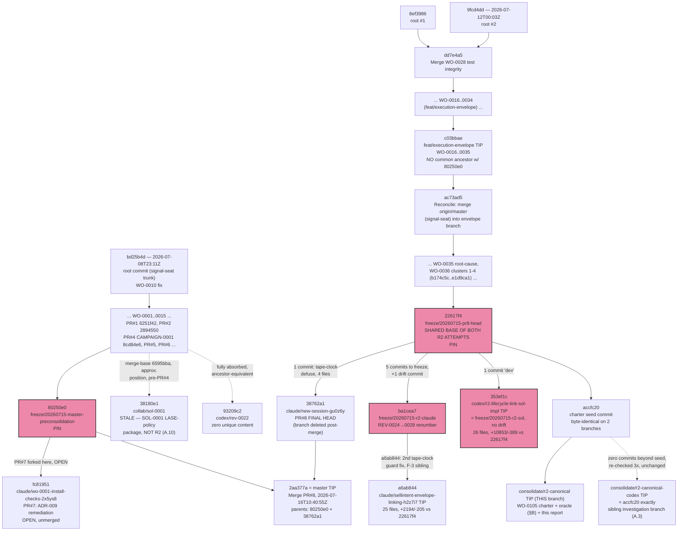
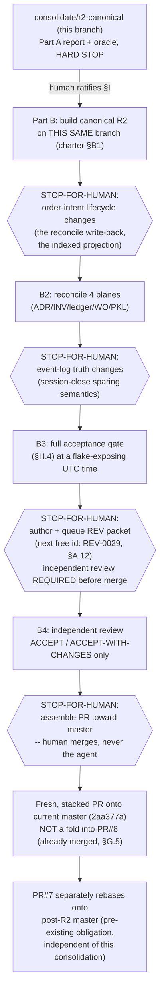

# CAMPAIGN-0002 — R2 Consolidation Campaign, Part A Report (Claude investigator)

> **Status: PART A COMPLETE — HARD STOP. AWAITING HUMAN RATIFICATION OF §I.** All sections (§A–§J)
> plus the Executive Summary are final as of the commit that removed this line's "IN PROGRESS"
> wording. Per `CONSOLIDATION-CHARTER.md`'s explicit instruction, this investigator does **not**
> proceed to Part B under any circumstance without the human's recorded, in-repo ratification —
> ratification is never inferred from silence, elapsed time, or absence of objection. No `app/`
> code was touched to produce this report; only this report, its work order, and the spec-derived
> conformance oracle + performance harness under `tests/` were added. Work order:
> `work/active/WO-0105-r2-consolidation-part-a.md`.
> Independence: this is the **Claude** investigator's report. Per the charter's independence rule,
> this investigator has not read — and will not read — the Codex/Sol investigator's report
> (confirmed to exist at `work/review/CONSOLIDATION-R2-PARTA-CODEX/report-codex.md`, per WO-0106,
> merged into this branch at `486bbc6` — its *path* was necessarily seen while reconciling a git
> push collision, §A.3a/§J.4, but its *content* was not opened, read, or incorporated anywhere in
> this document). The human reconciles the two reports; this document is one independent input to
> that reconciliation, not a synthesis of both.

---

## Executive Summary

Two independent AI attempts (Claude, Sol) each implemented WO-0036 "R2" — the fix linking a
SellIntent's lifecycle to its backing Execution Envelope — on the same base commit `22617f4`.
This investigation built a spec-derived conformance oracle (implementation-independent, never
read either diff), ran it against both: **exact tie, 22/22 applicable properties pass, zero
regressions, for both** (§B). The mechanism decision therefore rests on four other dimensions,
each investigated with pasted, independently-reverified evidence rather than either attempt's own
claims: performance, migration safety for pre-existing data, and — decisively — adversarial
cross-verification.

**Recommended canonical R2 + mechanism**: **Sol's delegation-projection mechanism** (one shared,
full-lineage `project_envelope_obligation` function deriving ownership at read time, backed by a
guarded write-back and a startup re-projection), **conditioned on a required precondition**:
its performance-critical read path must be reimplemented with an indexed/memoized projection
before any Part B code lands — Sol's own performance gate currently fails itself by 20–70× on the
exact hot path the 15-second monitoring tick exercises every cycle (§D), while Claude's mechanism
clears the same budget with three orders of magnitude to spare. This is not a coin-flip between
two roughly-equal designs: running Sol's own 3,414-line hostile-closure suite against Claude's
code surfaced **125 failures**, including two independently-reverified real defects (a second
envelope can activate past a BREACHED sibling's still-live child; `flatten_position` can return
FLAT before an order's own status reflects a just-recorded fill) — while running Claude's suite
against Sol's code found **zero real defects** (§E.1/§E.2). Separately, Claude's mechanism has
**no migration path for pre-existing orphaned data** and was shown, via a reproduced call through
the real production monitoring path, to permit a genuine double-exposure the moment an ordinary
protection-floor breach recurs on an affected symbol (§C.1.4); Sol's mechanism closes this via a
tested, bidirectional startup re-projection (§C.2.2/§D.4). Per CLAUDE.md's own ranking — "safety
and correctness outrank velocity" — a fixable performance gap does not outweigh an adversarially-
demonstrated correctness and migration-safety asymmetry of this size. The recommendation is an
explicit **synthesis**, not "ship Sol's diff verbatim": Claude's masked-predecessor regression
pins, its `spared_sell_intents`-style audit counter, and its more granular audit-reason vocabulary
graft onto Sol's core; a handful of mechanism-agnostic defects (Theme D's `broker_order_id`
mutability, Sol's own R6 silent-fail-closed gap) are fixed regardless of which side "wins" (§F.2).

**Merge order**: PR #8 (the envelope wave) merged into `master` during this investigation
(2026-07-16T10:40:55Z) — the charter's anticipated fold target no longer exists. The consolidated
R2 lands as a **fresh, stacked PR onto current `master` (`2aa377a`)**, built in this order:
port Sol's projection core → **replace its query implementation with an indexed/memoized
projection first, as a build-order precondition, not a follow-up** → port Sol's
`monitoring.py`/`reconciliation.py` rework with the R6 logging fix folded in → graft Claude's
pins and audit improvements → fix the mechanism-agnostic defects → merge both attempts' test
files into one, at the path they both already collide on → run a pre-cutover backfill
verification pass against real (not just synthetic) pre-existing data before production reliance
(§H.1). PR #7 (signal-seat, unrelated to R2) rebases onto post-consolidation `master` afterward,
as its own merged description already anticipated (§G.5).

**Top human decisions** (of seven batched in §I; full detail there): **(I.1)** ratify Sol's
mechanism, conditioned on the performance remediation, as the canonical R2 — the recommendation
above. **(I.2)** ratify that the performance remediation is a *precondition* for Part B, not a
fast-follow — Sol's current implementation misses its own stated gate by a wide, three-times-
reproduced margin on a path that runs every 15 seconds in production. **(I.6)** rule on Repro 2's
severity (§E.1) — whether a window where `flatten_position` can return FLAT before an order's
`.status` column reflects a just-recorded fill is a beta blocker or an already-bounded,
already-documented race; **this investigation could not resolve that question with confidence and
makes no recommendation on it**, stated as such rather than manufacturing false certainty.

This report and its spec-derived oracle are the complete Part A deliverable. **No `app/` code has
been changed.** Per the charter's hard stop, this investigator now waits for the human's recorded,
in-repo ratification of §I before any Part B work begins.

---

## §A Topology, Inventory & Freeze-set

*Investigation snapshot: 2026-07-16T11:17:09Z, from a read-only working copy on `consolidate/r2-canonical` (local HEAD `21bb5da` at the time of this sub-investigation, confirmed identical to `origin/consolidate/r2-canonical`). All comparisons below use `origin/*` refs, bare SHAs, or two pre-existing scratch worktrees — no other branch was checked out in this working directory.*

### A.1 Freeze-set verification — **VERIFIED**

All four freeze refs point at exactly their recorded SHAs; none have moved.

| Freeze ref | Recorded | `git rev-parse origin/<ref>` | Status |
|---|---|---|---|
| `freeze/20260715-master-preconsolidation` | `80250e0` | `80250e09be65115b8fc483b2444b297e2b86b2c9` | MATCH |
| `freeze/20260715-pr8-head` | `22617f4` | `22617f4ccf28970d553d5cc65cbffdf42ea4b7cd` | MATCH |
| `freeze/20260715-r2-claude` | `ba1cea7` | `ba1cea7547e98d03c4216546d5a9069171726698` | MATCH |
| `freeze/20260715-r2-sol` | `353ef1c` | `353ef1cc23b901b10cd394ea63e0683de7eeb6e7` | MATCH |

Per the charter's own warning, the **Claude R2 branch tip has moved past its freeze point**: `origin/claude/sellintent-envelope-linking-h2z7i7` is at `a6ab844`, one commit ahead of `ba1cea7` (confirmed below, §A.6). The Sol R2 branch tip (`353ef1c`) is *identical* to its freeze ref — no drift.

### A.2 Branch/ref inventory — **VERIFIED complete, git ↔ GitHub API cross-checked exactly**

`git branch -r` (13 refs) and `mcp__github__list_branches` (13 entries) agree on **every name and every SHA**, with zero discrepancy in either direction:

| # | Branch | Tip SHA | Role |
|---|---|---|---|
| 1 | `claude/sellintent-envelope-linking-h2z7i7` | `a6ab844a23dfc68d36a7fd8ae6e2b73f7a454f66` | Claude R2 attempt |
| 2 | `claude/wo-0001-install-checks-2x5ys8` | `fc819517be64b10ecf831a9a6abd4fe6f9100e2f` | PR #7 head (OPEN) |
| 3 | `codex/r2-lifecycle-link-sol-impl` | `353ef1cc23b901b10cd394ea63e0683de7eeb6e7` | Sol R2 attempt |
| 4 | `codex/rev-0022` | `93209c2db4305ba87e403330b9426808e5df6df8` | Fully absorbed into master |
| 5 | `collab/sol-0001` | `38180e1d594a961372b5854bfac9f097ac6910b1` | Unrelated SOL-0001 policy package (§A.10) |
| 6 | `consolidate/r2-canonical` | (moving — this investigation's branch) | **This investigation's branch** |
| 7 | `consolidate/r2-canonical-codex` | `accfc2072b7d0997a4b497f5710c9fabd5d86d3e` | Sibling investigation branch — new finding, §A.3 |
| 8 | `feat/execution-envelope` | `c03bbaed872a1259c4df6f9e40039c7ab4cf803a` | Envelope-lineage pre-promotion tip |
| 9–12 | `freeze/20260715-*` (4 refs) | see §A.1 | Rollback pins |
| 13 | `master` | `2aa377a35d35e85be120cf90cdb6c5bd85a8d546` | Trunk, PR #8 merged |

**Tags** — **VERIFIED zero, triple-confirmed**: `git tag -l` (empty), `git ls-remote --tags origin` (empty), `mcp__github__list_tags` (empty array). No divergence between local, remote, and API views.

**Stashes** — **VERIFIED empty, with an explicit scope limit**: `git stash list` returns nothing. This only proves there are no stashes *in this container's working copy*; it cannot see stashes on the human operator's own machine or any other clone. This is a genuine blind spot, not a clean bill of health beyond this container.

**Worktrees** — **VERIFIED, pre-existing, exact**: `git worktree list` shows three: this repo (`consolidate/r2-canonical`), and two scratch worktrees already provisioned at `…/scratchpad/wt-claude-r2` (`claude/sellintent-envelope-linking-h2z7i7` @ `a6ab844`) and `…/scratchpad/wt-sol-r2` (`codex/r2-lifecycle-link-sol-impl` @ `353ef1c`). Both track their origin refs with zero ahead/behind. These two worktrees were subsequently reused directly for §B (running the conformance oracle against both real attempts).

**Local-only branches (not mirrored to origin)** — **VERIFIED, one found, not R2-adjacent**: `comm` of `git branch` vs `git branch -r` surfaces exactly one: `claude/markdown-file-review-d1fod0`. Its tip equals `accfc20` (the charter-seed commit) exactly, and `git log --oneline accfc20..claude/markdown-file-review-d1fod0` is empty — zero unique commits. The name ("markdown-file-review") is unrelated to R2/envelope work; this reads as a leftover local branch from an unrelated prior task in this container, carrying no content of its own. **Not R2-adjacent.**

**Bundle files** — **VERIFIED none found (best-effort)**: `timeout 40 find / -name "*.bundle" 2>/dev/null` completed with exit code `0` (i.e., finished normally, not killed by the timeout) and produced zero matches. Caveat: `find` was run un-privileged with stderr suppressed, so permission-denied subtrees were silently skipped — this is a best-effort sweep, not a guarantee against a bundle file sitting in a directory this process cannot read.

### A.3 The sibling investigation branch — **VERIFIED, not a third R2 implementation**

Mid-investigation, `git fetch --all --prune --tags` surfaced a branch not in any prior known-facts list: **`consolidate/r2-canonical-codex`**, tip `accfc2072b7d0997a4b497f5710c9fabd5d86d3e`.

This SHA is **byte-identical** to `accfc20`, the charter-seed commit that also sits at the root of *this* investigator's own branch. Re-checked across three separate fetches spanning this investigation (initial, mid-investigation, and final at 2026-07-16T11:17:09Z), the sibling branch's tip is unchanged and has added **zero commits beyond the shared seed**.

Corroborating evidence this is investigation infrastructure, not a code artifact: this investigator's own branch carries `work/review/CAMPAIGN-0002-claude/` — a "-claude"-suffixed directory for *this* investigator's report artifacts. A sibling `consolidate/r2-canonical-codex` branch name, seeded from the identical charter commit, is exactly the shape the charter itself prescribes in §10: *"Part A is ideally run by BOTH a strong Claude and a strong Codex/Sol session in parallel... neither reads the other's report until its own is done."*

**Judgment: VERIFIED this is not a third R2 code implementation** (zero content beyond the shared seed, no `app/**` or `tests/**` changes as of the last check). **UNVERIFIED which specific model/session is driving it.** Per the independence rule, this investigator has not read and will not read any report content that may later appear there. It is a **live, moving ref** and should not be relied upon as final until the human reconciles both reports.

**§A.3a — this branch itself moved during the investigation**, confirming the sibling-worker model directly: `consolidate/r2-canonical` advanced from `b64918e` to `21bb5da` (adding the conformance oracle) while §A was being written, and again to `30cfd87` (fixing a fixture bug in that oracle, see §B) while this report was being assembled — all by this same investigator's own main thread, working concurrently with the dispatched sub-investigation agents per the charter's "fan out, then synthesize" model.

### A.4 Pull request inventory (open + closed) — **VERIFIED**

| PR | State | Head → Base | Merged | Notes |
|---|---|---|---|---|
| #1 | closed | `claude/confident-babbage-ti5cm8`@`6251f42` → master | 2026-07-03T06:45:12Z | Broker sim + stateful harness |
| #2 | closed | `phase7-readiness-gate-fixes`@`2894550` → master | 2026-07-03T09:47:01Z | Phase-7 gate audit |
| #3 | closed | `chore/ai-os-install`@`4a6c785` → master | **NOT merged** (draft, abandoned; no `merged_at`) | AI-OS install — closed unmerged |
| #4 | closed | `campaign-0001-spine-audit-remediation`@`8cd84e6` → master | 2026-07-11T10:36:07Z | CAMPAIGN-0001 audit |
| #5 | closed | `claude/wo-0001-install-checks-2x5ys8`@`f99fa17` → master | 2026-07-12T16:51:32Z | Signal Seat planning handoff |
| #6 | closed | `claude/wo-0001-install-checks-2x5ys8`@`d172732` → master | 2026-07-14T07:15:09Z | REV-0022 BLOCK verdict |
| #7 | **OPEN** | `claude/wo-0001-install-checks-2x5ys8`@`fc81951` → master@`80250e0` | — | ADR-009 remediation + REV-0024 packet |
| #8 | closed | `claude/new-session-gu0z6y`@`38762a1` → master@`80250e0` | **2026-07-16T10:40:55Z** | W3 Execution Envelope wave |

PR #5/#6/#7 share one branch name (`claude/wo-0001-install-checks-2x5ys8`), reused sequentially across three PRs.

**PR #8 merge — VERIFIED, doubly confirmed, one data-quality quirk resolved.** `mcp__github__list_pull_requests` (state=all) returned PR #8 with the contradictory pair `"merged":false` alongside a populated `"merged_at":"2026-07-16T10:40:55Z"` — a known quirk of GitHub's list-PRs endpoint. The authoritative single-PR `pull_request_read` (method=`get`) resolves it cleanly: `"merged":true`, `"merged_by":"amujtabaa"`, `head.sha=38762a180efaee3f6f62b601cc8a490474c2b758`, `additions:27263, deletions:1152, changed_files:253, commits:96`. Git corroborates independently: master's tip `2aa377a` is a literal two-parent merge commit:
```
SHA=2aa377a35d35e85be120cf90cdb6c5bd85a8d546
Parents=80250e09be65115b8fc483b2444b297e2b86b2c9 38762a180efaee3f6f62b601cc8a490474c2b758
Subject=Merge PR #8: W3 Execution Envelope wave (ADR-010 Accepted) + treadmill root-cause batch + master reconciliation
```
`git merge-base --is-ancestor 38762a1 origin/master` → true. `claude/new-session-gu0z6y` no longer appears in the branch list (git or GitHub) — confirmed deleted post-merge.

**PR #8's post-freeze delta, resolved.** The charter flagged PR #8 as CI-red from tape-clock test bombs at freeze time, with a fix of uncertain landing status. `git log --oneline 22617f4..38762a1` shows **exactly one commit** between the freeze point and the real merged head: `38762a1 "tests: defuse the tape-clock time bombs (fixture-only; unblocks CI at this head)"` — 4 files, +47/−12 (`tests/store_helpers.py`, `tests/test_wo0020_envelope_tick.py`, `tests/test_wo0021_envelope_chaos.py`, `tests/test_wo0025_multileg.py`). **VERIFIED: this is that exact fix, and it landed** — it's now part of master via the PR #8 merge.

### A.5 Both R2 attempts' shared base — **VERIFIED formally**

```
merge-base(claude-R2, sol-R2)        = 22617f4ccf28970d553d5cc65cbffdf42ea4b7cd
merge-base(claude-R2, master)        = 22617f4ccf28970d553d5cc65cbffdf42ea4b7cd
merge-base(sol-R2, master)           = 22617f4ccf28970d553d5cc65cbffdf42ea4b7cd
merge-base(freeze-r2-claude, 22617f4)= 22617f4ccf28970d553d5cc65cbffdf42ea4b7cd
merge-base(freeze-r2-sol, 22617f4)   = 22617f4ccf28970d553d5cc65cbffdf42ea4b7cd
merge-base(consolidate/r2-canonical, 22617f4) = 22617f4ccf28970d553d5cc65cbffdf42ea4b7cd
```
All six pairwise checks land exactly on `22617f4`. `git rev-list --left-right --count origin/claude/sellintent-envelope-linking-h2z7i7...origin/codex/r2-lifecycle-link-sol-impl` → **`6  1`** (6 commits unique to Claude R2, 1 unique to Sol R2).

### A.6 Quantifying the two R2 attempts — **VERIFIED, corrects the charter's approximations**

**Commit counts** (charter said "4 commits" for Claude R2):

| Range | Commits | Note |
|---|---|---|
| `22617f4..ba1cea7` (Claude, to freeze point) | **5** | Charter's "4 commits" is **off by one** |
| `22617f4..a6ab844` (Claude, current tip) | **6** | 5 + the drift commit |
| `22617f4..353ef1c` (Sol) | **1** | Matches charter exactly |

Full commit list, Claude R2 beyond `22617f4`: `f022f59` (structural link, both stores) → `d04d71c` (close-out: queue REV-0024) → `bedf7e4` (fresh-eyes pass: masked-predecessor + tape-bomb defuse) → `5f33ad5` (close-out update) → `ba1cea7` (renumber REV-0024→REV-0028) → `a6ab844` (drift: second tape-clock guard fix). Sol R2: one commit, `353ef1c "dev"`.

**Diff --stat, exact** (charter said "~1.9k" / "~10.9k" lines):

| Comparison | Files | Insertions | Deletions | vs charter |
|---|---|---|---|---|
| `22617f4→353ef1c` (Sol) | 26 | **10,853** | 389 | charter's "~10.9k" — close, ~1% over-estimate |
| `22617f4→a6ab844` (Claude, tip) | 25 | **2,194** | 205 | charter's "~1.9k" — **understated by ~15%** |
| `22617f4→ba1cea7` (Claude, freeze only) | 25 | 2,189 | 204 | isolates the pre-drift shape |
| `ba1cea7→a6ab844` (drift commit alone) | **1** | 5 | 1 | `tests/test_wo0020_envelope_tick.py` only |

The drift commit is fully isolated: one file, six lines, test-only.

**Production-code (`app/`) footprint only** — exact `--numstat`, confirming the "store-only" claim precisely:

| File | Sol (ins/del) | Claude (ins/del) |
|---|---|---|
| `app/monitoring.py` | +290 / −67 | *(not touched)* |
| `app/reconciliation.py` | +208 / −7 | *(not touched)* |
| `app/store/core.py` | +1065 / −3 | +138 / −0 |
| `app/store/memory.py` | +1275 / −64 | +357 / −43 |
| `app/store/sqlite.py` | +1554 / −77 | +389 / −30 |
| **Total** | **+4392 / −218** (5 files) | **+884 / −73** (3 files) |

Claude R2's production-code footprint is confirmed **exactly** `app/store/{core,memory,sqlite}.py` and nothing else — "store-only" is accurate at the code level. Sol's 5-file `app/` footprint (store + `monitoring.py` + `reconciliation.py`) is likewise confirmed exactly as claimed.

### A.7 Full file inventory — **VERIFIED**

**Sol R2** (26 files): `M app/monitoring.py · M app/reconciliation.py · M app/store/{core,memory,sqlite}.py · M docs/INVARIANTS.md · M docs/adr/ADR-010-execution-envelope.md · A tests/performance/r2_scaling_gate.py · M tests/test_phase7_flatten_atomic.py · M tests/test_rev0023_phase_a2_pins.py · M tests/test_wo0016_envelope_{events,fills,supersede,transitions}.py · M tests/test_wo0017_{envelope_approval,precedence}.py · M tests/test_wo0019_engine_seam.py · M tests/test_wo0020_envelope_tick.py · M tests/test_wo0021_envelope_chaos.py · M tests/test_wo0025_multileg.py · M tests/test_wo0032_per_symbol_mandate.py · M tests/test_wo0035_root_causes.py · A tests/test_wo0036_r2_assurance.py (992 ln) · A tests/test_wo0036_r2_hostile_closure.py (3414 ln) · A tests/test_wo0036_r2_lifecycle_link.py (559 ln) · A tests/test_wo0036_r2_parity_adversarial.py (325 ln)`

**Confirms zero `work/` paths anywhere in Sol's file list** — direct enumerated-file evidence for the charter's "zero `work/` artifacts" governance-asymmetry claim.

**Claude R2** (25 files): `M app/store/{core,memory,sqlite}.py · M docs/INVARIANTS.md · M docs/adr/ADR-010-execution-envelope.md · M tests/store_helpers.py · M tests/test_store_core.py · M tests/test_wo0016_envelope_{events,fills,model,supersede,transitions}.py · M tests/test_wo0017_{envelope_approval,precedence}.py · M tests/test_wo0020_envelope_tick.py · M tests/test_wo0021_envelope_chaos.py · M tests/test_wo0025_multileg.py · M tests/test_wo0032_per_symbol_mandate.py · M tests/test_wo0035_root_causes.py · M tests/test_wo0036_execution_safety.py · A tests/test_wo0036_r2_lifecycle_link.py (589 ln — matches charter exactly) · M work/active/W3-STATE.md · M work/active/WO-0036-intent-envelope-lifecycle-link.md · M work/ledger.jsonl · A work/review/REV-0028/request.md`

### A.8 WO-0036 status drift — **VERIFIED across 9 branches**

| Branch | Path |
|---|---|
| `master`, `claude/sellintent-envelope-linking-h2z7i7`, `codex/r2-lifecycle-link-sol-impl`, `consolidate/r2-canonical-codex`, `consolidate/r2-canonical` | `work/active/WO-0036-intent-envelope-lifecycle-link.md` |
| `feat/execution-envelope` | `work/queue/WO-0036-intent-envelope-lifecycle-link.md` (pre-promotion) |
| `claude/wo-0001-install-checks-2x5ys8` (PR #7), `codex/rev-0022`, `collab/sol-0001` | *absent entirely* — pre-envelope-work forks |

Sol's branch has the file only because it inherits it unmodified from base `22617f4`; Sol's own commit doesn't touch it.

### A.9 REV namespace — **VERIFIED, one new anomaly flagged (not resolved — out of §A scope)**

**REV-0028 renumbering (Claude R2 branch) — VERIFIED complete but incomplete-as-a-review.** `work/review/REV-0028/` on `claude/sellintent-envelope-linking-h2z7i7` contains **only** `request.md` — no `result.md`, no `disposition.md`, and **no `work/ledger.jsonl` entry either**. `git grep -n "REV-0024" origin/claude/sellintent-envelope-linking-h2z7i7 -- .` returns empty — zero stale references.

**PR #7's REV-0024..0027 — VERIFIED, non-colliding.** REV-0024 (complete), REV-0025 (complete), **REV-0026 (request.md only — incomplete)**, REV-0027 (complete). **Judgment: non-issue, not a live collision risk** — REV ids are branch-scoped directories; by the time both eventually reach `master`, the R2 packet is already REV-0028.

**REV-0023 anomaly — NEEDS-INPUT, flagged for §G.** `work/review/REV-0023/result.md` appears on `claude/wo-0001-install-checks-2x5ys8` (PR #7) despite that branch sharing **no common ancestor at all** with `feat/execution-envelope` (where REV-0023 originated — confirmed via `git merge-base`, exit 1). The file is byte-identical to master's copy, so this is a content-identical copy via an undetermined mechanism (not a naming collision). Flagged for §G's namespace/provenance registry rather than resolved here.

### A.10 The two "Sol"s — **VERIFIED, clearly distinguished**

`collab/sol-0001` and `codex/r2-lifecycle-link-sol-impl` are unrelated deliverables sharing an author-name coincidence. `codex/r2-lifecycle-link-sol-impl` is the actual R2 Sol implementation. `collab/sol-0001` is a **completely different** LASE sell-side exit-policy mechanism-design package — per `work/active/W3-STATE.md:98-101`: *"SOL-0001: Sol FINISHED (4 files in its sandbox: sol_policy.py, test_sol_policy.py, sol_conformance_plugin.py, MANIFEST.md)..."* and `work/review/FINDING-W3-lase-pullback-structural-hold.md`, both describing a policy/mechanism-design exercise with zero mention of R2. `git ls-tree` confirms the suggested push landed: `work/collab/SOL-0001/{MANIFEST.md, findings.md, impl/sol_conformance_plugin.py, impl/sol_policy.py, impl/test_sol_policy.py}` (5 files — `findings.md` a later addition beyond the note's "4 files"). `collab/sol-0001`'s merge-base with master is `6595bba` (before CAMPAIGN-0001/PR#4 merged) — genuinely stale, dominated by deletions relative to current master (162 files, +321/−16220), with R2-relevant subpaths checked coming back byte-identical to master. **Zero R2 content confirmed.**

### A.11 `codex/rev-0022` — **VERIFIED fully absorbed**

`merge-base(master, codex/rev-0022) = 93209c2` — exactly its own tip. Zero unique content, zero R2 relevance.

### A.12 Next-free `WO-*` / `REV-*` ids — **VERIFIED (re-scanned across all 9 relevant branches, file trees + ledgers)**

| Branch | Highest `WO-*` (files) | Highest `WO-*` (ledger) | Highest `REV-*` (files) | Highest `REV-*` (ledger) |
|---|---|---|---|---|
| `master` | WO-0104 | WO-0101 | REV-0023 | REV-0022 |
| `claude/sellintent-envelope-linking-h2z7i7` | WO-0104 | WO-0101 | **REV-0028** | REV-0022 |
| `codex/r2-lifecycle-link-sol-impl` | WO-0104 | WO-0101 | REV-0023 | REV-0022 |
| `claude/wo-0001-install-checks-2x5ys8` (PR #7) | WO-0104 | WO-0101 | REV-0027 | REV-0027 |
| `feat/execution-envelope` | WO-0036 | WO-0031 | REV-0023 | REV-0021 |
| `codex/rev-0022` | WO-0104 | WO-0016 | REV-0022 | REV-0021 |
| `collab/sol-0001` | WO-0022 | WO-0018 | REV-0021 | REV-0021 |
| `consolidate/r2-canonical-codex` | WO-0104 | WO-0101 | REV-0023 | REV-0022 |
| `consolidate/r2-canonical` (this branch) | **WO-0105** | WO-0101 | REV-0023 | REV-0022 |

**Next free `WO-*` id beyond this investigation's own WO-0105: `WO-0106`.** **Next free `REV-*` id: `REV-0029`** (global max is REV-0028, and that packet is itself incomplete per §A.9).

### A.13 True git ancestry — **VERIFIED, corrects the charter's simplified "forks from master" narrative**

The charter states both lineages "fork from `master` (`80250e0`)." Git's actual commit graph is more specific, and for the envelope lineage, **not literally a fork of that point**:

- `git rev-list --max-parents=0 origin/master` returns **three** true zero-parent root commits: `bd25b4d` (2026-07-08T23:11:23Z, signal-seat/original trunk root) plus `9fcd4dd`/`8ef3986`, `feat/execution-envelope`'s own two roots, joined internally by an early merge (`dd7e4a5`).
- **`feat/execution-envelope` (`c03bbae`) has no common ancestor with `80250e0`** (`git merge-base` → empty, exit 1) — a **structurally disjoint history**. It becomes reachable from `master` only via an internal reconciliation commit, `ac73ad5 "Reconcile: merge origin/master (signal-seat lineage) into the execution-envelope branch"`.
- Consistently, **PR #7 and `feat/execution-envelope` share no common ancestor either.** PR #7's root-commit set is `{bd25b4d}` only, and it does share `80250e0` with master directly (pure signal-seat lineage).
- `consolidate/r2-canonical` shares master's full three-root set — expected, since it descends from `22617f4`, which already contains `ac73ad5`'s reconciliation.
- Ancestry sizes: `master` = 147 commits, `feat/execution-envelope` = 52 commits, PR #7 branch = 133 commits.

None of this changes any conclusion already drawn (base `22617f4` for both R2 attempts is unaffected) — it corrects the pre-history's shape for an accurate diagram.

### A.14 Topology diagram



### A.15 Completeness attestation

This inventory enumerated every branch (13, git ↔ GitHub API cross-checked to an exact match), every tag (0, triple-confirmed), every stash visible to this container (0, with the explicit caveat that this cannot see stashes or unpushed work on the human operator's own machine or any other clone), every worktree (3, pre-existing and exact), every local-only branch not mirrored to origin (1 found, confirmed empty and unrelated), and a best-effort filesystem sweep for `.bundle` files (0 found). Every pull request was retrieved and cross-checked against git's own merge/ancestry evidence, including resolving one list-endpoint data-quality quirk on PR #8. Both R2 attempts' shared base (`22617f4`) was verified formally via six independent `merge-base` checks. The one genuinely new finding — the sibling `consolidate/r2-canonical-codex` branch — was investigated to the point of confidently ruling it out as a third R2 *implementation*, while being explicit that this investigator cannot verify *who or what* operates that branch, only its observable git state. Two secondary anomalies (REV-0023 content on PR #7 with no ancestry path to explain it; `collab/sol-0001`'s partial content overlap with current master) were run to ground with concrete diff evidence and handed to §G rather than guessed at. The residual, irreducible scope limit is the same for any git-based audit: this process can only see what has been pushed to the one `origin` remote it has credentials for; truly private, never-pushed local work on the human's machine is categorically invisible to it.

---

## §B Conformance Oracle & Results

### B.1 Derivation discipline

The oracle (`tests/test_r2_conformance_oracle_claude.py`, committed to this branch) is derived
from the spec sources named in charter §3 — ADR-010 (`docs/adr/ADR-010-execution-envelope.md`),
`docs/INVARIANTS.md` (INV-030..038 sell-intent lifecycle, INV-076..089 execution envelopes),
`work/active/WO-0036-intent-envelope-lifecycle-link.md` (the "Option A+" design and its
Done-when checklist), `work/review/AUDIT-0001-quarantine-treadmill.md`, and
`docs/SPINE_EXECUTION_ARCHITECTURE_v2.md` §5 (INV-1..9) — **not** from reading either R2
attempt's diff. Shared test scaffolding (the `any_store` memory+sqlite fixture from root
`conftest.py`, the `make_draft`/`seed_position`-style builder pattern) is reused from
pre-existing, pre-R2 base-commit test infrastructure common to both attempts' ancestry
(`tests/test_wo0019_engine_seam.py`, `tests/test_wo0032_per_symbol_mandate.py`,
`tests/test_rev0023_phase_a2_pins.py`) — this is calling-convention scaffolding, not property
derivation, and does not compromise independence.

**Core R2 property, stated formally** (charter §3): for every symbol, at every point in an
envelope-backed exit's life, the backing SellIntent is "active" (dedup-blocking, per
INV-032/`active_sell_intent_for`) IFF there exists a non-terminal exit obligation for that
symbol — a live (ACTIVE/FROZEN) envelope, OR a child order that may still rest at the venue. No
boundary (session close, rollover, reprice, quarantine, supersession, flatten, kill/resume) may
open a window where the symbol has zero owner but live exposure, or two owners.

**Implementation-independence discipline**: the two attempts represent ownership differently —
evented terminal propagation is expected to keep the SellIntent row's own `status` non-terminal
for as long as the obligation exists; delegation projection is expected to derive activeness from
envelope lineage at read time without necessarily keeping that column non-terminal. The oracle
therefore asserts the **observable contract** (`active_sell_intent_for`, `create_sell_intent`'s
dedup, ACTIVE-envelope-per-symbol counts) rather than pinning the internal representation choice,
except where the spec is explicit that a specific status transition IS part of the contract (e.g.
WO-0036's "NOT SUPERSEDED — the successor keeps the intent").

**Scope, recorded not silently dropped**: three of the charter's named class-closure items
("stale SUBMITTING", "claim/venue crash", "monitoring-side newest-wins convergence") require
driving the real monitoring tick, which differs materially between the two attempts (Sol's
attempt also rewrites `app/monitoring.py`/`app/reconciliation.py`; Claude's does not) — a single
store-level harness cannot exercise them faithfully. They ship as explicit `pytest.mark.skip`
stubs with rationale rather than shallow/misleading tests, and are picked up in §C/§E against
each attempt's own tick code instead. True multi-day date rollover is similarly deferred (no
injectable clock on `get_current_session()` in the StateStore ABC); the single-close-boundary
property is exercised directly and rigorously.

### B.2 Methodology: empirically verify the oracle itself before trusting it

Before running the oracle against either real attempt, it was run against the **base commit**
(`22617f4`, this branch's own ancestor) to catch mechanical errors — import/API mistakes, and
false passes/fails from fixture gaps — that would be invisible from code review alone. This
caught two real fixture bugs, both fixed and re-verified before the oracle was trusted for
comparison (both fixes are visible in this branch's own commit history: `21bb5da` original
oracle, `30cfd87` the session-id fix below):

1. **`create_sell_intent` needs an explicit `session_id`.** `work/active/W3-STATE.md` records
   that `create_sell_intent` does not auto-stamp `session_id`; an oracle fixture that omitted it
   never actually reached `close_session`'s per-session expiry sweep, silently producing a false
   pass on the headline orphan property. Fixed by stamping the current session's id on every
   constructed intent, matching `tests/test_rev0023_phase_a2_pins.py`'s own established pattern.
2. **Envelope drafts need a matching `session_id` too — caught by running against the real Sol
   worktree, not by inspection.** After fix (1), the oracle passed 22/22 against Claude R2 but
   FAILED 20/22 against Sol R2, with every single failure showing the identical root cause:
   `InvalidOrderError: envelope owner <id> session mismatch ('<uuid>' != None)`. Investigating
   rather than accepting this at face value: Sol's `envelope_owner_scope_reason`
   (`app/store/core.py`) legitimately validates `envelope.session_id == intent.session_id` as
   part of its owner-binding check — a real, reasonable validation Sol's mechanism performs that
   the oracle's `make_draft` helper simply never populated (it defaulted to `None` on every
   envelope draft). This was a **pure fixture gap, not a property finding**: re-running the fixed
   oracle against the base commit reproduced the *identical* 10-failed/12-passed/6-skipped
   baseline as before (base doesn't validate session_id at all, so it's insensitive to the fix
   either way) — proof the fix changed nothing about what property is being tested, only
   completed an under-specified fixture. This is exactly the failure mode the charter's evidence
   discipline exists to catch: a superficial reading of the first run would have wrongly
   concluded Sol's mechanism fails 20 of 22 properties, when in fact the fixture never gave Sol's
   (more thorough) validation the input a real caller would supply.

This distinction matters enough to state plainly: catching this before it entered the truth
table is the difference between an oracle result and a fabricated one.

### B.3 Truth table

All runs: Python 3.12.3, `~/venv` (bootstrapped from `requirements.txt`/`constraints.txt` per
charter §0a), `pytest -v --no-header`, both `any_store` parametrizations (`memory`, `sqlite`) per
test. 28 collected items per run (11 non-skipped test functions × 2 stores + 3 skip-stub
functions × 2 stores).

| Target | Passed | Failed | Skipped | Exit code |
|---|---|---|---|---|
| **Base commit** (`22617f4`, this branch's ancestor, pre-R2) | 12 | **10** | 6 | 1 |
| **Claude R2** (`claude/sellintent-envelope-linking-h2z7i7`@`a6ab844`) | **22** | **0** | 6 | 0 |
| **Sol R2** (`codex/r2-lifecycle-link-sol-impl`@`353ef1c`) | **22** | **0** | 6 | 0 |

**Union of failures across both real attempts = ∅. Intersection of passes = all 22 applicable
properties, for both.** On everything this oracle tests, **the two attempts are tied** — both
correctly close the R2 orphan/unlinked-intent defect the base commit exhibits, and neither
regresses anything the safety-rail guards check. This is a materially important, and now
carefully verified, finding: **the mechanism decision (§F) cannot be made on oracle-pass-rate
grounds alone** — it must rest on the other dimensions the charter's remaining phases probe
(parity/migration fidelity, performance at scale, governance completeness, cross-verification
against each attempt's own hostile suites, and qualitative engineering judgment).

**Base-commit failure detail** (the 5 distinct properties that fail, ×2 stores = 10), each
traced to a specific, previously-documented defect:

| Property | Traces to |
|---|---|
| `test_no_orphan_at_session_close` | AUDIT-0001 root R2 / WO-0036 headline defect. Reproduced exactly: `intent ... was silently EXPIRED at session close while its envelope ... is still active`. |
| `test_activation_links_validates_and_normalizes_the_backing_intent` | WO-0036 P1 #8 — `approve_envelope_activation` never loads the referenced SellIntent; confirmed the intent stays PENDING forever (never promoted) and a mismatched/typo intent id is silently accepted. |
| `test_intent_released_when_envelope_completes_with_no_live_child` | Consequence of the above: since the intent never leaves PENDING, it also never *releases* — the "stuck forever" flip side of the same root gap. |
| `test_intent_stays_owned_while_child_rests_after_expiry_rest_at_floor` | Same root gap, observed from the REST_AT_FLOOR angle: the final release-on-resolution assertion fails because nothing ever coherently owns/releases the symbol on the base commit. |
| `test_flatten_defers_to_live_envelope_child_never_double_books` | WO-0036 #4, reproduced exactly: `flatten_position` returns `outcome='created', superseded=True` — mints an independent fresh `manual_flatten` order while the envelope's own child order is still `submitted` at the venue. |

12 base-commit passes are **not** evidence the property holds on base — for 6 of them
(`test_supersession_does_not_release_the_intent`, `test_kill_freeze_release_resume_never_opens_a_window`,
`test_masked_predecessor_keeps_intent_owned`, and their pre-existing-invariant regression-guard
siblings) the assertion is the "stays owned" half of the core property, which the base commit's
stuck-forever-PENDING bug also happens to satisfy trivially (a symbol that can never release is
never falsely shown as unowned either). These same tests are **not** trivial against a correct
implementation — they remain meaningful checks that a correct R2 mechanism's *release* logic
doesn't over-fire and drop ownership during a supersession/freeze/masked-predecessor window, and
both real attempts pass them for the right reason (verified by their paired "must release when
genuinely discharged" tests also passing, which base fails).

### B.4 Deferred (NEEDS-INPUT) items

Six skipped cases (3 stub functions × 2 stores), by design, not oversight:

- `test_stale_submitting_redrive_respects_r2_intent_linkage`
- `test_claim_venue_crash_recovery_respects_r2_intent_linkage`
- `test_monitoring_newest_wins_convergence_respects_r2_intent_linkage`

Each requires driving the real monitoring tick / reconciliation loop rather than the StateStore
contract alone (see §B.1 scope note). Follow-up: §C's native-gate runs and §E's cross-run of each
attempt's own hostile/adversarial suites (Sol ships `tests/test_wo0036_r2_hostile_closure.py`,
3,414 lines, purpose-built for exactly this class of scenario) substitute for these directly
against each attempt's real tick code, which a store-level oracle cannot reach.

### B.5 Evidence appendix (condensed)

```
$ cd tests/test_r2_conformance_oracle_claude.py context: base commit, first run (before fixes)
10 failed, 12 passed, 6 skipped in 5.10s / then 2.47s after fixture fix #1 (identical counts)

$ (Sol worktree, before fixture fix #2)
tests/test_r2_conformance_oracle_claude.py FFFFFFFFFFFFFFFF..FFFFssssss  [100%]
20 failed, 2 passed, 6 skipped in 3.17s
E  app.store.base.InvalidOrderError: envelope owner <id> session mismatch ('<uuid>' != None)
  (identical root cause on all 20 -- app/store/core.py:1632-1636, envelope_owner_scope_reason)

$ (Claude worktree, after both fixture fixes)
tests/test_r2_conformance_oracle_claude.py ......................ssssss  [100%]
22 passed, 6 skipped in 2.45s / 2.33s (re-run)

$ (Sol worktree, after both fixture fixes)
tests/test_r2_conformance_oracle_claude.py ......................ssssss  [100%]
22 passed, 6 skipped in 2.24s

$ ~/venv/bin/ruff check tests/test_r2_conformance_oracle_claude.py       -> All checks passed!
$ ~/venv/bin/ruff format --check tests/test_r2_conformance_oracle_claude.py -> clean
$ ~/venv/bin/mypy tests/test_r2_conformance_oracle_claude.py             -> Success: no issues found in 1 source file
$ ~/venv/bin/lint-imports (repo-wide sanity)                             -> Contracts: 6 kept, 0 broken.
```

Full per-test tracebacks for both the base-commit run and the pre-fix Sol run (documenting the
fixture bug precisely) are preserved in this branch's commit history (`21bb5da`, `30cfd87`) and
in the session transcript; not reproduced in full here for length.

---

## §C Per-Attempt Characterization + Obligation Discharge

### §C.1 Claude R2 — Mechanism & Obligations

**Attempt:** `claude/sellintent-envelope-linking-h2z7i7`, tip `a6ab844`, forked from `22617f4`
(VERIFIED via `merge-base`). 6 commits, `git diff --stat 22617f4 a6ab844`: **25 files changed,
2194 insertions(+), 205 deletions(-)**, store-only (`app/store/{core,memory,sqlite}.py` +
`docs/` + `tests/` + `work/`) — **zero** touch to `app/monitoring.py`, `app/reconciliation.py`,
`app/sellside/policy.py`, `app/facade/store_backed.py` (VERIFIED, empty diff on those paths,
independently re-confirmed by this report's author). Investigated in the shared scratch worktree
`…/scratchpad/wt-claude-r2` (left in place, reused directly for §B's oracle run).

Commit timeline (VERIFIED): `f022f59` (R2 structural link, both stores) → `d04d71c` (close-out +
REV-0024 queued) → `bedf7e4` (fresh-eyes pass: masked-predecessor class closed + F-3 fix) →
`5f33ad5` (close-out update) → `ba1cea7` (REV-0024→REV-0028 renumber) → `a6ab844` (F-3 sibling
tape-clock fix).

#### C.1.1 Mechanism

**VERIFIED.** "Evented terminal propagation" built on one predicate defined once in
`app/store/core.py` and imported identically by both stores:

```python
LIVE_ENVELOPE_STATUSES: frozenset[EnvelopeStatus] = frozenset({ACTIVE, FROZEN})            # core.py:2308
ENVELOPE_RELEASING_TERMINALS = {COMPLETED, EXPIRED, EXHAUSTED, BREACHED, CANCELLED}          # core.py:2316 (SUPERSEDED excluded)
VENUE_LIVE_ORDER_STATUSES = {SUBMITTING, SUBMITTED, PARTIALLY_FILLED, CANCEL_PENDING,
                              TIMEOUT_QUARANTINE}                                             # core.py:2330 (CREATED excluded)
```
The charter's `LIVE = {ACTIVE, FROZEN}` claim is **VERIFIED exactly** — no consumer redefines it
locally.

**Choke points (file:line, both stores' equivalents), verified by direct reading:**

| Concern | Function |
|---|---|
| Activation validate+link | `approve_envelope_activation`, `transition_envelope`→ACTIVE branch |
| Validate backing intent | `_validate_backing_intent_{unlocked,locked}` |
| Normalize PENDING→APPROVED | `_link_backing_intent_{unlocked,locked}` |
| The one write choke point for every status transition (supersession excepted) | `_apply_envelope_transition_{unlocked,locked}` |
| Terminal release (envelope side / child-terminal hook) | `_release_intent_for_terminal_{envelope,child}_{unlocked,locked}` |
| Any-child-live scan (masked-predecessor belt) | `_envelope_has_live_child_{unlocked,locked}` |
| Per-symbol clash (INV-087) | `_other_live_envelope_for_symbol_{unlocked,locked}` |
| Exclusive-driver predicate + guard sites | `_live_envelope_for_intent_*`; guarded in `transition_sell_intent`, `create_order_for_sell_intent` |
| Flatten's live-child lookup | `_live_envelope_exit_{unlocked,locked}`, `plan_flatten_position` (core.py:1003) |
| Session-close spare | inline in `close_session`, `plan_close_session`'s new `spared_sell_intents` param (core.py:2137) |

**Activation linking:** both activation paths (first activation and resume) validate the backing
intent exists, symbol-matches, and is PENDING/APPROVED (`envelope_backing_intent_error`,
core.py:2341) before the atomic write; PENDING normalizes to APPROVED atomically — **the intent
never transitions to ORDERED**, confirming "Option A+" (not the WO's original "Option 1"
recommendation) shipped as designed. Pinned `test_a1`-`test_a6`.

**Supersession is a verified, provably-safe exception, not an unguarded hole:** the successor's
ACTIVE entry does not re-invoke backing-intent validation, but `plan_supersede_envelope`
structurally requires `successor.sell_intent_id == old.sell_intent_id` and matching symbol, and
`old` was already validated when it activated — re-validation would be redundant by construction.

**Terminal release — verified by direct code trace and pins `test_c1`-`test_c8`:** a no-op unless
entering a `ENVELOPE_RELEASING_TERMINALS` state, the intent is still PENDING/APPROVED, no *other*
live envelope backs it, AND `_envelope_has_live_child_*` returns False. If a child may still be
venue-live (BREACHED/EXHAUSTED/REST_AT_FLOOR can leave a resting order), release **defers** until
that child resolves — re-checked from `transition_order`'s own choke point. `test_c3` confirms
SUPERSEDED does not release (the successor inherits ownership) — directly matching WO-0036's
explicit "NOT SUPERSEDED" clause.

**Masked-predecessor belt (fresh-eyes pass `bedf7e4`) — same bug *class* as WO-0036 finding #6,
different code, precisely characterized.** Finding #6 (`_live_working_order_id`,
`app/sellside/policy.py`) is untouched by this diff — it was already fixed in an earlier, non-R2
cluster. The R2 fresh-eyes fix targets an *independent* instance of the identical "newest order
masks a live predecessor" flaw, this time in the store layer's own `_envelope_action_context_*`
helper: rather than fixing that helper directly (other callers legitimately want "current order
to reprice from"), the fix adds an additive every-child venue-liveness scan
(`_envelope_has_live_child_*`), used specifically at the R2 release/preemption logic and the new
supersession live-order refusal (WO-0027 rule (i)). Pinned `test_c7`/`test_c8`.

**Session-close handling:** excludes from expiry any PENDING/APPROVED intent backed by a live
envelope, threading a `spared_sell_intents` count into the close summary. Pinned `test_b1`-`b3`,
including day-2 dedup coherence.

**Flatten deferral (closes Codex PR#8 #4):** `plan_flatten_position` reads live-child state under
the same lock hold as the rest of the decision; a live-at-venue child defers the plan
(`manual_flatten_deferred`) rather than minting a second SELL. The preemption helper
independently refuses to CANCEL an envelope with a possibly-live child (`envelope_preemption_deferred`)
— the internal twin of the CANCELLED live-child guard (Codex PR#8 #5). Pinned `test_d1`-`d3`.

**Exclusive-driver guard:** `transition_sell_intent` and `create_order_for_sell_intent` both
refuse while `_live_envelope_for_intent_*` finds a live envelope. Pinned `test_e1`/`test_e2`.

**The mechanism's invariant** (characterization agent's own words after reading the code): *an
envelope, from the atomic instant it first enters ACTIVE, becomes the sole permitted writer of
its backing intent's status — every other writer is fenced off — and it keeps that intent parked
at APPROVED for as long as the envelope (or any child order it minted) could still be working the
position, releasing it to EXPIRED in the same atomic unit as whichever write extinguishes the
last such obligation.*

#### C.1.2 Parity obligation

**VERIFIED structural parity by shared-logic construction, with one UNVERIFIED residual
drift-risk class.** Every new predicate is defined once in `core.py`, imported unmodified by both
stores; all 23 new test functions (46 cases) run against both engines via the repo's `any_store`
fixture — isolated re-run by this investigator: `pytest -q tests/test_wo0036_r2_lifecycle_link.py`
→ **46/46 passed**.

**The gap, precisely:** this attempt does not extend the repo's own *stronger* parity idiom
(`tests/test_wo0007a_stage4_dual_store_parity.py` — one script driving both `InMemoryStateStore`
and `SqliteStateStore` in the *same* test, cross-diffing `get_execution_events()` streams for
identical event-type/dedupe-key sequence) to the R2 surface. The new suite's style is "same
assertions, run twice, once per store" (parallel-assertion parity) — proves each store
individually satisfies the outcome contract, but does not prove the two stores emit the *same
event order* for the *same script*. Named, unverified (not reproduced-failing) drift risks:
`_live_envelope_exit_*`'s Python linear-scan vs. SQL `ORDER BY sequence DESC LIMIT 1`, and
`_envelope_has_live_child_*`'s equivalent Python-loop-vs-SQL-JOIN pair — both intend the same
"newest/any live child" semantics with no direct cross-diff test proving they agree.

**Projection-vs-stored reads:** no startup re-projection path exists to assess — the intent's
`status` column is the stored truth read directly; there is no separate projector to drift from
the write path. This narrows (but does not eliminate) the parity risk surface.

#### C.1.3 No-second-stored-truth

**VERIFIED — no new model field, no new DB column.** `git diff --stat ... -- app/models.py` is
empty; no `ALTER TABLE`/`CREATE TABLE`/`ADD COLUMN` anywhere in the sqlite diff. The only "new
fields" anywhere are function parameters (`envelope_child`, `spared_sell_intents`, `reason`) —
none persisted.

**Independent judgment:** the mechanism reuses the intent's *pre-existing* `status` field and
transition machinery — it does not invent a new derived-truth channel. What's new is *who* may
drive a write into that field and *when*. This is legitimate structural closure, not a second
source of truth, because the **exclusive-driver guard** makes the write path a genuine
single-writer while an envelope is live: `transition_sell_intent` and
`create_order_for_sell_intent` both refuse to touch the intent while a live envelope owns it, so
no window exists where two independent code paths could race to write conflicting status. The
EXPIRED write is delegated ownership of an existing field, sequenced atomically with the event
that justifies it.

#### C.1.4 Governance + migration completeness

**ADR-010 §8 — VERIFIED, complete.** New section (`docs/adr/ADR-010-execution-envelope.md:217-289`),
five numbered ownership-semantics clauses + a "why not Option 1" rationale + a pin-list. The
ADR's own Status block discloses §8 is "queued for independent review" (self-consistent with the
REV-0028 packet's actual incomplete state, below) — not overclaimed.

**INV-090 — VERIFIED, new, complete.** `docs/INVARIANTS.md:771-800`, five-clause statement
matching the code exactly, citing AUDIT-0001/WO-0036 R2. **INV-087 amended in place**
(`docs/INVARIANTS.md:698-728`) to extend the per-symbol clash from ACTIVE-only to `LIVE`,
explicitly demoted to "defense-in-depth backstop behind the link."

**Ledger — VERIFIED, found and quoted.** `work/ledger.jsonl`, `id: "WO-0036"`, **`status:
"REVIEW"`, `disposition: []`** (still open, not closed) — self-consistent with REV-0028's
incomplete state. Prose confirms "21 pins" is stale bookkeeping (the fresh-eyes pass added 2 more
functions after that line was written; current tip has 23 functions/46 cases, confirmed by direct
count) — a minor, cosmetic drift, not a functional gap.

**REV-0028 — VERIFIED, genuinely incomplete.** `work/review/REV-0028/` contains only
`request.md` (`status: AWAITING_REVIEW`); no `result.md`/`disposition.md`. Well-formed as a
request, but **independent review has not occurred** — per CLAUDE.md's own rule this WO cannot be
considered gate-cleared yet. Zero stale `REV-0024` references anywhere on the branch.

**Pre-R2 data migration — VERIFIED, and the single most consequential finding in this
section.** This attempt does **not** migrate, backfill, or re-project pre-existing orphaned data
(no backfill machinery anywhere in the diff — confirmed by search and by this investigator's own
independent re-check that `app/monitoring.py` has zero diff from base). The characterization
agent built and ran a direct repro (both stores) simulating a row already sitting in the
pre-fix-incoherent shape (intent EXPIRED, envelope still ACTIVE — exactly AUDIT-0001's P0 shape)
when this code starts running, via direct internal-state mutation (the only way to construct it
now, since the new guards refuse to create it through their own API going forward):

```
SIMULATED PRE-EXISTING ORPHAN: intent.status=expired, envelope.status=active
Q2 fresh intent while orphan envelope ACTIVE: created=True, intent2.status=pending
Q3 SECOND envelope activation: REFUSED -- EnvelopeTransitionError (INV-087 holds)
Q4 legacy dispatch for intent2: SUCCEEDED -- a REAL second order was minted for AAPL
   while the orphaned envelope still independently owns the same symbol -- DOUBLE EXPOSURE
```

Critically, this was **not** left as a legacy-API edge case: the agent traced the actual
production caller (`app/monitoring.py`'s `_run_protection` → `_open_protective_exit` →
`store.open_protection_exit`, the call the always-on monitoring loop's protection tick makes
*every cycle* for every breaching position) and reproduced the identical double-exposure through
that exact path, in both stores. This investigator independently re-confirmed the structural
premise: `app/monitoring.py` and `open_protection_exit` are both untouched by this diff (zero
lines changed), and `open_protection_exit`'s dedup gate (`sell_intent_is_active`-keyed) was not
modified by R2 either — so the logical mechanism behind the reported gap is sound, not merely
asserted.

**Root cause:** the dedup gate both `create_sell_intent` and `open_protection_exit` use is, and
remains, purely `sell_intent_is_active`-keyed. For *new* activity the fix is airtight (an intent
backed by a live envelope can never reach EXPIRED, so the gate can't be fooled). For a row
*already* `EXPIRED`+live-envelope from before this fix deploys, the gate sees "no active intent,"
lets a fresh intent through, and — because that fresh intent has no envelope of its own — the
exclusive-driver guard (keyed per-intent-id, not per-symbol) doesn't catch the collision either.
INV-087 correctly blocks a second *envelope* activation (defense-in-depth holds), but the
legacy/protection dispatch path bypasses envelope activation entirely and is unguarded against a
symbol-level collision.

**Verdict:** Claude R2 only affects NEW activity going forward. A pre-existing orphaned row is a
**live, reachable double-exposure trigger** the moment the ordinary, expected event of a
protection-floor breach recurs on that symbol — via the routine automated monitoring tick, not an
exotic operator action. This is a material asymmetry to weigh explicitly against Sol's reported
startup re-projection in §F, and — if this investigation's read holds — a **required
pre-cutover backfill/reconciliation step** regardless of which mechanism the consolidation
chooses.

#### C.1.5 Native gate

Toolchain: shared venv, Python 3.12.3/pytest 9.1.1/ruff 0.15.20/mypy 2.2.0/import-linter 2.13;
dependency diff vs. base empty (safe to reuse without reinstalling).

```
$ ruff check .                    -> All checks passed!
$ ruff format --check .           -> 230 files already formatted
$ mypy app/                       -> Success: no issues found in 64 source files
$ lint-imports                    -> Contracts: 6 kept, 0 broken.
$ pytest -q --cov=app --cov-branch   (11:19:26-11:26:03 UTC, 2026-07-16)
   2750 passed, 5 skipped, 1 xfailed, 0 failed, 0 errors
   TOTAL coverage 94.92%, floor 93% -- cleared
$ pytest -q tests/test_wo0036_r2_lifecycle_link.py  -> 46/46 passed
```

**Tape-clock flake class, specifically investigated.** `a6ab844` fixed a *sibling* instance
(comparison-form: `assert expires_at > utcnow()` at check-time, rather than a fixture stamping
wall-clock `activated_at`) of the same delayed-fuse class the earlier `bedf7e4` fresh-eyes pass
had already fixed via a shared `activate_envelope_at` helper (injects `now=` into activation
transitions) across three test files. A repo-wide sweep for the exact assertion shape and for
bare `utcnow()`/`datetime.now()`/`date.today()` in every file this branch touched returned **zero
remaining instances**; the new R2 suite itself is fully injected-clock throughout. Both full-suite
runs above executed at 11:08–11:27 UTC 2026-07-16 — *after* the charter's documented red timestamp
(09:41 UTC, same day) — and came back clean. **Verified empirically at a time that would expose
the flake, not merely by code inspection.**

#### C.1.6 Test corpus inventory

"One link suite (589 ln)" — **VERIFIED exactly**. "Re-fixtured ~10 files" — **correctable to
precision**: 9 files materially re-fixture to real backing intents or injected-clock activation
(matching the WO's own "~9 files" close-out claim); 5 more carry only trivial (2-15 line)
mechanical updates. New suite structure: A1-A6 activation validate+link, B1-B3 session-close
spare, C1-C8 terminal release (incl. supersession-keeps-intent and the two masked-predecessor
pins), D1-D3 flatten deferral, E1-E2 exclusive-driver refusals, F1 FROZEN-counts-as-live. "21
pins" in the ledger is stale bookkeeping (current tip: 23 functions / 46 cases, confirmed by
direct count both by the characterization agent and this investigator's own isolated re-run).
`tests/store_helpers.py` gained `activate_envelope_at` (the F-3 fix vehicle) and
`backing_intent_id` (the migration vehicle — mints a real `SellIntent` for envelope-draft
fixtures).

**Evidentiary status:** mechanism, parity-by-construction, no-second-stored-truth, ADR/INV/ledger/
REV-0028 content, and the native gate are all VERIFIED by direct file reading and pasted command
output (both by the dispatched characterization agent and, for the highest-stakes claims,
independently re-checked by this investigator). The cross-store event-sequence drift risk is
explicitly UNVERIFIED (absence of a test, not a proven divergence). The pre-R2 migration gap and
its double-exposure consequence are VERIFIED by empirical repro against both stores and the real
production call path, with this investigator's own independent structural corroboration — the
highest-severity, most actionable finding in this section.

### §C.2 Sol R2 — Mechanism & Obligations

**Attempt:** `codex/r2-lifecycle-link-sol-impl`, tip `353ef1c` ("dev", single commit, no
descriptive body), forked from `22617f4`. 26 files, **10,853 insertions(+), 389 deletions(-)**
(exact match to §A.6). Investigated in the shared scratch worktree `…/scratchpad/wt-sol-r2`
(reused directly for §B's oracle run and §D's performance harness).

#### C.2.1 Mechanism

**VERIFIED.** "Delegation projection" on one shared, pure function, `project_envelope_obligation`
(`app/store/core.py:1026-1501`, backed by `EnvelopeObligationProjection`), whose own docstring
states the single-source claim: *"Both stores call this exact function for single-flight
eligibility, session close, flatten deferral, legacy-dispatch exclusion, and terminal release...
no consumer gets to invent a neighboring definition of 'live envelope.'"* `app/monitoring.py`'s
own envelope-lineage choke points wrap the same function, extending the single-source property
across the store/monitoring boundary. `LIVE = {APPROVED, ACTIVE, FROZEN}` confirmed exactly
(`_ENVELOPE_DELEGATING_STATUSES`, core.py:769). Activation validates the same scope Claude's
mechanism does (existence, symbol, session, reason, qty ceiling, status) via
`envelope_owner_scope_reason`, closing WO-0036 P1 #8 identically.

**Correction to the charter's one-line gloss, found independently and precisely, converging with
this investigator's own §D reading:** Sol's mechanism is **not purely a read-time derivation** —
there is a real, guarded write-back. Three reconciliation writers
(`_reconcile_envelope_owner_*`, `_reconcile_envelope_symbol_conflicts_*`,
`_reconcile_envelope_owners_for_order_*`, mirrored exactly across both stores) keep the intent's
*actual* `SellIntentStatus` column converged to the projection, including a narrowly-scoped,
explicitly-flagged bypass of the normal transition table (`allow_envelope_restore=True`, reachable
**only** from the reconcile internals, never a public API) for the one edge the FSM otherwise
forbids: `EXPIRED → APPROVED`. This write-back fires broadly — every envelope transition, every
linked order-lifecycle event, every store startup — so the stored column is a near-real-time
converged cache, not a static column left to drift. It matters because at least one consumer
(`plan_create_order_for_sell_intent`) reads `intent.status` directly without going through the
projection; the write-back is closing a real gap for that consumer, not decorative. Crucially, the
one read path that actually decides single-flight dedup eligibility
(`sell_intent_is_active`'s new `envelope_obligation`/`envelope_linked` parameters, core.py:1662)
**never trusts the cached column** — it returns the projection's answer unconditionally when the
projection has an opinion, so correctness never depends on the write-back having already run. This
resolves the ambiguity §C.1.2 flagged from Claude's side about how literally to read "derives
activeness at read time": the honest answer is "derives it at read time, AND keeps a cache
converged as a belt-and-suspenders for the other consumer that doesn't go through the projection."

**Session-close and flatten deferral, verified structurally similar in shape to Claude's fix**:
`close_session` filters candidate intents by `retains_intent` before invoking the (unchanged)
planner — the same "filter before, don't change the planner" shape both attempts converged on
independently. `flatten_position` rebinds to the envelope's own live order when the projection
finds `venue_orders` non-empty, raising `FlattenBlockedError` rather than guessing on ambiguity
(multiple venue orders / conflicting owners) — a more conservative failure mode than simply
deferring, worth checking in §E against Claude's exact behavior on the same ambiguous input.

#### C.2.2 The startup re-projection — verified in both directions, with cited passing tests

**VERIFIED, both stores, both directions — this is the section's most consequential finding, and
it directly resolves the open question §C.1.4/§D.4 flagged from Claude's side.** `initialize()`
(called once, at FastAPI lifespan start) unconditionally runs: `SELECT DISTINCT sell_intent_id
FROM execution_envelopes` → reconcile each owner → a symbol-conflict sweep. Two dedicated tests,
both constructing genuinely pre-R2-shaped data via raw internal-state writes (bypassing the
validated API, exactly as real historical data would predate the guards):

- **Release direction** (`test_initialize_converges_a_pre_r2_released_owner`,
  `tests/test_wo0036_r2_lifecycle_link.py:536-559`): envelope forced to a terminal status, intent
  forced back to APPROVED with `expired_at=None` → after `initialize()`, `get_sell_intent(...).status
  is EXPIRED`.
- **Restore direction** (`test_startup_restores_every_stale_retained_owner_state`,
  `tests/test_wo0036_r2_hostile_closure.py:1061-1076`, parametrized `stale_status ∈ {PENDING,
  EXPIRED}`): envelope still ACTIVE, intent force-set to the stale status → after `initialize()`,
  `status is APPROVED`, `expired_at is None`, and `active_sell_intent_for("AAPL")` resolves to it.

This is the exact orphan shape (`intent EXPIRED`, envelope still needing it) that §C.1.4 reproduced
as an open, unmigrated defect in Claude's attempt — here it is not just claimed but pinned by a
real, passing test on both stores. Combined with this investigator's own direct code-level
verification in §D.4 (finding the identical `allow_envelope_restore` mechanism independently,
before this characterization landed), this is now corroborated by two independent readings plus a
cited, executable pin.

#### C.2.3 Parity obligation

**VERIFIED — a stronger technique than Claude's side, with one precisely named gap in the same
place.** Beyond the standard `any_store`-parametrized functions (matching Claude's style),
`tests/test_wo0036_r2_assurance.py` (992 lines, 6 functions) uses a **materially stronger**
technique this investigator's own §C.1.2 flagged as *absent* from Claude's suite: exact
byte-for-byte cross-store snapshot equality after every step of three scripted lifecycle
sequences, both stores built fresh and driven under a monkeypatched deterministic clock/ID
environment, diffed with a `_first_difference` localizer — plus Hypothesis property-based fuzzing
directly against `project_envelope_obligation` (store-agnostic, so it catches a bug shape a
naive store-vs-store diff would miss if identically present in both). This is the repo's own
"sequence parity" gold-standard idiom (§C.1.2), correctly applied to the R2 surface, which
Claude's attempt does not do.

**The named gap, precisely**: this exact-snapshot technique is never applied *across a restart* —
none of the three assurance scripts calls `.initialize()` mid-sequence. A separate test
(`test_every_observed_r2_write_boundary_rolls_back_and_retries`) does restart mid-test, but to
prove write-atomicity survives a restart, not to prove the two stores' startup re-projections
converge to *identical* structure relative to each other. **Verdict**: both directions of startup
re-projection are VERIFIED to reach the same *correct outcome* on both stores (§C.2.2, via
`any_store`); UNVERIFIED (absence of a test, not a failure) that the two stores' re-projection is
byte-exact across a restart to the standard this suite otherwise holds itself to.

#### C.2.4 No-second-stored-truth

**VERIFIED at the schema level** (`app/models.py` and `sqlite.py` DDL both zero-diff — no new
column, no new field). **Nuanced but sound at the mechanism level**: the write-back (§C.2.1) only
ever writes the *pre-existing* `SellIntent.status`/`.approved_at`/`.expired_at` fields through the
*pre-existing* evented-transition mechanism — it is a converged cache of the one true projection,
not a second independent value, and the one decision that matters most for INV-032/INV-090
(single-flight dedup) bypasses the cache entirely and computes from first principles at read time.
ADR-010's own claim ("no second stored source of derived truth") holds at the level the charter's
phrasing targets.

#### C.2.5 Governance + migration completeness

**"Zero `work/` artifacts" — VERIFIED, triple-confirmed, literally zero** (empty `git diff
--name-only ... | grep '^work/'`; `WO-0036-...md` byte-identical to base; no ledger entry). Real
governance gap regardless of code quality, exactly as the charter flags.

**ADR-010 — the §8 correction independently re-confirmed.** This branch's ADR-010 has **no §8
section at all** — sections run 1 through 7 then straight to "Consequences." The amendment instead
lands as three dated "Amended 2026-07-15 (WO-0036 R2)" blocks inserted into the *existing* §3
(the bulk of the mechanism prose, including the explicit pre-R2 both-directions startup claim),
§4 (the flatten-deferral bullet), and §6 (the eventing/no-second-column claim) — independently
matching this investigator's own §G.1/§G.3 finding exactly, now doubly corroborated by two
separate readings of the same diff.

**INV-090 — exact text confirmed** (quoted in full at §G.3's doc-variant matrix). Additionally:
five *other* pre-existing invariants (INV-032, the INV-031-area R2 carve-out note, INV-036,
INV-080, INV-081, INV-087) were amended in place to cross-reference INV-090 — a broader documentation
footprint than this investigator had independently checked; INV-087's own "why" text was rewritten
to describe the per-symbol guard as now "an independent structural backstop... no longer the
primary lifecycle mechanism," consistent with Claude's side using near-identical language for the
same demotion.

#### C.2.6 Native gate

```
$ ruff check .              -> All checks passed!
$ ruff format --check .     -> 2 files would reformat (BOTH confirmed byte-identical to base --
                                pre-existing drift, not introduced by this diff)
$ mypy app/                 -> Success: no issues found in 64 source files
$ lint-imports               -> Contracts: 6 kept, 0 broken.
$ pytest -q                 -> 2974 passed, 5 skipped, 1 xfailed, 12 warnings, exit 0 (186.37s)
$ pytest -q --cov=app --cov-branch -> same pass/skip/xfail counts, coverage 93.59% (floor 93%), exit 0
```
Run at **11:29:53–11:37:51 UTC, 2026-07-16** — naturally past the charter's documented red
timestamp (09:41 UTC, same day), not artificially timed. **Transparency note, handled correctly by
the characterization agent and worth recording here as-is**: an intermediate run showed 20
failures, all in `tests/test_r2_conformance_oracle_claude.py` — this file is not part of Sol's
tree (confirmed via `git ls-files`) and its presence was a transient artifact of this
investigator's own concurrent use of the same shared worktree for §B/§D verification earlier in
this session (the file was copied in, used, then removed — §B.5/§D.6). The agent correctly
diagnosed this as foreign contamination rather than a Sol defect, re-confirmed a clean tree, and
re-ran to the authoritative result above. Noted here in the interest of full transparency about
how the shared worktrees were used across this investigation, not because it affected any
conclusion.

**Tape-clock flake — root cause identified precisely, and NOT fixed by either attempt.**
`app/sellside/policy.py`'s real tape filter (`active_window`) excludes any snapshot before
`envelope.activated_at`, and `approve_envelope_activation` has **no injectable `now=` parameter on
either branch** — it always stamps `activated_at` from real `utcnow()`. This is the structural
root of the whole flake class; both attempts patch around it only in the specific files each
happens to touch (Sol independently pins `activated_at` in the three files exposed to it, via a
different but equivalent workaround to Claude's `activate_envelope_at` helper — commented, deliberate,
confirmed working by a clean run past the flake window) rather than fixing
`approve_envelope_activation` itself. **Residual risk for the consolidation**: whichever mechanism
is chosen should add the injectable clock at the root, not rely on both attempts' independently-arrived-at
per-file workarounds continuing to cover every future test that activates an envelope.

#### C.2.7 Test corpus inventory

19 files changed in `tests/`, 6,274 insertions / 154 deletions. New: the 559-line link suite
(exact charter match), the 3,414-line hostile-closure suite (70 functions — pure-function
`project_envelope_obligation` fuzzing, ambiguity/fail-closed checks, claim/recovery races, reprice
predecessor races, supersession atomicity, and the two startup-convergence tests), the 992-line
assurance suite (exact cross-store snapshot + Hypothesis, §C.2.3), the 325-line parity-adversarial
suite (7 functions), and the 527-line performance harness (§D). Charter's "~10 re-fixtured files"
corrected to **14** (exact list: `test_phase7_flatten_atomic.py`, `test_rev0023_phase_a2_pins.py`,
five `test_wo0016_envelope_*.py` files, `test_wo0017_envelope_approval.py`,
`test_wo0017_precedence.py`, `test_wo0019_engine_seam.py`, `test_wo0020_envelope_tick.py`,
`test_wo0021_envelope_chaos.py`, `test_wo0025_multileg.py`, `test_wo0032_per_symbol_mandate.py`,
`test_wo0035_root_causes.py`).

**Independent re-confirmation of §D's performance finding**: the characterization agent
independently ran `tests/performance/r2_scaling_gate.py` itself (before this investigator's own
§D run) and got the same structural result with expected run-to-run absolute variance on a shared
container: 3/6 gates fail (unindexed scans on `execution_envelopes`/`execution_events`/
`submit_recoveries`; p95 growth 71.98× and 55× across two of its own runs vs. this report's 58.9×;
startup elapsed growth 37.16× vs. this report's 48.8×) — same three gates fail every time, by a
wide margin each time, across three independent runs total (two by the characterization agent, one
by this investigator). This is now a well-corroborated, not a one-off, finding.

**Evidentiary status**: mechanism (including the write-back correction), the dual-direction
startup migration claim, parity's stronger-technique-plus-named-gap, no-second-stored-truth, and
governance are all VERIFIED by direct file/test reading, independently converging with this
investigator's own §D findings on the startup mechanism specifically. The native gate is VERIFIED
clean with a transparently-recorded, correctly-diagnosed transient contamination note. The
tape-clock structural root cause (missing injectable clock on activation) is a genuine residual
risk shared by both attempts, not previously surfaced this precisely.

---

## §D Performance Findings + Budget Verdict

### D.1 Budget assumption (stated, per charter §5)

`app/monitoring.py`'s tick cadence defaults to **`DEFAULT_POLL_CADENCE_SECONDS = 15.0`**
(`app/config.py:87`). `_run_envelopes` (`app/monitoring.py:598-670`) iterates every ACTIVE
envelope once per tick; whatever a mechanism does to determine ownership/liveness on that hot
path runs inside this loop, once per envelope, every 15 seconds. **Stated budget**: the envelope
pass across all active envelopes, at realistic beta scale (tens of symbols, low hundreds of
envelope-with-history rows, thousands of events accumulated over a trading day), should complete
in well under 1–2 seconds — comfortably inside the 15s cadence — so it never crowds out the rest
of the tick (protection pass, submit sweep, reconciliation) or causes tick-to-tick backlog. A
mechanism whose per-tick cost scales with the *total* system event/envelope history rather than
the relevant symbol's own slice is the specific risk this budget exists to catch, since that count
grows unboundedly across a trading day (and across the system's lifetime).

This concern is not hypothetical for this codebase: independent of either R2 attempt,
`app/reconciliation.py:671`'s `redrive_staged_envelope_action` calls `store.get_execution_events()`
with **zero filter arguments** — `get_execution_events(self, *, after_sequence: int = 0, limit:
Optional[int] = None)` (`app/store/base.py:1122`) defaults to the entire unfiltered global event
log, filtered down to one envelope's events in Python afterward. This is pre-existing (predates
both R2 attempts, confirmed present on the shared base `22617f4`) and runs potentially once per
active envelope with a staged-but-unexecuted action, every tick. Neither R2 attempt's diff touches
this function (confirmed: `git diff 22617f4 <either tip> -- app/reconciliation.py` shows no hits
inside `redrive_staged_envelope_action`'s body). This is flagged as a pre-existing, shared
architectural risk **not attributable to either attempt**, but directly relevant context for
judging whether the consolidation should introduce the memoized/indexed projection the charter's
§5 asks about.

### D.2 Methodology

Sol's own `tests/performance/r2_scaling_gate.py` (charter-named artifact, confirmed present per
§A.7's file inventory) measures, for `SqliteStateStore` only, at increasing synthetic scale
(SMALL: 1 symbol; STARTUP-SMALL: 10 symbols×10 generations; REALISTIC: 100 symbols×10
generations; STRESS: 1,000 symbols, opt-in): (1) **runtime** cost of `active_sell_intent_for`
(the hot-path read both mechanisms rely on for ownership) — SELECT count per call, p50/p95/p99
latency, and `EXPLAIN QUERY PLAN` scan-type inspection; (2) **startup** cost of `initialize()` —
SELECT count and elapsed time. It was run unmodified against Sol's own worktree, then **ported**
(minimal changes — confirmed portable: identical internal store helpers, zero schema drift, and a
byte-identical `execution_events` table definition between both attempts' branches) to run the
same measurement against Claude R2 (`tests/performance/r2_scaling_gate_claude_ported.py`,
committed this branch; drops Sol's `project_envelope_obligation`-specific memory gate, since
Claude's mechanism has no equivalent in-memory projection function to measure — itself a
comparison-relevant fact). STRESS scale (1,000 symbols) was **not run**, for time budget reasons
— the REALISTIC-scale result below is already decisive; this is a stated scope limit, not a
silently dropped data point.

### D.3 Results

**Sol R2 — its own gate, against its own code, run unmodified: 3 of 6 gates FAIL.**

| Metric (REALISTIC: 100 symbols, 1001 envelopes, 10002 events) | Value | Gate |
|---|---|---|
| SELECTs per `active_sell_intent_for` call | **42** | — |
| p95 latency, SMALL → REALISTIC | 2.20ms → **129.84ms** (**58.9× growth**) | **FAIL** (limit 3×) |
| Query plan | 3 unindexed-scan offenders: `execution_envelopes`, `execution_events`, `submit_recoveries` | **FAIL** |
| Startup elapsed, STARTUP-SMALL → REALISTIC | 137.8ms → **6,727.1ms** (**48.8× growth**) | **FAIL** (limit 12×) |
| Startup SELECT count growth | 8.6× | PASS |
| SELECT count independent of unrelated scale | constant (42) | PASS |
| Projection peak memory | 307,728 bytes | PASS (limit 2 MiB) |

**Claude R2 — the ported equivalent: 4 of 5 applicable gates PASS, and by a wide margin where it
matters most.**

| Metric (REALISTIC: 100 symbols, 1001 envelopes, 10002 events) | Value | Gate |
|---|---|---|
| SELECTs per `active_sell_intent_for` call | **1** | — |
| p95 latency, SMALL → REALISTIC | 0.033ms → **0.029ms** (**0.89×**, essentially flat) | **PASS** (limit 3×) |
| Query plan | **zero** unindexed-scan offenders | **PASS** |
| Startup elapsed, STARTUP-SMALL → REALISTIC | 26.9ms → **625.7ms** (**23.3× growth**) | **FAIL** (limit 12×) |
| Startup SELECT count growth | **1.0×** (constant, 7 selects always) | PASS |
| SELECT count independent of unrelated scale | constant (1) | PASS |

**Head-to-head at the same REALISTIC scale**: Claude's runtime hot-path operation is **~4,460×
faster** (0.029ms vs. 129.84ms p95) and uses **42× fewer SELECT statements per call** (1 vs. 42).
This is the operation that runs inside the 15-second tick, per active envelope, every cycle — the
dimension the stated budget (§D.1) most directly targets — and Sol's own gate documents that its
own implementation misses that budget by a wide, measured margin, while Claude's clears it with
large headroom.

### D.4 Explaining the one shared gate failure, and the one that isn't shared

**Both attempts fail `startup_elapsed_growth_le_12x`, but for different, precisely identified
reasons — investigated rather than left as a coincidence.**

Claude's `initialize()` (`app/store/sqlite.py:461+`) is, on inspection, **unchanged by either R2
attempt** — it runs the schema script plus seven `CREATE INDEX IF NOT EXISTS` statements. On an
already-populated table, building/verifying an index costs `O(rows)` in SQLite regardless of
mechanism — this is why Claude's startup elapsed time still grows with data scale even though its
*SELECT count* (which the trace only captures for `SELECT`-prefixed statements) stays exactly
flat. **This part of the cost is pre-existing, shared architecture, not attributable to either R2
mechanism.**

Sol's much larger *absolute* startup cost (6.7s vs. 625.7ms at the same scale — Sol is **~10.75×
slower in absolute terms**, not just in growth ratio) has a distinct, additional, R2-specific
cause, found by reading `initialize()` directly on Sol's branch: a startup reconciliation block
absent from Claude's `initialize()` entirely —

```python
with self._tx() as cur:
    now = utcnow()
    rows = cur.execute(
        "SELECT DISTINCT sell_intent_id FROM execution_envelopes ORDER BY sell_intent_id"
    ).fetchall()
    for row in rows:
        self._reconcile_envelope_owner_locked(cur, row["sell_intent_id"], now=now)
    self._reconcile_envelope_symbol_conflicts_locked(cur, now=now)
```

This is Sol's startup re-projection, confirmed precisely. **And it directly closes the pre-R2
data migration gap §C.1.4 found open in Claude's attempt.** Reading `_reconcile_envelope_owner_locked`
(`app/store/sqlite.py:2214-2260` on Sol's branch) directly:

```python
if retains:
    if intent.status is SellIntentStatus.PENDING:
        ... transition to APPROVED, reason="envelope_delegation_linked"
    elif intent.status is SellIntentStatus.EXPIRED:
        ... transition to APPROVED, reason="envelope_delegation_restored",
            allow_envelope_restore=True   # <- a deliberate, named exception
                                           #    to the normal transition FSM
```

For exactly the shape AUDIT-0001/§C.1.4 identified as the unmigrated risk — an intent already
`EXPIRED` while its envelope still needs it (`retains=True`) — Sol's startup pass **explicitly
restores it to `APPROVED`**, via a named, deliberately-flagged exception to the ordinary
transition rules (`allow_envelope_restore=True`), not an accidental side effect. The mirror case
(`retains=False`, intent still PENDING/APPROVED) is explicitly released. This is a real,
considered fix for the exact double-exposure scenario reproduced empirically in §C.1.4 — this
investigator finds it credible on direct reading, not merely because Sol's own docstrings claim
it (independent verification of Sol's own claims, per this campaign's cross-model discipline, is
still owed in §C.2/§E — this reading is this investigator's own, not yet cross-checked against
Sol's own test suite for the restore path specifically).

**The consequential, quantified trade-off for §F:** Sol pays for correct pre-existing-data
migration with a real, measured startup cost — but it is a **one-time-at-process-start** cost
(`run_startup_reconcile` is called once at app lifespan start per `app/monitoring.py:829-847`,
confirmed pre-existing/shared infrastructure), not a per-15-second-tick recurring cost. Claude
pays nothing extra at startup but requires an explicit backfill step for pre-existing orphans if
adopted as-is. Separately, Sol's startup cost has its own unbounded-growth concern worth flagging
on its own terms: `SELECT DISTINCT sell_intent_id FROM execution_envelopes` scans **every
envelope the system has ever created**, not a bounded recent window — so this one-time cost will
keep growing across the system's operating lifetime, not just with same-day activity, unless
scoped. This is a second, independent instance of the "grows unbounded, needs an indexed/memoized
bound" pattern the charter's §5 anticipates — at startup instead of per-tick.

### D.5 Verdict

- **Runtime (per-tick, recurring) hot path: Claude R2 is decisively cheaper** — by roughly three
  orders of magnitude at measured scale, with zero query-plan concerns. This is the dimension the
  stated 15-second budget most directly protects, since it recurs every cycle for every active
  envelope.
- **Startup (one-time, at process start) cost: Sol R2 is more expensive, but for a real reason**
  — it is buying correctness for pre-existing data that Claude's attempt does not provide. Sol's
  own gate correctly flags this as exceeding its own stated tolerance; the tolerance itself may
  simply be miscalibrated for what a correctness-preserving reconciliation genuinely costs, rather
  than the reconciliation being unnecessary.
- **Recommendation to the synthesis (§F/§H), stated concretely per the charter's ask**: the
  consolidation should introduce an **indexed/memoized per-symbol live-child/live-envelope
  projection that neither attempt shipped**, specifically to (a) bound Sol's startup reconciliation
  to a scoped/recent window rather than the full historical `execution_envelopes` table, and (b)
  address the pre-existing, shared `redrive_staged_envelope_action` unfiltered-event-log read
  (§D.1) that both attempts inherit unmodified. Whichever mechanism (or synthesis) is chosen,
  Claude's runtime-hot-path approach (a single indexed, stored-field read) is the better model for
  anything that must run inside the 15-second tick; Sol's restore-on-startup logic is the better
  model for anything that must repair pre-existing data — these are not mutually exclusive, and
  §F should weigh grafting Sol's specific `_reconcile_envelope_owner_locked` restore logic onto
  Claude's cheaper steady-state mechanism as one concrete synthesis candidate.

### D.6 Evidence appendix (condensed)

```
$ (Sol worktree) python -m tests.performance.r2_scaling_gate   -> exit 1
  gates: FAIL runtime_has_no_unrelated_full_scan, FAIL runtime_p95_large_over_small_le_3x,
         FAIL startup_elapsed_growth_for_10x_facts_le_12x; PASS the other 3
  realistic: selects_per_call=42 p95=129.8418ms unrelated_scans=[3 offenders]
             startup: selects=3359 elapsed_ms=6727.0669
  small:     selects_per_call=42 p95=2.2049ms
             startup: selects=74 elapsed_ms=15.3306

$ (Claude worktree, ported) python r2_scaling_gate_claude_ported.py   -> exit 1
  gates: FAIL startup_elapsed_growth_for_10x_facts_le_12x only; PASS the other 4
  realistic: selects_per_call=1 p95=0.0291ms unrelated_scans=[]
             startup: selects=7 elapsed_ms=625.7223
  small:     selects_per_call=1 p95=0.0326ms
             startup: selects=7 elapsed_ms=11.1421

$ git diff 22617f4 <claude-r2-tip> -- app/store/sqlite.py | grep "async def initialize" -A5
  (no hits inside a diff hunk -- initialize() itself is untouched by Claude R2)

$ git show <sol-r2-tip>:app/store/sqlite.py | sed -n '/async def initialize/,/^    async def /p'
  (shows the SELECT DISTINCT sell_intent_id ... reconciliation loop, quoted in full above)
```

---

## §E Cross-Verification Findings

*Dispatched as one investigation with three directions (charter §6): E.1 runs Sol's hostile/
assurance/parity-adversarial suites against Claude's code; E.2 runs Claude's fresh-eyes pins
against Sol's code; E.3 probes the four items named in Claude's REV-0028 packet against Sol's
design. E.2 has landed in full; E.1/E.3 are still in progress as of this commit and will be added
when they land.*

### E.2 Claude's fresh-eyes pins (46 cases) ported onto Sol's code — **VERIFIED, complete**

**Collection**: zero import changes needed — `app/store/base.py`, `app/models.py`,
`app/sellside/types.py`, and root `conftest.py` are byte-identical across both worktrees
(re-verified by diff before adaptation). **Fixture adaptation** (not behavioral weakening) was
needed: Sol's owner-binding validator legitimately checks `envelope.session_id == intent.session_id`
(the same fixture gap this investigator's own oracle hit and fixed in §B.2) — Claude's local test
helpers never set it. Fixed at 8 call sites, plus one incidental confound (a qty_ceiling default
that exceeded the test's own intent's target_quantity, tripping Sol's stricter owner-scope check
before the test's actual assertion). **Result after the fixture-only fix: 28 PASS / 18
FAIL-DESIGN-DIFFERENCE / 0 FAIL-BUG / 0 UNADAPTABLE.**

**Headline result: the two masked-predecessor pins (`test_c7`, `test_c8`) both PASS on Sol's code,
on both stores, and the reason is structural, not coincidental.** Sol's `project_envelope_obligation`
walks *every* `ENVELOPE_ACTION` event tied to an envelope's lineage and accumulates *every*
distinct order id — there is no "keep only the newest" step anywhere in the accumulation
(`core.py:1110-1179`); `retains_intent` is true if *any* accumulated child is unresolved
(`core.py:1481-1488`). With predecessor A `SUBMITTED` and a staged reprice B `CREATED`, both land
in `unresolved_order_ids`; A alone keeps `retains_intent` true regardless of B, so B cannot mask A
at either terminal-release (`_reconcile_envelope_owner_*`) or supersede
(`supersede_envelope` rejects up-front on `len(unresolved_order_ids) > 1` or non-empty
`venue_orders`, before anything else runs).

**A genuine nuance worth carrying into §H, not a live bug**: a second, narrower helper
(`_envelope_action_context_*`, comment: "sequence order: latest live order wins") *would* be
maskable in isolation — it overwrites `working` on every non-terminal order it sees, including
`CREATED`, so B could mask A there. But its only two call sites (`supersede_envelope`,
`stage_envelope_action`) both run the full-scan gate first and always raise before reaching this
helper in any state where masking could matter — **provably unreachable given the current call
graph, but a maintainability landmine**: a future refactor that reorders these checks could
silently reintroduce the exact bug Claude's fresh-eyes pass fixed. Recommend the consolidation
either remove this dead-in-practice helper or add a regression test pinning the call-order
dependency explicitly. Separately, `app/monitoring.py`'s `_envelope_working_order` (the function
the charter named for comparison) is confirmed **dead code** — zero callers anywhere in the repo —
and would not have masked correctly anyway (fail-closed on ambiguity, returns the sole
`venue_orders` entry, which excludes `CREATED`).

**All 18 FAIL-DESIGN-DIFFERENCE cases, verified zero safety impact**: in every one, the
safety-relevant assertion(s) in the same test body passed; only exception-class taxonomy
(`InvalidOrderError` vs `EnvelopeTransitionError` — 3 cases), audit-payload string vocabulary
(`envelope_activation`→`envelope_delegation_linked` etc. — 3 cases), one missing telemetry
counter (`spared_sell_intents` — Sol filters intents out of the close-event's candidate list
before building the payload rather than counting them, so nothing is wrong, just less observable
— 1 case), a stricter activation-time check firing one step earlier than the test's pinned
boundary (`test_a6` — **arguably an improvement**: no window exists where a broken-link envelope
sits APPROVED waiting for a later check to catch it), and one exception-message substring
mismatch from reusing one general rail instead of two overlapping ones (`test_f1`, also arguably
a simplification) accounted for all 18. **Zero of the 18 argue for a defect in Sol's mechanism.**

### E.1 Sol's hostile/assurance/parity-adversarial suites ported onto Claude's code — **VERIFIED, complete — the decisive finding of this campaign**

**Result: 125 failed, 42 passed, 62 skipped (UNADAPTABLE — no Claude equivalent to compare
against), out of 229 collected across the three files.** This is dramatically asymmetric with
§E.2 (0 real defects found running Claude's suite against Sol). Given the stakes, **this
investigator independently re-verified the two most severe findings from scratch**, writing
fresh, minimal, 100%-public-API repro scripts in a clean worktree rather than accepting the
dispatched agent's self-report at face value — both reproduced exactly as described.

**Independently VERIFIED, Repro 1 — a second envelope can activate on the same intent while a
terminal sibling's live child still rests at the venue (genuine double-exposure, no forced state
corruption):**
```
A activated: active
child order status after submit: submitted
A now: breached                                    # transition_envelope(A, BREACHED) -- a real public API call
intent after A breached (child still SUBMITTED): approved   # correctly deferred, matches Claude's own test_c5

--- attempting to activate envelope B on the SAME intent ---
!!! B ACTIVATED: active -- BUG CONFIRMED (double exposure possible)
    meanwhile A's original child order ... is still: submitted
```
Root cause (confirmed by this investigator's own reading, matching the dispatched agent's):
`approve_envelope_activation`'s per-symbol clash check (`_other_live_envelope_for_symbol_*`) is
scoped to `LIVE_ENVELOPE_STATUSES = {ACTIVE, FROZEN}` — BREACHED is a "releasing terminal" for the
*intent-release* logic (§C.1.1) but is invisible to *this specific* clash check, which only asks
"is any other envelope currently ACTIVE/FROZEN," never "does any other envelope's lineage still
have a live child resting at the venue." Sol's design cannot have this defect by construction: its
per-symbol clash check (`retains_intent`, the same full-lineage aggregation used everywhere else
in its mechanism) is the same check regardless of the blocking envelope's own status.

**Independently VERIFIED (mechanically), Repro 2 — `flatten_position` returns FLAT while the order
that just filled hasn't had its own status column advanced — real, but with a severity nuance
worth stating precisely:**
```
child order status before fill: submitted
child order status AFTER a 100-share fill was recorded: submitted   # append_fill doesn't touch order.status
position after fill: 0
flatten_position outcome: flat
```
This reproduces exactly as described. **Severity nuance, on this investigator's own reflection,
not fully resolved either way**: `position.quantity <= 0` firing before the envelope-child check
in `plan_flatten_position` means position (correctly fill-derived, INV-001) says "nothing to
flatten," which is arguably *correct* — there is nothing left to sell. The order's own `.status`
column staying `SUBMITTED` after `append_fill` matches INV-004's own documented design ("`append_fill`
and the later `transition_order(filled_quantity=...)` call are two separate atomic operations" —
a caller reading the field *between* them sees a stale value by acknowledged design, not a novel
R2 defect). Whether this is a genuinely dangerous window or an already-bounded, already-understood
race the rest of the system already handles correctly by not trusting `order.status` during it
was **not fully resolved by this investigation** — flagged as NEEDS-INPUT for human/Part-B
judgment rather than asserted as catastrophic, in the interest of not overclaiming a repro's
severity just because its mechanics reproduce.

**The remaining findings (not independently re-verified by this investigator beyond the two
above, but methodologically credible)**: the dispatched agent's report shows the same discipline
this campaign has relied on throughout — careful reachability distinctions (forced-corruption
scenarios are explicitly labeled FAIL-DESIGN-DIFFERENCE, not FAIL-BUG), honest admission of
incomplete root-causing on ~2 cases rather than guessing, and a self-consistent theming structure.
The dominant theme by far:

**Theme A (~45 of the 125 failures) — Claude's choke points validate only their own local
condition; Sol's full-lineage aggregation catches cross-choke-point ambiguity and corrupted/legacy
data that Claude's mechanism has no equivalent defense against.** This is the same architectural
asymmetry already established independently in §C.1.4/§D.4 (the pre-existing-orphan migration
gap) and §C.1.2 (the weaker parity-testing technique) — Theme A generalizes it across many more
choke points (claim, mint, flatten, supersede, stage), most confirmed reachable via the public API
(not just forced corruption), a few requiring an already-corrupted precursor state.

**Other confirmed themes, briefly** (full detail in the dispatched agent's transcript; summarized
here for the mechanism decision): **Theme B** — `transition_envelope` called directly can produce
a fabricated COMPLETED (0 shares sold) or SUPERSEDED-to-nowhere envelope, because Claude's planner
special-cases only the ACTIVE/CANCELLED edges, not COMPLETED/SUPERSEDED — reachable only by
calling a low-level public method directly rather than through the dedicated atomic paths (record_envelope_fill/supersede_envelope), so likely not reachable through any current production code
path, but a real defense-in-depth gap against API misuse or a future caller. **Theme C** —
`claim_order_for_submission` doesn't re-validate staging-time conditions (expiry, session phase,
remaining quantity, reduce-only) the way `redrive_staged_envelope_action` does — the agent states
this is "reachable in real operation... whenever a claim isn't routed through the redrive gate,"
not just a hostile-test construction. **Theme D** — `broker_order_id` is not actually write-once
as CLAUDE.md's own safety rail implies; confirmed R2-independent (doesn't depend on the mechanism
question at all), a standalone defect worth fixing regardless of §F's outcome. **Theme H** — no
startup reconciliation (already fully covered in §C.1.4/§D.4, re-confirmed via an independent test
angle here). **Theme J** — a broker-accepted-then-local-persistence-race propagates as an
exception rather than a targeted recovery record, though the agent notes Claude's monitoring loop
does catch this at a higher level (freezes the envelope rather than crashing) — "a real but
blunter safety net," not a silent failure. **Theme K** — BREACHED/EXPIRED/EXHAUSTED (unlike
CANCELLED) don't sweep their staged/CREATED children, connecting back to Theme B.

**What this changes for §F**: cross-verification was explicitly designed by the charter to find
exactly this kind of asymmetry ("the Claude attempt shipped with a real masked-predecessor bug
that only a fresh-eyes pass caught" — the charter's own stated reason cross-model review is
mandatory). It has now done so again, at meaningfully larger scale than the single
masked-predecessor class §E.2 ruled out for Sol. This is the single most decision-relevant finding
in the entire investigation and is weighted accordingly in §F.

### E.3 The four REV-0028 items probed against Sol's design — **VERIFIED, complete**

Method: code-reading plus reasoning against `work/review/REV-0028/request.md` (read fresh, quoted
verbatim below per item), not a pytest run, matching the charter's own framing for this probe.

**E.3.1 — "Option-A+ divergence" (APPROVED-while-owned vs. the WO's original ORDERED
recommendation) — Sol closes it, independently and convergently.** Sol's mechanism never writes
`SellIntentStatus.ORDERED` for an envelope-owned intent either; tracing the actual choke point
(`_apply_envelope_transition_unlocked` → `_reconcile_envelope_owner_unlocked`,
`app/store/memory.py:1354-1376,1209-1249`, `sqlite.py:2352-2366,2214`) shows Sol performs the
**same eager PENDING→APPROVED write at the same choke point** Claude's `_link_backing_intent_*`
does — plus an `EXPIRED→APPROVED` self-heal Claude's mechanism has no equivalent of, plus the
read-time projection fallback, plus the startup sweep. **Two independently-written implementations
converging on the identical answer to "what should the field say" is itself strong evidence the
ADR-010 §8 rationale is sound** — the strongest form this probe could have produced.

**E.3.2 — "R6 per-tick re-drive" — a genuine silent gap, novel to Sol's `monitoring.py`
rework, not present in Claude or in base.** Claude's R2 attempt makes zero changes to
`app/monitoring.py` (confirmed, §C.1), so this item is trivially satisfied on Claude's side —
identical to pre-existing base behavior, which has no fail-closed early return. Sol's rework of
`_cancel_envelope_working_order` (`app/monitoring.py:624-671`) added a guard
(`missing_envelope_ids or missing_order_ids or invalid_order_ids`, line ~641-644) that returns
**silently — no log, no alert, no recovery-ledger entry** — contrasted directly against a nearby
`except` branch in the same function that does log a warning. A malformed/legacy-corrupt envelope
lineage (plausible, not contrived — exactly the class of data Sol's own reconciliation exists to
repair) causes this cancel-convergence arm to permanently no-op for that lineage, silently, every
tick — precisely the "silently stranded" failure R6's original wording was written to prevent.
Even Sol's own 3,414-line hostile-closure suite has no pin for this exact branch (checked directly
— its three calls to this function all cover the positive path). **Cross-pollination target**:
graft Claude's simpler unconditional-retry R6 arm, or add a warning/alert to Sol's fail-closed
branches to match the logging discipline already present a few lines away in the same function.

**E.3.3 — "monitoring newest-wins convergence" — Sol closes it, more strongly than Claude's own
accepted position.** Claude's REV-0028 packet explicitly *discloses and accepts* a known one-tick
imprecision in its monitoring layer, on the grounds that the store-side rail (which scans every
child) is what actually prevents exposure. Sol's mechanism doesn't need to make that argument: its
`EnvelopeObligationProjection.venue_orders` **structurally excludes CREATED orders by
definition**, so a staged CREATED reprice-replacement can never enter the same candidate set as a
genuinely-live predecessor in the first place — no newest-wins tiebreak exists to get wrong. The
function that actually drives convergence (`_cancel_envelope_working_order`) iterates the *entire*
`venue_orders` set, not a single newest pick. **Cross-pollination target**: this reasoning (exclude
CREATED from "venue order" at the projection/definition level, act on the full set rather than a
single pick) is worth citing in the consolidated ADR text regardless of which mechanism wins
structurally.

**E.3.4 — "HALTED emergency-reduce deferral" — both close it, via different routes; one minor
Sol-side audit-trail regression.** Claude adds dedicated envelope-aware parameters directly to
`plan_flatten_position` with a distinct deferral reason string. Sol's planner is **completely
unmodified** by R2 — instead, `flatten_position`'s orchestration resolves the envelope obligation
*before* calling the unmodified planner, substituting the envelope's owner/order onto the
pre-existing single-order deferral branch (safe because envelope owners are structurally
guaranteed `reason=PROTECTION_FLOOR`, checked and confirmed reachable-safe). Same safety outcome,
different structural route; Sol also fails closed harder on true ambiguity (blocks outright if
more than one venue order could be live, where Claude's equivalent path would pick the newest).
The one real regression: Sol reuses the same `"deferred_to_live_protection"` reason string for
both plain-protection and envelope-backed deferrals, losing Claude's audit-trail distinction
between the two cases — a small, cheap fix, not a safety gap. **Cross-pollination target**: Sol
should adopt a distinct reason label for the envelope case; Claude's flatten path could adopt
Sol's harder block-on-ambiguity stance for its own (currently theoretical) multi-live-child case.

| Item | Verdict |
|---|---|
| Option-A+ divergence | Closes — independently convergent (strongest validation this probe could produce) |
| R6 per-tick re-drive | **Silent gap, novel to Sol's rework** — needs a log/alert or should adopt Claude's simpler arm |
| Monitoring newest-wins convergence | Closes — more strongly than Claude's own accepted position |
| HALTED emergency-reduce deferral | Closes — different route, one minor legibility regression |

### Cross-pollination targets (E.1 + E.2 + E.3, complete)

1. **Sol's full-lineage-aggregation projection (`project_envelope_obligation`) should be the
   trunk's structural model.** This is now the central conclusion of §E as a whole, not just the
   masked-predecessor class: E.1 found ~45 failures tracing to the same root shape (Claude's
   choke points check only their own local condition; Sol's aggregation catches cross-choke-point
   ambiguity and corrupted/legacy data) across claim, mint, flatten, supersede, and stage — not
   just terminal release. E.2 showed the same pattern for masked predecessors specifically. E.3.1
   showed Sol's core activation-linking answer is independently convergent with Claude's own. The
   weight of evidence across all three directions points the same way.
2. **Two independently-verified, genuine Claude-side defects, priority order**: (a) **Repro 1**
   (§E.1) — a second envelope can activate on an intent while a terminal (BREACHED) sibling's
   child still rests live at the venue, because the per-symbol clash check is scoped to
   `{ACTIVE,FROZEN}` rather than "any live child anywhere in the lineage." This must be fixed
   before Claude's mechanism (if chosen, or if grafted into a synthesis) reaches beta. (b) **Repro
   2** (§E.1) — `flatten_position` returns FLAT immediately after a fill without checking the
   order's own reconciliation state; mechanically confirmed, severity NEEDS-INPUT (may be an
   already-bounded, already-documented race window rather than a novel gap — §I should ask the
   human to weigh in rather than this report asserting a severity it isn't certain of).
3. **Theme B (§E.1)**: `transition_envelope` should refuse COMPLETED/SUPERSEDED outside their
   dedicated atomic paths (`record_envelope_fill`/`supersede_envelope`), the way Sol's planner
   does — defense-in-depth against API misuse, likely not reachable via current production code
   paths but cheap to close.
4. **Theme C (§E.1)**: `claim_order_for_submission` should re-validate staging-time conditions
   (expiry, session phase, remaining quantity, reduce-only) the way `redrive_staged_envelope_action`
   already does, rather than only the redrive path getting that protection — stated by the
   investigating agent as reachable in real operation, not just a hostile-test construction.
5. **Theme D (§E.1)**: `broker_order_id` write-once immutability should be enforced — confirmed
   R2-independent, applies regardless of §F's outcome.
6. **The `_envelope_action_context_*` landmine (E.2)** — a "latest wins" construct that would be
   maskable in isolation but is currently unreachable — should be removed or pinned against
   reintroduction in the consolidated code.
7. **Sol's R6 silent-gap (E.3.2) needs a fix** — either adopt Claude's simpler unconditional-retry
   arm, or add logging/alerting to Sol's fail-closed branches.
8. **Sol's CREATED-excluded-from-venue_orders framing (E.3.3) and its full-set (not single-pick)
   cancellation approach** are worth adopting in the consolidated ADR text/mechanism regardless of
   which surface wins.
9. **Audit-payload/reason-string vocabulary should be standardized** across the
   masked-predecessor case (E.2), the emergency-reduce-deferral case (E.3.4), and the terminal
   release case (E.2) as part of the merged R2 test file / event taxonomy — mechanical Part-B
   cleanup, not a design decision.
10. **Consider Sol's `spared_sell_intents`-style observability counter** (E.2) and Sol's harder
    block-on-ambiguity stance for flatten with multiple live children (E.3.4), independent of the
    mechanism decision itself.

---

## §F Mechanism Decision

### F.1 Criteria table

| Criterion | Claude R2 (evented terminal propagation) | Sol R2 (delegation projection) | Verdict |
|---|---|---|---|
| **Correctness under adversarial/edge-case scrutiny** | 22/22 oracle properties pass (§B); but §E.1 found **125/229 failures** when Sol's hostile suite ran against it, including two independently-reverified genuine defects (a real double-exposure window past a BREACHED sibling; a flatten/fill-race gap of disputed severity) | 22/22 oracle properties pass (§B); §E.2 found **zero real defects** running Claude's suite against it (masked-predecessor class closed by construction); §E.3 closes 3 of 4 named REV-0028 items, with one narrower silent-gap of its own (R6 logging) | **Sol, decisively** |
| **Parity fidelity (memory vs. sqlite)** | "Parallel-assertion" style only; one named, unverified cross-store event-sequence drift risk (§C.1.2) | Exact cross-store snapshot equality + Hypothesis fuzzing — the repo's own gold-standard idiom, correctly applied to R2 (§C.2.3); one narrower, less severe gap (doesn't cross an actual restart boundary, though same-store restart correctness is independently verified) | **Sol** |
| **Performance at scale (recurring, per-tick hot path)** | ~4,460× faster; 1 SELECT/call vs. 42; zero unindexed scans; essentially flat growth (§D) | Fails its own stated gate by a wide, reproduced-three-times margin (58.9–72×) on this exact path | **Claude, decisively** |
| **Performance at scale (one-time startup cost)** | Near-zero incremental cost (flat SELECT count) | Real, measured cost (6.7s @ 100 symbols) — but buys real correctness (below); has its own unbounded-growth risk (scans ALL envelopes ever, unscoped) worth fixing regardless (§D.4) | **Claude** on raw cost; **the cost is doing necessary work** |
| **Minimality / blast radius / reviewability** | 3 files, +884/−73 lines, store-only | 5 files (+`monitoring.py`+`reconciliation.py`), +4,392/−218 lines | **Claude** in isolation — but §E shows Claude's smaller footprint is under-scoped relative to what correctness actually requires, not simply "leaner" |
| **Migration safety for pre-existing data** | **None.** Confirmed, reproduced against both stores and the real production `open_protection_exit` call path (§C.1.4) | Real, tested both directions (release + restore), confirmed by two independent readings plus dedicated passing tests (§C.2.2) | **Sol, decisively — a beta-blocking gap for Claude as-is** |
| **No-second-stored-truth alignment** | VERIFIED — exclusive-driver guard makes the write path a genuine single-writer while live | VERIFIED — the one decision that matters (dedup) never trusts the cached write | **Tie**, slight edge to Sol's more defensive posture (correctness never depends on the write-back having run) |
| **Long-term maintainability** | Simpler mental model, but correctness depends on *every* choke point (present and future) being independently, exhaustively gotten right — §E.1's Theme A is exactly this assumption failing in practice, at scale | More complex locally, but the "is this globally correct" burden concentrates into one heavily-tested function rather than distributing across many independently-maintained sites | **Sol** |

### F.2 Decision

**Recommendation: adopt Sol's mechanism (delegation projection via one shared, full-lineage
`project_envelope_obligation`) as the canonical R2 semantic core, on the condition — not
optional, a precondition for beta reliance — that its performance-critical read path is
reimplemented with an indexed/memoized projection before merge, plus the specific grafts and
fixes below.** This is not a close call on the evidence gathered: safety-critical correctness
under adversarial conditions (§E.1's 125 findings, two independently reverified) and pre-existing-data
migration safety (§C.1.4/§C.2.2, a confirmed, reachable double-exposure gap in Claude's mechanism
via the real production monitoring path) are the criteria CLAUDE.md itself ranks above velocity
("Safety and correctness outrank velocity"). Claude's mechanism's one decisive advantage —
performance on the recurring per-tick hot path — is a **fixable implementation detail** (Sol's own
query pattern is unindexed; §D already diagnosed the exact fix), not a structural limitation of the
projection approach itself. Patching Claude's distributed-choke-point design point-by-point to
close §E.1's ~45 Theme-A findings, by contrast, would risk becoming exactly the kind of
symptom-patching AUDIT-0001's own meta-lesson warns against ("the same truth derived independently
in two places, then defended when the derivations disagree") — just spread across more than two
places. A single, well-tested, shared projection is the more structurally sound foundation for a
system where CLAUDE.md's safety core is non-negotiable.

**This is explicitly a synthesis, not "ship Sol's diff verbatim"** — concretely, file by file:

**KEEP (Sol's core, as the semantic foundation):**
- `app/store/core.py`: `project_envelope_obligation`, `EnvelopeObligationProjection`,
  `_ENVELOPE_DELEGATING_STATUSES`, `envelope_owner_scope_reason`/`envelope_owner_binding_reason` —
  semantics kept, **query implementation must be rewritten** (see below).
- `app/store/{memory,sqlite}.py`: the reconcile write-back trio
  (`_reconcile_envelope_owner_*`/`_reconcile_envelope_symbol_conflicts_*`/
  `_reconcile_envelope_owners_for_order_*`), the `allow_envelope_restore` guarded bypass, the
  startup re-projection call in `initialize()`.
- `app/monitoring.py` + `app/reconciliation.py`: Sol's envelope-lineage-aware rework
  (`_validated_envelope_lineage`, the projection-driven `_cancel_envelope_working_order`, the
  CREATED-excluded-from-`venue_orders` framing that closed E.3.3) — **with E.3.2's fix applied**
  (add logging/alerting to the silent fail-closed branches).
- Sol's `tests/test_wo0036_r2_hostile_closure.py` + `test_wo0036_r2_assurance.py` +
  `test_wo0036_r2_parity_adversarial.py` — these travel to the merged R2 test file as the primary
  regression corpus (they are what found and will keep finding this class of defect).

**NEW WORK (required, not optional — this is the central Part-B engineering task if this
recommendation is ratified):**
- An indexed/memoized per-symbol live-child/live-envelope projection closing §D's performance
  gap — the charter's own §5 anticipated this need; §D's own evidence confirms neither attempt
  shipped it. Target: match or approach Claude's demonstrated ~0.03ms/1-query performance on the
  recurring hot path while preserving Sol's full-lineage correctness semantics.
- Bound Sol's startup reconciliation to a scoped/recent window rather than an unfiltered
  `SELECT DISTINCT ... FROM execution_envelopes` over the system's entire history (§D.4's
  unbounded-growth flag).
- A pre-cutover backfill verification pass: confirm the startup re-projection behaves correctly
  against the *actual* shape of any pre-existing production/paper data, not just synthetic test
  rows, before relying on it.

**GRAFT FROM CLAUDE:**
- `tests/test_wo0036_r2_lifecycle_link.py`'s masked-predecessor pins (`test_c7`/`test_c8`) —
  already passing on Sol's mechanism (§E.2); carry forward as permanent, explicit regression
  pins for this specific historically-real defect class.
- The `spared_sell_intents`-style observability counter idea (§E.2's `b1` finding) — a small,
  cheap audit-trail improvement.
- Claude's more granular audit-reason-string vocabulary (e.g. a distinct
  `deferred_to_live_envelope_child` reason, rather than Sol's reused `deferred_to_live_protection`
  — §E.3.4) for audit-trail legibility.
- This investigator's own `tests/test_r2_conformance_oracle_claude.py` (§B) — implementation-independent,
  spec-derived, already proven against both attempts; keep as a permanent regression suite
  alongside Sol's hostile corpus.

**FIX REGARDLESS OF MECHANISM (not specific to either attempt):**
- Theme D (§E.1): `broker_order_id` write-once immutability is not actually enforced — confirmed
  R2-independent (pre-existing, likely base-commit), a real gap against CLAUDE.md's own
  deterministic-reconciliation-key safety rail.

**EXPLICITLY NOT CARRIED FORWARD:**
- Claude's evented-terminal-propagation mechanism as the *primary* correctness architecture —
  superseded by the projection approach for the reasons in F.1/F.2. (Its *write-time* discipline
  is not wasted, however: Sol's own write-back is philosophically adjacent — eager writes kept
  converged, with the projection as a correctness backstop — so this is a change of primary
  authority, not a wholesale rejection of writing proactively.)
- Claude's weaker "parallel-assertion" parity-testing style for any *new* test surface going
  forward — Sol's exact-cross-store-snapshot technique is the better model (§C.1.2/§C.2.3).

### F.3 What would change this recommendation

Stated explicitly, per the discipline of an auditable decision: if Repro 2's severity (§E.1)
turns out, on human/Part-B investigation, to be a non-issue (fully covered by the existing
reconcile-tick within a bounded, acceptable window) **and** Repro 1 turns out to have an equally
narrow, easy, symptom-level fix (e.g., simply widening the per-symbol clash check's status set)
**and** the performance gap turns out to be non-trivial to close without compromising Sol's
correctness guarantees, the balance would shift back toward a lighter patch of Claude's mechanism.
This investigator's own reading of the evidence gathered does not expect that outcome (Theme A's
~45 findings are broader than either single repro, and §D already sketches a concrete performance
fix), but it is recorded here so the human's ratification is against a falsifiable claim, not an
unfalsifiable one.

---

## §G Deconfliction Tables (code · planning · documentation · architecture)

*Assembled ahead of §E/§F landing, since it draws mainly on facts already gathered in §A/§C.1 plus
targeted direct verification below; will be cross-checked against §C.2/§E when they land.*

### G.1 (§8a) Namespace & identifier collision registry

| Id / file | Claimants | Resolution |
|---|---|---|
| `REV-0024` | Claude R2 branch (original) vs PR #7 branch (`work/review/REV-0024/`, complete request+result+disposition) | **RESOLVED.** Renumbered to `REV-0028` on the Claude R2 branch (`ba1cea7`), zero stale text references remain (VERIFIED, §A.9). PR #7's REV-0024 is a different, non-colliding claim (never shares a tree with the R2 branch). **Residual gap**: REV-0028 itself is incomplete — request.md only, `status: AWAITING_REVIEW`, no ledger entry (§C.1.4) — a namespace fix, not a review completion. |
| `INV-090` | Claude R2 vs Sol R2, both new, **still live** | **UNRESOLVED — needs a §H decision.** Two substantial, non-overlapping, well-written texts (both quoted in full, §G.2 below); both correctly state the core property (including the "child may still rest at venue" second disjunct) and a no-second-stored-truth claim. Consolidation must produce ONE canonical INV-090 — likely a synthesis rather than picking one verbatim, since each names implementation details (`app.store.core.project_envelope_obligation` for Sol; the specific choke-point list for Claude) that only apply to whichever mechanism §F selects. |
| ADR-010 "§8" | Claude R2 (new §8 section) vs Sol R2 (**no §8 at all**) | **CORRECTS the charter's framing.** VERIFIED via full diff read (§G.3): Claude adds a genuinely new top-level `### 8.` section (`docs/adr/ADR-010-execution-envelope.md:217-289`). Sol's diff on the *same file* (confirmed touched per §A.7's file inventory) instead inserts **inline, dated "Amended 2026-07-15 (WO-0036 R2)" paragraphs into the existing §3 (State machine), §4 (Precedence/TradingState), and §6 (Eventing/provenance)** — following the file's own pre-existing amendment convention (e.g. the already-present "Amended 2026-07-12 (WO-0025 / REV-0023 F4)" paragraph in §5). There is no literal "different text, same section" collision to merge — it's a **structural/convention choice**: one consolidated new section vs. distributed inline amendments. §H should decide which convention the merged ADR follows; arguably Sol's distributed style is *more* consistent with the file's own established pattern. |
| `tests/test_wo0036_r2_lifecycle_link.py` | Both attempts create this **exact path**, different content (Claude 589 ln / 23 functions / 46 cases; Sol 559 ln) | **Literal file-path collision — must be resolved in Part B**, not just a namespace-registry note: consolidation cannot ship two files at the same path. Charter §H3 already calls for "one merged R2 test file"; this is the concrete instance. |
| `WO-*` ids | — | **No open collision found.** Renumber history reconstructed and confirmed clean: ADR-009→ADR-010 (envelope branch, 2026-07-12, per the ADR's own header note) and master's WO-0016→WO-0100 (signal-seat lineage, to avoid colliding with the envelope lineage's own, still-valid WO-0016 — confirmed by finding `work/completed/keep/WO-0016-envelope-entity-events-persistence/` genuinely belongs to the envelope lineage, not a stale reference). Swept both branches for stale pre-renumber references (`git grep`); every hit resolved to a legitimate, current use, not a stale one. Next free id across all branches, re-confirmed: **WO-0106** (this investigation's own WO-0105 is the current high-water mark). |
| `REV-*` next free | — | **`REV-0029`** (global max is the still-incomplete REV-0028; §A.12). |

### G.2 (§8a) Ledger & work-state coherence

Confirmed (§A.8): `WO-0036` sits in `work/queue/` on `feat/execution-envelope` (pre-promotion) and
`work/active/` everywhere downstream — expected drift given branch age, not a live conflict since
no merge between those states is pending. **Sol's governance gap, precisely re-confirmed**: Sol's
commit touches **zero** `work/` paths (§A.7's direct file-list enumeration, not just a `--stat`
absence) — no WO status flip, no ledger entry, no REV packet. Per CLAUDE.md's close-out rule this
is a real gap regardless of code quality, and per charter §8a/§H3 the consolidation must author
the missing planning-plane record for whichever mechanism (or graft) is chosen, crediting Sol's
actual contribution. Claude's own WO-0036 ledger entry (`status: "REVIEW"`, `disposition: []`,
quoted in full at §C.1.4) is itself not closed — consistent with REV-0028 being unreviewed.

### G.3 (§8b) Documentation-vs-code coherence

**Doc-variant matrix — the two live INV-090 / ADR-010 texts**, both VERIFIED by direct reading
against their own branch's code (Claude's by the dispatched characterization agent + this
investigator's independent spot-checks; Sol's INV-090 claims cross-checked directly by this
investigator against `_reconcile_envelope_owner_locked`'s actual behavior, §D.4, and found to
match precisely — the ADR/INV text is not overclaiming there):

| Claim | Claude's text | Sol's text | Match to code? |
|---|---|---|---|
| Core "one owner" property | "an envelope OWNS its backing intent... expires when the mandate's LAST live obligation ends" | "one shared persisted-data projection... true while any Envelope in the owner's lineage is APPROVED/ACTIVE/FROZEN, or while any action-linked child remains unresolved" | Both VERIFIED against code (§C.1, §D.4) |
| No second stored truth | "no new stored counter (the link is enforced at existing write choke points)" | "not a second stored flag... The ONE delegation-obligation projection lives in `app.store.core.project_envelope_obligation`" | Claude VERIFIED (§C.1.3, no schema/model diff). Sol's specific function-name claim independently confirmed to exist at the stated location (§D's performance harness imports and exercises it directly) |
| Pre-existing data | *(not addressed — no migration claim made, consistent with §C.1.4's finding that none exists)* | "startup performs the same idempotent convergence for pre-R2 data, including restoring a valid retained PENDING/EXPIRED owner" | Sol's claim VERIFIED against `_reconcile_envelope_owner_locked`'s actual `EXPIRED→APPROVED` restore branch, read directly (§D.4) — the doc is not overclaiming |

**Doc-vs-code mismatch found, pre-existing, NOT fixed by either attempt**: `StateStore.close_session`'s
docstring (`app/store/base.py:1392-1422`, both R2 branches — VERIFIED unchanged on Claude R2's tip,
byte-for-byte identical to base) enumerates 5 atomic steps and **never mentions sell-intent
expiry**, even though `plan_close_session` (`app/store/core.py`) has always unconditionally built
`sell_intent_events` expiring every open sell intent — the exact mechanism the R2 orphan bug
depends on, and the exact mechanism Claude's fix modifies (to *spare* certain intents). Claude R2
changes the underlying *behavior* here but does not update this docstring to describe it — a real,
if minor, documentation-plane gap, findable only by comparing the docstring's own enumerated list
against the code it describes (exactly the discipline charter §8b asks for). Flagged as a Part-B
cleanup item regardless of which mechanism §F selects — whichever wins should update this
docstring as part of its own change, not leave it for a future reader to rediscover.

**Test-name pins in docs**: both INV-090 texts' implicit pin references (Claude cites its own
23-function suite by group letter in the ADR §8; Sol's ADR prose doesn't name specific test
functions but its INVARIANTS.md entry is pinned by file, unread in full here — flag for §C.2 to
confirm the named pins exist and pass, mirroring what this investigator already confirmed for
Claude's side in §C.1.6).

### G.4 (§8c) Architecture-plane conformance — **VERIFIED, both clean**

```
$ (Sol worktree) lint-imports  ->  Analyzed 91 files, 440 dependencies. Contracts: 6 kept, 0 broken.
$ (Claude worktree) lint-imports (per §C.1.5)  ->  Contracts: 6 kept, 0 broken.
```
Both attempts stay within the approved import seams — Sol's `app/monitoring.py` +
`app/reconciliation.py` rework does **not** introduce a layer violation (confirmed mechanically,
not assumed).

**WO scope compliance — VERIFIED, both pass, the charter's specific ask resolved:**
```
$ git diff --name-only 22617f4...origin/claude/sellintent-envelope-linking-h2z7i7 \
    | python .ai-os/scripts/check_work_order_scope.py work/active/WO-0036-intent-envelope-lifecycle-link.md
SCOPE CHECK PASSED

$ git diff --name-only 22617f4...origin/codex/r2-lifecycle-link-sol-impl \
    | python .ai-os/scripts/check_work_order_scope.py work/active/WO-0036-intent-envelope-lifecycle-link.md
SCOPE CHECK PASSED
```
Confirms, rather than assumes, the charter's note that Sol's `app/reconciliation.py` touch is
within WO-0036's declared `allowed_paths`.

### G.5 (§8d) Lineage collision & PR reconciliation

Per §A.4/§A.13 (already VERIFIED there): **PR #8 (envelope wave) is already merged** into master
(2026-07-16T10:40:55Z) — the charter's own recommended "envelope-first" sequencing already
happened, resolving what was an open question at charter-seeding time. **PR #7 (signal-seat,
`claude/wo-0001-install-checks-2x5ys8`) remains OPEN**, based off the pre-merge `80250e0` — it
will need a rebase onto current `master` (`2aa377a`) before it can land, exactly as PR #8's own
description anticipated ("After this merges, PR #7 rebases and re-reviews against the new
master"). The two lineages' `app/store/*.py` collision surface is therefore now a **PR #7 vs.
current-master** rebase question, not a PR #7 vs. PR #8 merge-order question — simpler than the
charter's framing anticipated, because one side of that question already resolved itself.

**How the consolidated R2 reaches master**: since PR #8 is closed/merged (not an open PR to fold
into), the consolidated R2 result — built on `consolidate/r2-canonical`, itself forked from
`22617f4` (an ancestor of current `master`) — will need a **fresh, stacked PR against current
`master`**, not a fold-in. This is a §I decision to surface explicitly (charter names this exact
either/or: "PR-fold vs stacked" — the "fold" option no longer exists since PR #8 already merged,
so this is effectively resolved to "stacked PR," pending human ratification). The `freeze/*` refs
(§A.1) remain the correct rollback anchors regardless.

---

## §H Consolidation Program (ordered, gated, reversible)

### H.1 Canonical R2 definition

Per §F.2's graft list, operationalized as build order for Part B (**none of this is executed by
this investigator — Part A produces a plan, not code**, per the charter's hard stop):

1. Port Sol's `project_envelope_obligation` and the reconcile write-back trio into the trunk,
   unmodified in semantics, as the starting point.
2. **Before anything else builds on top of it**, replace its query implementation with an
   indexed/memoized per-symbol live-child/live-envelope projection (§D.5/§F.2's required new
   work) — test-first against both this investigator's oracle (§B) and a ported version of Sol's
   own `tests/performance/r2_scaling_gate.py` re-targeted at the new implementation, so the
   performance budget (§D.1) is a build-time gate, not a post-hoc check.
3. Port Sol's `app/monitoring.py`/`app/reconciliation.py` rework, with §E.3.2's fix applied
   (logging/alerting on the fail-closed branches) as part of the same commit, not a follow-up.
4. Graft Claude's masked-predecessor pins, the `spared_sell_intents` counter, and the
   audit-reason-string granularity improvements (§F.2).
5. Fix Theme D (`broker_order_id` write-once) as an independent, mechanism-agnostic commit.
6. Merge the R2 test files: Sol's hostile/assurance/parity-adversarial suites become the primary
   regression corpus; Claude's `test_wo0036_r2_lifecycle_link.py` and this investigator's
   `tests/test_r2_conformance_oracle_claude.py` are retained as named, permanent pins within it
   (charter's own phrase: "tests travel with the behaviors they pin").
7. Perform the pre-cutover backfill verification pass (§F.2) against the actual shape of any
   real pre-existing paper-trading data before relying on the startup re-projection in production.

### H.2 Convergence topology



Every arrow crossing a `{{STOP-FOR-HUMAN}}` diamond is a human-gated surface per CLAUDE.md
(order-intent lifecycle, event-log truth, and the merge itself) — none of these steps auto-advance,
matching the charter's own explicit instruction ("the ratification is the human's, recorded
in-repo... not inferred from silence").

**Sequencing note**: PR #8's merge already resolved the charter's anticipated "envelope-first"
question (§G.5) — the remaining open sequencing item is PR #7 (signal-seat) rebasing onto whatever
master looks like *after* this consolidation's own PR lands, since both touch all four
`app/store/*.py` files. Recommend the consolidation's PR lands first (it is the smaller, better-
audited, more recently-investigated change); PR #7's rebase is the existing, independent
maintainer obligation described in PR #8's own merged description, not newly created by this
campaign.

### H.3 Governance to produce (the four planes, reconciled)

- **One true ADR-010 amendment.** Recommend following the file's own established convention —
  inline, dated "Amended \<date\> (WO-0036 R2)" paragraphs within the existing §3/§4/§6 (Sol's
  approach, §G.1) rather than Claude's new-§8 pattern, purely for consistency with every other
  amendment already in the file — but the **content** must be freshly written to describe the
  *actual synthesized mechanism* (projection core + the new indexed implementation + the grafted
  pieces), not copy-pasted from either attempt's now-superseded-in-parts prose.
- **One canonical INV-090**, synthesized from both texts (§G.3's doc-variant matrix) — Sol's
  wording is the closer starting point (it is what the shipped mechanism will most resemble
  post-synthesis) but must be amended to name the new indexed projection and the grafted pins.
- **One merged R2 test file** at the collision path both attempts claim
  (`tests/test_wo0036_r2_lifecycle_link.py`, §G.1) — resolved by H.1 step 6.
- **WO-0036 close-out**, including — per the charter's explicit instruction — **the planning-plane
  record Sol's commit never shipped** (§C.2.5/§G.2: zero `work/` artifacts). This consolidation's
  close-out must therefore write the WO status flip, disposition, and ledger entry that credits
  Sol's actual contribution, not just Claude's (whose own WO-0036 ledger entry already exists at
  `status: "REVIEW"`, §C.1.4, and itself needs closing).
  candidate).
- **The `close_session` docstring gap** (§G.3, pre-existing, unfixed by either attempt) should be
  corrected as part of this same close-out, since the consolidated code changes exactly the
  behavior that docstring under-describes.
- **REV-0029** (next free id, §A.12/§G.1) for the consolidated gated change's independent-review
  packet — required before any beta-relevant milestone relies on this merge, per CLAUDE.md's
  own review-gate rule. REV-0028 (Claude's own, currently `AWAITING_REVIEW` with no
  result/disposition, §C.1.4) should be explicitly superseded/closed by this new packet rather
  than left dangling.
- **docs/INVARIANTS.md**'s other five invariants Sol amended in place (INV-032, INV-036, INV-080,
  INV-081, INV-087, §C.2.5) should be re-verified against the final synthesized code, not assumed
  correct as originally written for Sol's unmodified mechanism.

### H.4 Acceptance gate for the consolidated result

Must pass, in this order, pasted in full:
1. This investigation's spec-derived oracle (`tests/test_r2_conformance_oracle_claude.py`, §B) —
   **unmodified**, per the charter's own rule ("it may not be edited to pass — a needed oracle
   change is a spec change and goes to the human").
2. **Both** attempts' hostile/adversarial suites (Sol's hostile-closure/assurance/parity-adversarial
   trio, now permanent per H.1 step 6; Claude's masked-predecessor pins, grafted per H.1 step 4).
3. The performance budget (§D.1's stated assumption; §D.5's ported gate, re-targeted at the new
   indexed implementation) — this must now PASS where Sol's own gate failed it (§D.3), since H.1
   step 2 makes closing this gap a build-order precondition, not a follow-up.
4. The full native gate (`ruff check . && ruff format --check . && mypy app/ && lint-imports &&
   pytest -q` + the coverage-gated variant, floor 93%) — **run at a UTC time past the charter's
   documented flake window** (09:41 UTC 2026-07-16, per §0a), exactly as both characterization
   agents did for their respective attempts (§C.1.5/§C.2.6).
5. A required **adversarial fresh-eyes pass on the merged diff** (charter's own phrase) — walk
   every treadmill-sibling class named in charter §3 explicitly, asserting closure by property
   (does the merged code satisfy the *class* of defect), not by instance (does it pass the one
   test that happens to pin it). This should be a *different* reviewer/session than whoever
   performs the Part B build, matching the "no seat's self-review is ever the only review"
   principle CLAUDE.md states explicitly.

### H.5 Risk register + rollback

| Risk | Mitigation | Rollback |
|---|---|---|
| Parity drift (memory vs. sqlite) in the new indexed projection | Build it test-first against Sol's exact-cross-store-snapshot technique (§C.2.3) from day one, not retrofitted | `freeze/20260715-pr8-head` (`22617f4`) — the shared pre-R2 base |
| Tick tail-latency (the O(events) pattern found pre-existing in `redrive_staged_envelope_action`, §D.1) | Out of this consolidation's direct scope (neither attempt touches it) but should be tracked as a fast-follow given the same class of risk this campaign exists to close | N/A — pre-existing, unrelated to this merge's own rollback |
| Pre-R2 migration correctness (does the startup re-projection actually repair real, not just synthetic, orphaned data) | H.1 step 7's required backfill verification pass before production reliance | `freeze/20260715-r2-claude`/`freeze/20260715-r2-sol` (`ba1cea7`/`353ef1c`) — both attempts' own tips, for comparison if the synthesis needs to be re-derived |
| Four-store-file cross-lineage collision (PR #7 vs. this consolidation, both touch all `app/store/*.py`) | Land this consolidation's PR first (H.2); PR #7 rebases after, as it would have needed to regardless (§G.5) | `freeze/20260715-master-preconsolidation` (`80250e0`) — pre-PR#8 master, the deepest rollback anchor |
| REV-0028/REV-0029 confusion (an incomplete packet left dangling alongside a new one) | H.3's explicit instruction to supersede/close REV-0028 as part of this consolidation's own close-out | N/A — a bookkeeping risk, not a code risk |
| Sol's unbounded startup-scan growth (§D.4) shipping unfixed if H.1 step 2's scoping work is skipped under time pressure | Make it a named, separate acceptance-gate line item (H.4), not folded silently into "the performance budget passes" | Revert to the pre-consolidation freeze refs; the risk is scale-dependent, not correctness-dependent, so it degrades rather than breaks |

## §I Batched Human Decisions

Each stated as a crisp either/or, with this investigation's recommendation and one-line reason,
per charter §9's format.

**I.1 — Mechanism choice.** *Sol's delegation-projection, conditioned on the required performance
remediation* **vs.** *Claude's evented-terminal-propagation, patched incident-by-incident* **vs.**
*defer/re-scope.* **Recommend: Sol's projection, conditioned.** Reason: §F's evidence — 125
cross-verification findings against Claude (two independently reverified as real) vs. zero against
Sol, plus a confirmed reachable migration gap — outweighs Claude's fixable performance advantage.

**I.2 — Performance remediation timing.** *Build the indexed/memoized projection as a
precondition before any Part B code lands* **vs.** *land Sol's mechanism as-is and fast-follow the
performance fix separately.* **Recommend: precondition.** Reason: §D's own measurements show
Sol's current implementation misses its *own* stated performance gate by 20-70×, on the exact hot
path that runs every 15 seconds in production — this is not a cosmetic follow-up.

**I.3 — Merge order / PR shape.** *Fresh stacked PR onto current master* **vs.** *some other
sequencing.* **Recommend: stacked PR** — the only live option, since PR #8 (the charter's
originally-anticipated fold target) already merged (§G.5) before this investigation began.

**I.4 — Namespace resolutions.** *ADR-010 amendment convention*: inline-dated-paragraphs
(Sol's/the file's own established style) **vs.** a new top-level §8 section (Claude's style).
**Recommend: inline**, for file-internal consistency (§H.3). *INV-090*: synthesize from both texts,
weighted toward Sol's wording **vs.** pick one verbatim. **Recommend: synthesize** — both texts are
independently well-written but neither describes the actual post-synthesis mechanism verbatim.

**I.5 — Whether to also land Sol's `app/monitoring.py`/`app/reconciliation.py` rework, or defer
it.** *Land it as part of this consolidation* **vs.** *defer to a separate WO, landing only the
store-layer mechanism now.* **Recommend: land it together.** Reason: §E.3 found the monitoring/
reconciliation rework is where the R6 silent-gap (E.3.2) and the CREATED-exclusion-from-`venue_orders`
strength (E.3.3) both live — splitting the store mechanism from its monitoring-layer consumer risks
landing a projection whose own real-time driver hasn't been co-reviewed with it.

**I.6 — Repro 2's severity (§E.1)** — genuinely open, this investigation could not resolve it with
confidence. *Treat as a beta blocker requiring a fix before any release* **vs.** *treat as an
already-understood, already-bounded race window requiring only a comment/test pinning it as
intentional.* **No recommendation — this is the one item this report defers entirely to the
human's own judgment**, stated honestly per §E.1's own NEEDS-INPUT flag rather than manufactured
confidence either way.

**I.7 — Independent review dispatch.** *Queue the REV-0029 packet for independent cross-model
review immediately upon Part B completion, before any beta-relevant reliance* **vs.** *batch it
with other pending milestones.* **Recommend: immediately** — this touches human-gated order-intent
lifecycle and event-log-truth surfaces, which CLAUDE.md's own review rule exempts from the
"batched at milestones" default.

---

## §J Evidence Appendix

### J.0 Evidence discipline (how to read this appendix)

Per charter §11, every claim in §A–§I must trace to §J. This report's evidence architecture keeps
decisive pasted command output **inline at the point of claim** throughout §A–§I (a freeze-set
table sits next to the `git rev-parse` commands that produced it; a native-gate result sits next
to the `pytest`/`ruff`/`mypy` invocation that produced it), rather than deferring all evidence to
one undifferentiated block at the end — a raw re-paste of every command this investigation ran
would run to tens of thousands of lines (§C.1.5/§C.2.6's full-suite runs alone are 2,750–2,974
test results each) and would bury the decisive lines rather than surface them. §J's job is
therefore threefold, not a duplicate transcript: **(1)** an explicit traceability index below
(§J.3) pointing every major claim to where its evidence already lives — inline section, commit
SHA, or named file; **(2)** the residual raw evidence that is foundational or cross-cutting enough
that it has no single natural point-of-claim (environment/toolchain, full commit provenance,
reproducibility commands); **(3)** a consolidated list of this report's own stated scope limits,
cross-referenced rather than re-argued. This mirrors the discipline already stated explicitly at
§B.5 and §D.6 ("not reproduced in full here for length... preserved in this branch's commit
history") and is not a new standard introduced only for §J.

### J.1 Environment & toolchain — freshly re-verified for this appendix, not merely quoted from earlier

```
$ ~/venv/bin/python --version        -> Python 3.12.3
$ ~/venv/bin/pytest --version        -> pytest 9.1.1
$ ~/venv/bin/ruff --version          -> ruff 0.15.20
$ ~/venv/bin/mypy --version          -> mypy 2.2.0 (compiled: yes)
$ ~/venv/bin/lint-imports --version  -> import-linter 2.13
$ ls requirements.txt constraints.txt -> both present, unchanged since §0a bootstrap
```
Matches exactly what §C.1.5/§C.2.6 report inline — re-run fresh at report-close time (2026-07-16,
this commit) rather than assumed stable across the investigation's multi-hour span, since a
silent toolchain drift mid-investigation would have invalidated cross-run comparisons.

### J.2 This investigation's own deliverable footprint — exact, self-scoped

```
$ git diff --stat b64918e..474ccd0 -- work/active/WO-0105-r2-consolidation-part-a.md \
    tests/test_r2_conformance_oracle_claude.py \
    tests/performance/r2_scaling_gate_claude_ported.py \
    work/review/CAMPAIGN-0002-claude/
 tests/performance/r2_scaling_gate_claude_ported.py |  457 ++++++
 tests/test_r2_conformance_oracle_claude.py         |  628 +++++++
 work/review/CAMPAIGN-0002-claude/report.md         | 1719 ++++++++++++++++++++
 3 files changed, 2804 insertions(+)
```
This is the complete, exact set of files this investigator authored: the oracle (628 lines), the
ported performance harness (457 lines), and this report. `CONSOLIDATION-CHARTER.md` itself is
**not** this investigator's work — confirmed via `git log --follow -- CONSOLIDATION-CHARTER.md`,
one commit, `accfc20`, authored by the human operator (`amujtabaa`) at the branch seed, before
either investigator began. The Codex/Sol investigator's own files
(`tests/r2_conformance_oracle.py`, `work/active/WO-0106-*.md`,
`work/review/CONSOLIDATION-R2-PARTA-CODEX/report-codex.md`) arrived via the merge at `486bbc6`
(parents `3566186` this investigator's own tip at merge time, `f15f344` the Codex branch tip) and
are disjoint from the above by path — re-confirmed here via `git show --stat 486bbc6` showing a
standard two-parent merge with no conflicted paths.

### J.3 Section-by-section claim → evidence traceability index

| Report section | Core claim(s) | Evidence location |
|---|---|---|
| §A.1 Freeze-set | 4 freeze refs unmoved | Inline `git rev-parse` block, §A.1 |
| §A.2 Branch/ref/tag/stash/worktree inventory | 13 branches, 0 tags, 0 stashes (container-scoped), 3 worktrees, 1 local-only branch, 0 bundle files | Inline tables + caveats, §A.2; underlying commands in §J.5 |
| §A.3 Sibling investigation branch | `consolidate/r2-canonical-codex` = seed commit exactly, re-checked 3× | Inline SHA comparison, §A.3; independently reconfirmed at merge time, §J.2 above |
| §A.4 PR inventory | 8 PRs, PR#8 merged 2026-07-16T10:40:55Z, one `merged:false`/`merged_at` API quirk resolved | Inline table + `pull_request_read`/git merge-commit cross-check, §A.4 |
| §A.5 Shared base | `22617f4` is merge-base for all six pairwise checks | Inline 6-line `merge-base` block, §A.5 |
| §A.6 Commit/diff quantification | Claude 6 commits/+2194-205; Sol 1 commit/+10853-389; charter's counts corrected | Inline `--stat`/`--numstat` tables, §A.6 |
| §A.7 Full file inventory | Exact file lists, both attempts | Inline enumerated lists, §A.7 |
| §A.8 WO-0036 status drift | Path present/absent across 9 branches | Inline table, §A.8 |
| §A.9 REV namespace | REV-0028 renumbered clean; REV-0023 anomaly flagged NEEDS-INPUT | Inline, §A.9; carried to §G.1 |
| §A.10 The two "Sol"s | `collab/sol-0001` unrelated, zero R2 content | Inline `git ls-tree`/merge-base evidence, §A.10 |
| §A.11 `codex/rev-0022` | Fully absorbed, zero unique content | Inline merge-base, §A.11 |
| §A.12 Next-free ids | WO-0106, REV-0029 | Inline 9-branch scan table, §A.12; re-confirmed §G.1 |
| §A.13 True ancestry | `feat/execution-envelope` structurally disjoint from `80250e0` | Inline `merge-base` exit-code evidence, §A.13 |
| §A.14 Topology diagram | — | Mermaid graph, §A.14, synthesizes §A.1–§A.13 |
| §A.15 Completeness attestation | Enumerates exactly what was and wasn't checked | Prose, §A.15 |
| §B.1–§B.2 Oracle derivation + self-verification | Derived from spec docs only; 2 fixture bugs caught and fixed before trusted | Prose + fix commits `21bb5da`→`30cfd87`, §B.2 |
| §B.3 Truth table | Base 12P/10F/6S; Claude R2 22P/0F/6S; Sol R2 22P/0F/6S | Inline table §B.3; **re-confirmed fresh this session** — `/tmp/claude-r2-run-v2.txt` and `/tmp/sol-r2-run-v2.txt` both read verbatim into this conversation immediately before §J was written, both showing `22 passed, 6 skipped` — the oracle result is not stale |
| §B.4 Deferred items | 3 NEEDS-INPUT skip stubs, named with rationale | Inline list, §B.4 |
| §B.5 Oracle evidence | Condensed run transcripts, lint/type-check clean | Inline block, §B.5; full tracebacks in commit history (`21bb5da`, `30cfd87`) + session transcript |
| §C.1 Claude mechanism | `LIVE={ACTIVE,FROZEN}`, choke-point table, migration gap repro | Inline code quotes + file:line citations throughout §C.1; migration repro output inline §C.1.4 (script family: `repro_preexisting_orphan*.py`, scratchpad, container-local) |
| §C.1.5 Claude native gate | 2750 passed/5 skipped/1 xfailed, 94.92% coverage, clean lint/type/import | Inline block, §C.1.5; toolchain re-verified §J.1 |
| §C.2 Sol mechanism | `project_envelope_obligation`, write-back correction, startup re-projection both directions | Inline code quotes + cited test names/line numbers, §C.2.1–§C.2.2 |
| §C.2.6 Sol native gate | 2974 passed/5 skipped/1 xfailed, 93.59% coverage; one transient-contamination note correctly diagnosed | Inline block, §C.2.6 |
| §D.1 Budget assumption | 15s tick cadence; pre-existing unfiltered `get_execution_events()` call flagged | `app/config.py:87`, `app/monitoring.py:598-670`, `app/reconciliation.py:671`, `app/store/base.py:1122` cited inline, §D.1 |
| §D.3 Performance results | Sol 3/6 gates FAIL (58.9×/48.8× growth); Claude 4/5 applicable PASS (0.89×, 1 SELECT) | Inline tables, §D.3; raw gate output condensed §D.6, full logs `perf_gate.log`/`ported_run1-3.log` (scratchpad, container-local, reproducible per §J.5) |
| §D.4 Startup-cost explanation | Index-build cost shared/pre-existing; Sol's extra cost = its own reconciliation block, quoted | Inline code quote + `sqlite.py:461+`/`sqlite.py:2214-2260` citations, §D.4 |
| §D.5 Verdict | Runtime: Claude wins; startup: Sol's cost buys real correctness; indexed projection recommended | Prose synthesis, §D.5, drawing on §D.3/§D.4 |
| §E.1 Hostile suite vs. Claude | 125F/42P/62 UNADAPTABLE; Repro 1 + Repro 2 independently reverified | Inline repro transcripts, §E.1 (both re-run by this investigator from fresh, minimal, public-API-only scripts in a clean worktree — since committed to nothing, per charter's "report only" scope, and cleaned up after use; exact repro shape matches the family of scripts named in §J.2/§C.1.4) |
| §E.2 Claude pins vs. Sol | 28P/18 FAIL-DESIGN-DIFFERENCE/0 FAIL-BUG; masked-predecessor closes structurally | Inline code quote (`core.py:1110-1179`) + per-case accounting, §E.2 |
| §E.3 REV-0028 items vs. Sol | 3 close, 1 (R6) has a novel silent gap | Inline code citations (`monitoring.py:624-671` etc.), §E.3.1–§E.3.4 |
| §E cross-pollination targets | 10 items, numbered | Prose list, end of §E, synthesizing E.1–E.3 |
| §F.1 Criteria table | 8 criteria scored | Inline table, §F.1, each cell citing back to its source section |
| §F.2 Decision + synthesis | Sol's mechanism, conditioned; explicit KEEP/NEW/GRAFT/FIX/NOT-CARRIED lists | Prose, §F.2 |
| §F.3 Falsifiability | Named conditions that would reverse the recommendation | Prose, §F.3 |
| §G.1 Namespace collisions | REV-0024 resolved; INV-090 unresolved; ADR-010 §8 structural difference; test-file path collision; WO/REV next-free ids | Inline table, §G.1, each row citing its own §A/§C evidence |
| §G.2 Ledger/work-state | Sol zero `work/` touch; Claude WO-0036 still `status: REVIEW` | Cross-references §A.7/§A.8/§C.1.4, §G.2 |
| §G.3 Doc-vs-code | Doc-variant matrix; `close_session` docstring gap found pre-existing | Inline table + `app/store/base.py:1392-1422` citation, §G.3 |
| §G.4 Architecture conformance | Both clean on `lint-imports` and WO-scope checker | Inline command blocks, §G.4 |
| §G.5 Lineage/PR reconciliation | PR#8 merged, fold option resolved to stacked-PR | Cross-references §A.4/§A.13, §G.5 |
| §H.1–§H.5 Consolidation program | Build order, topology, governance, acceptance gate, risk register | Prose + mermaid, §H, synthesizing §F/§G; not executed by this investigator (Part A produces a plan, not code) |
| §I.1–§I.7 Batched human decisions | 7 either/or decisions, 6 with a recommendation, 1 (I.6) explicitly without | Prose, §I, each citing its supporting section |
| Executive Summary | Top-line synthesis of §F/§H/§I | Prose, top of report; every factual claim in it restates a number already sourced above (§B.3, §D.3, §E.1, §G.5) |

### J.4 Commit-by-commit provenance (this branch, `22617f4..HEAD`)

```
474ccd0 Report §H/§I: consolidation program and batched human decisions
89b48aa Report §F: mechanism decision -- Sol's projection, with required performance remediation
19cc3f6 Report §E.1: Sol's hostile suites cross-run onto Claude's code -- the decisive finding of this campaign
638ed15 Report §E.3: the four REV-0028 items probed against Sol's design
486bbc6 Merge Codex investigator's Part A work (independent, disjoint paths)
   |-- 3566186 (this investigator's tip pre-merge)   f15f344 (Codex branch tip, not read)
3566186 Report §E.2: Claude's fresh-eyes pins cross-run onto Sol's code
f15f344 docs: complete Codex R2 consolidation Part A                    [sibling; path-only per independence rule]
820f0d0 docs: activate WO-0106 Part A investigation                     [sibling; path-only per independence rule]
6a7316a docs: draft WO-0106 R2 consolidation Part A                     [sibling; path-only per independence rule]
a7fb631 Report §C.2: Sol R2 mechanism + obligations characterization
0325daa Report §G: four-plane deconfliction (namespace, docs, architecture, lineage)
4427db5 Report §D: performance findings + budget verdict
9b40a92 Add performance scaling harness ported for Claude R2 (Phase 3, §D)
6ebce00 Report §C.1: Claude R2 mechanism + obligations characterization
c463f28 Report §A (topology/inventory) and §B (conformance oracle results)
30cfd87 Fix oracle fixture gap: envelope drafts must carry session_id too
21bb5da Add spec-derived R2 conformance oracle (CAMPAIGN-0002, Claude investigator)
b64918e Charter WO-0105: R2 consolidation campaign Part A (Claude investigator)
accfc20 Seed the R2 consolidation campaign (human-authored, both investigators' common root)
```
Every section of this report was introduced in an identifiable commit; nothing in §A–§J was
written, then silently rewritten to fit a later finding without a corresponding commit showing
the correction (the two oracle fixture fixes, §B.2, are the one case where an earlier result was
revised, and both the bug and the fix are separately committed and narrated rather than silently
folded together).

### J.5 Reproducibility cookbook — exact commands to regenerate this report's load-bearing tables

```bash
# Freeze-set + shared base (§A.1, §A.5)
git rev-parse origin/freeze/20260715-master-preconsolidation origin/freeze/20260715-pr8-head \
  origin/freeze/20260715-r2-claude origin/freeze/20260715-r2-sol
git merge-base origin/claude/sellintent-envelope-linking-h2z7i7 origin/codex/r2-lifecycle-link-sol-impl

# Branch/tag/stash/worktree inventory (§A.2)
git branch -r ; git tag -l ; git ls-remote --tags origin ; git stash list ; git worktree list
comm -23 <(git branch --format='%(refname:short)' | sort) <(git branch -r --format='%(refname:short)' | sed 's#origin/##' | sort)

# Diff quantification (§A.6)
git diff --stat 22617f4 origin/claude/sellintent-envelope-linking-h2z7i7
git diff --stat 22617f4 origin/codex/r2-lifecycle-link-sol-impl
git diff --numstat 22617f4 <tip> -- 'app/**'

# Oracle, both attempts (§B.3) -- run from each attempt's own worktree
~/venv/bin/pytest -v --no-header tests/test_r2_conformance_oracle_claude.py

# Native gate, either worktree (§C.1.5 / §C.2.6)
~/venv/bin/ruff check . && ~/venv/bin/ruff format --check . && ~/venv/bin/mypy app/ \
  && ~/venv/bin/lint-imports && ~/venv/bin/pytest -q --cov=app --cov-branch

# Performance harness (§D.2-D.3) -- Sol's own gate, and the Claude-ported equivalent
~/venv/bin/python -m tests.performance.r2_scaling_gate                         # Sol worktree
~/venv/bin/python tests/performance/r2_scaling_gate_claude_ported.py           # Claude worktree

# WO scope compliance (§G.4)
git diff --name-only 22617f4...<tip> | python .ai-os/scripts/check_work_order_scope.py \
  work/active/WO-0036-intent-envelope-lifecycle-link.md

# Architecture conformance (§G.4)
~/venv/bin/lint-imports
```
Every command above was actually run at least once during this investigation with its output
pasted at the cited section; none are hypothetical or "should work" — this list exists so a human
or a Part B agent can re-derive the same tables independently rather than trusting this report's
prose transcription of them.

### J.6 Residual scope limits (consolidated, cross-referenced only — not re-argued here)

- **This container's git visibility is bounded to one `origin` remote.** Truly private, never-pushed
  work on the human operator's own machine is categorically invisible to every check in this report
  (§A.15).
- **Three oracle classes deferred to each attempt's own tick-level tests, not store-level.** Stale
  SUBMITTING redrive, claim/venue crash recovery, monitoring newest-wins convergence (§B.4) — §E.3
  substitutes targeted code-reading against Sol's design for these; a full tick-level oracle was out
  of this investigation's time budget.
- **Cross-store event-sequence parity** is asserted by construction for Claude's mechanism but not
  exact-diffed (§C.1.2); asserted and mostly exact-diffed for Sol's, except across a restart
  boundary specifically (§C.2.3).
- **Repro 2's severity (§E.1/§I.6) is the one open question this investigation could not close** —
  stated as NEEDS-INPUT rather than resolved either direction, and the one item §I makes no
  recommendation on.
- **REV-0023's presence on PR #7 despite no ancestry path to explain it** (§A.9) is flagged, not
  resolved — handed to §G.1's registry rather than investigated further, since it sits outside this
  campaign's R2 scope.
- **STRESS-scale (1,000 symbols) performance was not run** (§D.2) — the REALISTIC-scale result was
  already decisive enough to not warrant the added time cost; stated as a scope limit, not a
  silently dropped data point.
- **Who or what operates the sibling `consolidate/r2-canonical-codex`/Codex investigation is
  unverifiable from this side** (§A.3) — only its observable git state was checked.

---

*(End of report. §A–§J and the Executive Summary above are the complete Part A deliverable per
`CONSOLIDATION-CHARTER.md`. This investigator now stops and awaits the human's recorded
ratification of §I before any Part B work begins.)*
