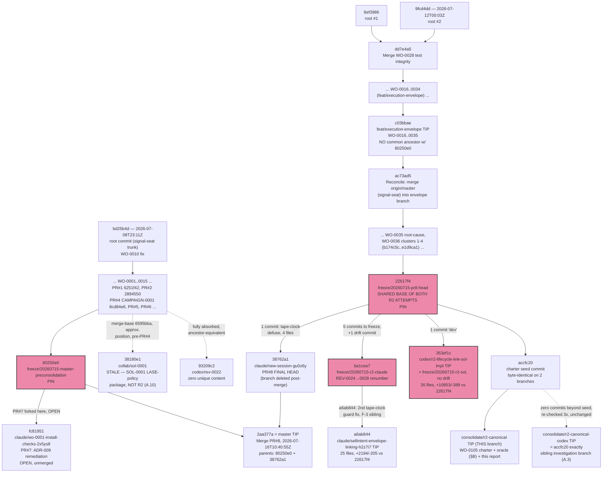

# CAMPAIGN-0002 — R2 Consolidation Campaign, Part A Report (Claude investigator)

> **Status: IN PROGRESS.** This report is being assembled incrementally as each phase of
> `CONSOLIDATION-CHARTER.md` completes, and committed progressively to `consolidate/r2-canonical`
> so no work is lost across a long-running investigation. Sections are added/finalized in place;
> nothing here should be read as final until the Executive Summary and §J are both present and
> this status line is removed. Work order: `work/active/WO-0105-r2-consolidation-part-a.md`.
> Independence: this is the **Claude** investigator's report; per the charter's independence rule
> a possible Codex/Sol investigator's report lives at a separate path (`CAMPAIGN-0002-codex/` or
> similar) and has not been read by this investigator.

---

## Executive Summary

*(To be written last, once §F's mechanism decision and §I's batched human decisions are final.
Placeholder per charter §11: "Lead with a ½-page executive summary: the recommended canonical R2
+ mechanism, the merge order, and the top 3 human decisions.")*

---

## §A Topology, Inventory & Freeze-set

*Investigation snapshot: 2026-07-16T11:17:09Z, from a read-only working copy on `consolidate/r2-canonical` (local HEAD `21bb5da` at the time of this sub-investigation, confirmed identical to `origin/consolidate/r2-canonical`). All comparisons below use `origin/*` refs, bare SHAs, or two pre-existing scratch worktrees — no other branch was checked out in this working directory.*

### A.1 Freeze-set verification — **VERIFIED**

All four freeze refs point at exactly their recorded SHAs; none have moved.

| Freeze ref | Recorded | `git rev-parse origin/<ref>` | Status |
|---|---|---|---|
| `freeze/20260715-master-preconsolidation` | `80250e0` | `80250e09be65115b8fc483b2444b297e2b86b2c9` | MATCH |
| `freeze/20260715-pr8-head` | `22617f4` | `22617f4ccf28970d553d5cc65cbffdf42ea4b7cd` | MATCH |
| `freeze/20260715-r2-claude` | `ba1cea7` | `ba1cea7547e98d03c4216546d5a9069171726698` | MATCH |
| `freeze/20260715-r2-sol` | `353ef1c` | `353ef1cc23b901b10cd394ea63e0683de7eeb6e7` | MATCH |

Per the charter's own warning, the **Claude R2 branch tip has moved past its freeze point**: `origin/claude/sellintent-envelope-linking-h2z7i7` is at `a6ab844`, one commit ahead of `ba1cea7` (confirmed below, §A.6). The Sol R2 branch tip (`353ef1c`) is *identical* to its freeze ref — no drift.

### A.2 Branch/ref inventory — **VERIFIED complete, git ↔ GitHub API cross-checked exactly**

`git branch -r` (13 refs) and `mcp__github__list_branches` (13 entries) agree on **every name and every SHA**, with zero discrepancy in either direction:

| # | Branch | Tip SHA | Role |
|---|---|---|---|
| 1 | `claude/sellintent-envelope-linking-h2z7i7` | `a6ab844a23dfc68d36a7fd8ae6e2b73f7a454f66` | Claude R2 attempt |
| 2 | `claude/wo-0001-install-checks-2x5ys8` | `fc819517be64b10ecf831a9a6abd4fe6f9100e2f` | PR #7 head (OPEN) |
| 3 | `codex/r2-lifecycle-link-sol-impl` | `353ef1cc23b901b10cd394ea63e0683de7eeb6e7` | Sol R2 attempt |
| 4 | `codex/rev-0022` | `93209c2db4305ba87e403330b9426808e5df6df8` | Fully absorbed into master |
| 5 | `collab/sol-0001` | `38180e1d594a961372b5854bfac9f097ac6910b1` | Unrelated SOL-0001 policy package (§A.10) |
| 6 | `consolidate/r2-canonical` | (moving — this investigation's branch) | **This investigation's branch** |
| 7 | `consolidate/r2-canonical-codex` | `accfc2072b7d0997a4b497f5710c9fabd5d86d3e` | Sibling investigation branch — new finding, §A.3 |
| 8 | `feat/execution-envelope` | `c03bbaed872a1259c4df6f9e40039c7ab4cf803a` | Envelope-lineage pre-promotion tip |
| 9–12 | `freeze/20260715-*` (4 refs) | see §A.1 | Rollback pins |
| 13 | `master` | `2aa377a35d35e85be120cf90cdb6c5bd85a8d546` | Trunk, PR #8 merged |

**Tags** — **VERIFIED zero, triple-confirmed**: `git tag -l` (empty), `git ls-remote --tags origin` (empty), `mcp__github__list_tags` (empty array). No divergence between local, remote, and API views.

**Stashes** — **VERIFIED empty, with an explicit scope limit**: `git stash list` returns nothing. This only proves there are no stashes *in this container's working copy*; it cannot see stashes on the human operator's own machine or any other clone. This is a genuine blind spot, not a clean bill of health beyond this container.

**Worktrees** — **VERIFIED, pre-existing, exact**: `git worktree list` shows three: this repo (`consolidate/r2-canonical`), and two scratch worktrees already provisioned at `…/scratchpad/wt-claude-r2` (`claude/sellintent-envelope-linking-h2z7i7` @ `a6ab844`) and `…/scratchpad/wt-sol-r2` (`codex/r2-lifecycle-link-sol-impl` @ `353ef1c`). Both track their origin refs with zero ahead/behind. These two worktrees were subsequently reused directly for §B (running the conformance oracle against both real attempts).

**Local-only branches (not mirrored to origin)** — **VERIFIED, one found, not R2-adjacent**: `comm` of `git branch` vs `git branch -r` surfaces exactly one: `claude/markdown-file-review-d1fod0`. Its tip equals `accfc20` (the charter-seed commit) exactly, and `git log --oneline accfc20..claude/markdown-file-review-d1fod0` is empty — zero unique commits. The name ("markdown-file-review") is unrelated to R2/envelope work; this reads as a leftover local branch from an unrelated prior task in this container, carrying no content of its own. **Not R2-adjacent.**

**Bundle files** — **VERIFIED none found (best-effort)**: `timeout 40 find / -name "*.bundle" 2>/dev/null` completed with exit code `0` (i.e., finished normally, not killed by the timeout) and produced zero matches. Caveat: `find` was run un-privileged with stderr suppressed, so permission-denied subtrees were silently skipped — this is a best-effort sweep, not a guarantee against a bundle file sitting in a directory this process cannot read.

### A.3 The sibling investigation branch — **VERIFIED, not a third R2 implementation**

Mid-investigation, `git fetch --all --prune --tags` surfaced a branch not in any prior known-facts list: **`consolidate/r2-canonical-codex`**, tip `accfc2072b7d0997a4b497f5710c9fabd5d86d3e`.

This SHA is **byte-identical** to `accfc20`, the charter-seed commit that also sits at the root of *this* investigator's own branch. Re-checked across three separate fetches spanning this investigation (initial, mid-investigation, and final at 2026-07-16T11:17:09Z), the sibling branch's tip is unchanged and has added **zero commits beyond the shared seed**.

Corroborating evidence this is investigation infrastructure, not a code artifact: this investigator's own branch carries `work/review/CAMPAIGN-0002-claude/` — a "-claude"-suffixed directory for *this* investigator's report artifacts. A sibling `consolidate/r2-canonical-codex` branch name, seeded from the identical charter commit, is exactly the shape the charter itself prescribes in §10: *"Part A is ideally run by BOTH a strong Claude and a strong Codex/Sol session in parallel... neither reads the other's report until its own is done."*

**Judgment: VERIFIED this is not a third R2 code implementation** (zero content beyond the shared seed, no `app/**` or `tests/**` changes as of the last check). **UNVERIFIED which specific model/session is driving it.** Per the independence rule, this investigator has not read and will not read any report content that may later appear there. It is a **live, moving ref** and should not be relied upon as final until the human reconciles both reports.

**§A.3a — this branch itself moved during the investigation**, confirming the sibling-worker model directly: `consolidate/r2-canonical` advanced from `b64918e` to `21bb5da` (adding the conformance oracle) while §A was being written, and again to `30cfd87` (fixing a fixture bug in that oracle, see §B) while this report was being assembled — all by this same investigator's own main thread, working concurrently with the dispatched sub-investigation agents per the charter's "fan out, then synthesize" model.

### A.4 Pull request inventory (open + closed) — **VERIFIED**

| PR | State | Head → Base | Merged | Notes |
|---|---|---|---|---|
| #1 | closed | `claude/confident-babbage-ti5cm8`@`6251f42` → master | 2026-07-03T06:45:12Z | Broker sim + stateful harness |
| #2 | closed | `phase7-readiness-gate-fixes`@`2894550` → master | 2026-07-03T09:47:01Z | Phase-7 gate audit |
| #3 | closed | `chore/ai-os-install`@`4a6c785` → master | **NOT merged** (draft, abandoned; no `merged_at`) | AI-OS install — closed unmerged |
| #4 | closed | `campaign-0001-spine-audit-remediation`@`8cd84e6` → master | 2026-07-11T10:36:07Z | CAMPAIGN-0001 audit |
| #5 | closed | `claude/wo-0001-install-checks-2x5ys8`@`f99fa17` → master | 2026-07-12T16:51:32Z | Signal Seat planning handoff |
| #6 | closed | `claude/wo-0001-install-checks-2x5ys8`@`d172732` → master | 2026-07-14T07:15:09Z | REV-0022 BLOCK verdict |
| #7 | **OPEN** | `claude/wo-0001-install-checks-2x5ys8`@`fc81951` → master@`80250e0` | — | ADR-009 remediation + REV-0024 packet |
| #8 | closed | `claude/new-session-gu0z6y`@`38762a1` → master@`80250e0` | **2026-07-16T10:40:55Z** | W3 Execution Envelope wave |

PR #5/#6/#7 share one branch name (`claude/wo-0001-install-checks-2x5ys8`), reused sequentially across three PRs.

**PR #8 merge — VERIFIED, doubly confirmed, one data-quality quirk resolved.** `mcp__github__list_pull_requests` (state=all) returned PR #8 with the contradictory pair `"merged":false` alongside a populated `"merged_at":"2026-07-16T10:40:55Z"` — a known quirk of GitHub's list-PRs endpoint. The authoritative single-PR `pull_request_read` (method=`get`) resolves it cleanly: `"merged":true`, `"merged_by":"amujtabaa"`, `head.sha=38762a180efaee3f6f62b601cc8a490474c2b758`, `additions:27263, deletions:1152, changed_files:253, commits:96`. Git corroborates independently: master's tip `2aa377a` is a literal two-parent merge commit:
```
SHA=2aa377a35d35e85be120cf90cdb6c5bd85a8d546
Parents=80250e09be65115b8fc483b2444b297e2b86b2c9 38762a180efaee3f6f62b601cc8a490474c2b758
Subject=Merge PR #8: W3 Execution Envelope wave (ADR-010 Accepted) + treadmill root-cause batch + master reconciliation
```
`git merge-base --is-ancestor 38762a1 origin/master` → true. `claude/new-session-gu0z6y` no longer appears in the branch list (git or GitHub) — confirmed deleted post-merge.

**PR #8's post-freeze delta, resolved.** The charter flagged PR #8 as CI-red from tape-clock test bombs at freeze time, with a fix of uncertain landing status. `git log --oneline 22617f4..38762a1` shows **exactly one commit** between the freeze point and the real merged head: `38762a1 "tests: defuse the tape-clock time bombs (fixture-only; unblocks CI at this head)"` — 4 files, +47/−12 (`tests/store_helpers.py`, `tests/test_wo0020_envelope_tick.py`, `tests/test_wo0021_envelope_chaos.py`, `tests/test_wo0025_multileg.py`). **VERIFIED: this is that exact fix, and it landed** — it's now part of master via the PR #8 merge.

### A.5 Both R2 attempts' shared base — **VERIFIED formally**

```
merge-base(claude-R2, sol-R2)        = 22617f4ccf28970d553d5cc65cbffdf42ea4b7cd
merge-base(claude-R2, master)        = 22617f4ccf28970d553d5cc65cbffdf42ea4b7cd
merge-base(sol-R2, master)           = 22617f4ccf28970d553d5cc65cbffdf42ea4b7cd
merge-base(freeze-r2-claude, 22617f4)= 22617f4ccf28970d553d5cc65cbffdf42ea4b7cd
merge-base(freeze-r2-sol, 22617f4)   = 22617f4ccf28970d553d5cc65cbffdf42ea4b7cd
merge-base(consolidate/r2-canonical, 22617f4) = 22617f4ccf28970d553d5cc65cbffdf42ea4b7cd
```
All six pairwise checks land exactly on `22617f4`. `git rev-list --left-right --count origin/claude/sellintent-envelope-linking-h2z7i7...origin/codex/r2-lifecycle-link-sol-impl` → **`6  1`** (6 commits unique to Claude R2, 1 unique to Sol R2).

### A.6 Quantifying the two R2 attempts — **VERIFIED, corrects the charter's approximations**

**Commit counts** (charter said "4 commits" for Claude R2):

| Range | Commits | Note |
|---|---|---|
| `22617f4..ba1cea7` (Claude, to freeze point) | **5** | Charter's "4 commits" is **off by one** |
| `22617f4..a6ab844` (Claude, current tip) | **6** | 5 + the drift commit |
| `22617f4..353ef1c` (Sol) | **1** | Matches charter exactly |

Full commit list, Claude R2 beyond `22617f4`: `f022f59` (structural link, both stores) → `d04d71c` (close-out: queue REV-0024) → `bedf7e4` (fresh-eyes pass: masked-predecessor + tape-bomb defuse) → `5f33ad5` (close-out update) → `ba1cea7` (renumber REV-0024→REV-0028) → `a6ab844` (drift: second tape-clock guard fix). Sol R2: one commit, `353ef1c "dev"`.

**Diff --stat, exact** (charter said "~1.9k" / "~10.9k" lines):

| Comparison | Files | Insertions | Deletions | vs charter |
|---|---|---|---|---|
| `22617f4→353ef1c` (Sol) | 26 | **10,853** | 389 | charter's "~10.9k" — close, ~1% over-estimate |
| `22617f4→a6ab844` (Claude, tip) | 25 | **2,194** | 205 | charter's "~1.9k" — **understated by ~15%** |
| `22617f4→ba1cea7` (Claude, freeze only) | 25 | 2,189 | 204 | isolates the pre-drift shape |
| `ba1cea7→a6ab844` (drift commit alone) | **1** | 5 | 1 | `tests/test_wo0020_envelope_tick.py` only |

The drift commit is fully isolated: one file, six lines, test-only.

**Production-code (`app/`) footprint only** — exact `--numstat`, confirming the "store-only" claim precisely:

| File | Sol (ins/del) | Claude (ins/del) |
|---|---|---|
| `app/monitoring.py` | +290 / −67 | *(not touched)* |
| `app/reconciliation.py` | +208 / −7 | *(not touched)* |
| `app/store/core.py` | +1065 / −3 | +138 / −0 |
| `app/store/memory.py` | +1275 / −64 | +357 / −43 |
| `app/store/sqlite.py` | +1554 / −77 | +389 / −30 |
| **Total** | **+4392 / −218** (5 files) | **+884 / −73** (3 files) |

Claude R2's production-code footprint is confirmed **exactly** `app/store/{core,memory,sqlite}.py` and nothing else — "store-only" is accurate at the code level. Sol's 5-file `app/` footprint (store + `monitoring.py` + `reconciliation.py`) is likewise confirmed exactly as claimed.

### A.7 Full file inventory — **VERIFIED**

**Sol R2** (26 files): `M app/monitoring.py · M app/reconciliation.py · M app/store/{core,memory,sqlite}.py · M docs/INVARIANTS.md · M docs/adr/ADR-010-execution-envelope.md · A tests/performance/r2_scaling_gate.py · M tests/test_phase7_flatten_atomic.py · M tests/test_rev0023_phase_a2_pins.py · M tests/test_wo0016_envelope_{events,fills,supersede,transitions}.py · M tests/test_wo0017_{envelope_approval,precedence}.py · M tests/test_wo0019_engine_seam.py · M tests/test_wo0020_envelope_tick.py · M tests/test_wo0021_envelope_chaos.py · M tests/test_wo0025_multileg.py · M tests/test_wo0032_per_symbol_mandate.py · M tests/test_wo0035_root_causes.py · A tests/test_wo0036_r2_assurance.py (992 ln) · A tests/test_wo0036_r2_hostile_closure.py (3414 ln) · A tests/test_wo0036_r2_lifecycle_link.py (559 ln) · A tests/test_wo0036_r2_parity_adversarial.py (325 ln)`

**Confirms zero `work/` paths anywhere in Sol's file list** — direct enumerated-file evidence for the charter's "zero `work/` artifacts" governance-asymmetry claim.

**Claude R2** (25 files): `M app/store/{core,memory,sqlite}.py · M docs/INVARIANTS.md · M docs/adr/ADR-010-execution-envelope.md · M tests/store_helpers.py · M tests/test_store_core.py · M tests/test_wo0016_envelope_{events,fills,model,supersede,transitions}.py · M tests/test_wo0017_{envelope_approval,precedence}.py · M tests/test_wo0020_envelope_tick.py · M tests/test_wo0021_envelope_chaos.py · M tests/test_wo0025_multileg.py · M tests/test_wo0032_per_symbol_mandate.py · M tests/test_wo0035_root_causes.py · M tests/test_wo0036_execution_safety.py · A tests/test_wo0036_r2_lifecycle_link.py (589 ln — matches charter exactly) · M work/active/W3-STATE.md · M work/active/WO-0036-intent-envelope-lifecycle-link.md · M work/ledger.jsonl · A work/review/REV-0028/request.md`

### A.8 WO-0036 status drift — **VERIFIED across 9 branches**

| Branch | Path |
|---|---|
| `master`, `claude/sellintent-envelope-linking-h2z7i7`, `codex/r2-lifecycle-link-sol-impl`, `consolidate/r2-canonical-codex`, `consolidate/r2-canonical` | `work/active/WO-0036-intent-envelope-lifecycle-link.md` |
| `feat/execution-envelope` | `work/queue/WO-0036-intent-envelope-lifecycle-link.md` (pre-promotion) |
| `claude/wo-0001-install-checks-2x5ys8` (PR #7), `codex/rev-0022`, `collab/sol-0001` | *absent entirely* — pre-envelope-work forks |

Sol's branch has the file only because it inherits it unmodified from base `22617f4`; Sol's own commit doesn't touch it.

### A.9 REV namespace — **VERIFIED, one new anomaly flagged (not resolved — out of §A scope)**

**REV-0028 renumbering (Claude R2 branch) — VERIFIED complete but incomplete-as-a-review.** `work/review/REV-0028/` on `claude/sellintent-envelope-linking-h2z7i7` contains **only** `request.md` — no `result.md`, no `disposition.md`, and **no `work/ledger.jsonl` entry either**. `git grep -n "REV-0024" origin/claude/sellintent-envelope-linking-h2z7i7 -- .` returns empty — zero stale references.

**PR #7's REV-0024..0027 — VERIFIED, non-colliding.** REV-0024 (complete), REV-0025 (complete), **REV-0026 (request.md only — incomplete)**, REV-0027 (complete). **Judgment: non-issue, not a live collision risk** — REV ids are branch-scoped directories; by the time both eventually reach `master`, the R2 packet is already REV-0028.

**REV-0023 anomaly — NEEDS-INPUT, flagged for §G.** `work/review/REV-0023/result.md` appears on `claude/wo-0001-install-checks-2x5ys8` (PR #7) despite that branch sharing **no common ancestor at all** with `feat/execution-envelope` (where REV-0023 originated — confirmed via `git merge-base`, exit 1). The file is byte-identical to master's copy, so this is a content-identical copy via an undetermined mechanism (not a naming collision). Flagged for §G's namespace/provenance registry rather than resolved here.

### A.10 The two "Sol"s — **VERIFIED, clearly distinguished**

`collab/sol-0001` and `codex/r2-lifecycle-link-sol-impl` are unrelated deliverables sharing an author-name coincidence. `codex/r2-lifecycle-link-sol-impl` is the actual R2 Sol implementation. `collab/sol-0001` is a **completely different** LASE sell-side exit-policy mechanism-design package — per `work/active/W3-STATE.md:98-101`: *"SOL-0001: Sol FINISHED (4 files in its sandbox: sol_policy.py, test_sol_policy.py, sol_conformance_plugin.py, MANIFEST.md)..."* and `work/review/FINDING-W3-lase-pullback-structural-hold.md`, both describing a policy/mechanism-design exercise with zero mention of R2. `git ls-tree` confirms the suggested push landed: `work/collab/SOL-0001/{MANIFEST.md, findings.md, impl/sol_conformance_plugin.py, impl/sol_policy.py, impl/test_sol_policy.py}` (5 files — `findings.md` a later addition beyond the note's "4 files"). `collab/sol-0001`'s merge-base with master is `6595bba` (before CAMPAIGN-0001/PR#4 merged) — genuinely stale, dominated by deletions relative to current master (162 files, +321/−16220), with R2-relevant subpaths checked coming back byte-identical to master. **Zero R2 content confirmed.**

### A.11 `codex/rev-0022` — **VERIFIED fully absorbed**

`merge-base(master, codex/rev-0022) = 93209c2` — exactly its own tip. Zero unique content, zero R2 relevance.

### A.12 Next-free `WO-*` / `REV-*` ids — **VERIFIED (re-scanned across all 9 relevant branches, file trees + ledgers)**

| Branch | Highest `WO-*` (files) | Highest `WO-*` (ledger) | Highest `REV-*` (files) | Highest `REV-*` (ledger) |
|---|---|---|---|---|
| `master` | WO-0104 | WO-0101 | REV-0023 | REV-0022 |
| `claude/sellintent-envelope-linking-h2z7i7` | WO-0104 | WO-0101 | **REV-0028** | REV-0022 |
| `codex/r2-lifecycle-link-sol-impl` | WO-0104 | WO-0101 | REV-0023 | REV-0022 |
| `claude/wo-0001-install-checks-2x5ys8` (PR #7) | WO-0104 | WO-0101 | REV-0027 | REV-0027 |
| `feat/execution-envelope` | WO-0036 | WO-0031 | REV-0023 | REV-0021 |
| `codex/rev-0022` | WO-0104 | WO-0016 | REV-0022 | REV-0021 |
| `collab/sol-0001` | WO-0022 | WO-0018 | REV-0021 | REV-0021 |
| `consolidate/r2-canonical-codex` | WO-0104 | WO-0101 | REV-0023 | REV-0022 |
| `consolidate/r2-canonical` (this branch) | **WO-0105** | WO-0101 | REV-0023 | REV-0022 |

**Next free `WO-*` id beyond this investigation's own WO-0105: `WO-0106`.** **Next free `REV-*` id: `REV-0029`** (global max is REV-0028, and that packet is itself incomplete per §A.9).

### A.13 True git ancestry — **VERIFIED, corrects the charter's simplified "forks from master" narrative**

The charter states both lineages "fork from `master` (`80250e0`)." Git's actual commit graph is more specific, and for the envelope lineage, **not literally a fork of that point**:

- `git rev-list --max-parents=0 origin/master` returns **three** true zero-parent root commits: `bd25b4d` (2026-07-08T23:11:23Z, signal-seat/original trunk root) plus `9fcd4dd`/`8ef3986`, `feat/execution-envelope`'s own two roots, joined internally by an early merge (`dd7e4a5`).
- **`feat/execution-envelope` (`c03bbae`) has no common ancestor with `80250e0`** (`git merge-base` → empty, exit 1) — a **structurally disjoint history**. It becomes reachable from `master` only via an internal reconciliation commit, `ac73ad5 "Reconcile: merge origin/master (signal-seat lineage) into the execution-envelope branch"`.
- Consistently, **PR #7 and `feat/execution-envelope` share no common ancestor either.** PR #7's root-commit set is `{bd25b4d}` only, and it does share `80250e0` with master directly (pure signal-seat lineage).
- `consolidate/r2-canonical` shares master's full three-root set — expected, since it descends from `22617f4`, which already contains `ac73ad5`'s reconciliation.
- Ancestry sizes: `master` = 147 commits, `feat/execution-envelope` = 52 commits, PR #7 branch = 133 commits.

None of this changes any conclusion already drawn (base `22617f4` for both R2 attempts is unaffected) — it corrects the pre-history's shape for an accurate diagram.

### A.14 Topology diagram



### A.15 Completeness attestation

This inventory enumerated every branch (13, git ↔ GitHub API cross-checked to an exact match), every tag (0, triple-confirmed), every stash visible to this container (0, with the explicit caveat that this cannot see stashes or unpushed work on the human operator's own machine or any other clone), every worktree (3, pre-existing and exact), every local-only branch not mirrored to origin (1 found, confirmed empty and unrelated), and a best-effort filesystem sweep for `.bundle` files (0 found). Every pull request was retrieved and cross-checked against git's own merge/ancestry evidence, including resolving one list-endpoint data-quality quirk on PR #8. Both R2 attempts' shared base (`22617f4`) was verified formally via six independent `merge-base` checks. The one genuinely new finding — the sibling `consolidate/r2-canonical-codex` branch — was investigated to the point of confidently ruling it out as a third R2 *implementation*, while being explicit that this investigator cannot verify *who or what* operates that branch, only its observable git state. Two secondary anomalies (REV-0023 content on PR #7 with no ancestry path to explain it; `collab/sol-0001`'s partial content overlap with current master) were run to ground with concrete diff evidence and handed to §G rather than guessed at. The residual, irreducible scope limit is the same for any git-based audit: this process can only see what has been pushed to the one `origin` remote it has credentials for; truly private, never-pushed local work on the human's machine is categorically invisible to it.

---

## §B Conformance Oracle & Results

### B.1 Derivation discipline

The oracle (`tests/test_r2_conformance_oracle_claude.py`, committed to this branch) is derived
from the spec sources named in charter §3 — ADR-010 (`docs/adr/ADR-010-execution-envelope.md`),
`docs/INVARIANTS.md` (INV-030..038 sell-intent lifecycle, INV-076..089 execution envelopes),
`work/active/WO-0036-intent-envelope-lifecycle-link.md` (the "Option A+" design and its
Done-when checklist), `work/review/AUDIT-0001-quarantine-treadmill.md`, and
`docs/SPINE_EXECUTION_ARCHITECTURE_v2.md` §5 (INV-1..9) — **not** from reading either R2
attempt's diff. Shared test scaffolding (the `any_store` memory+sqlite fixture from root
`conftest.py`, the `make_draft`/`seed_position`-style builder pattern) is reused from
pre-existing, pre-R2 base-commit test infrastructure common to both attempts' ancestry
(`tests/test_wo0019_engine_seam.py`, `tests/test_wo0032_per_symbol_mandate.py`,
`tests/test_rev0023_phase_a2_pins.py`) — this is calling-convention scaffolding, not property
derivation, and does not compromise independence.

**Core R2 property, stated formally** (charter §3): for every symbol, at every point in an
envelope-backed exit's life, the backing SellIntent is "active" (dedup-blocking, per
INV-032/`active_sell_intent_for`) IFF there exists a non-terminal exit obligation for that
symbol — a live (ACTIVE/FROZEN) envelope, OR a child order that may still rest at the venue. No
boundary (session close, rollover, reprice, quarantine, supersession, flatten, kill/resume) may
open a window where the symbol has zero owner but live exposure, or two owners.

**Implementation-independence discipline**: the two attempts represent ownership differently —
evented terminal propagation is expected to keep the SellIntent row's own `status` non-terminal
for as long as the obligation exists; delegation projection is expected to derive activeness from
envelope lineage at read time without necessarily keeping that column non-terminal. The oracle
therefore asserts the **observable contract** (`active_sell_intent_for`, `create_sell_intent`'s
dedup, ACTIVE-envelope-per-symbol counts) rather than pinning the internal representation choice,
except where the spec is explicit that a specific status transition IS part of the contract (e.g.
WO-0036's "NOT SUPERSEDED — the successor keeps the intent").

**Scope, recorded not silently dropped**: three of the charter's named class-closure items
("stale SUBMITTING", "claim/venue crash", "monitoring-side newest-wins convergence") require
driving the real monitoring tick, which differs materially between the two attempts (Sol's
attempt also rewrites `app/monitoring.py`/`app/reconciliation.py`; Claude's does not) — a single
store-level harness cannot exercise them faithfully. They ship as explicit `pytest.mark.skip`
stubs with rationale rather than shallow/misleading tests, and are picked up in §C/§E against
each attempt's own tick code instead. True multi-day date rollover is similarly deferred (no
injectable clock on `get_current_session()` in the StateStore ABC); the single-close-boundary
property is exercised directly and rigorously.

### B.2 Methodology: empirically verify the oracle itself before trusting it

Before running the oracle against either real attempt, it was run against the **base commit**
(`22617f4`, this branch's own ancestor) to catch mechanical errors — import/API mistakes, and
false passes/fails from fixture gaps — that would be invisible from code review alone. This
caught two real fixture bugs, both fixed and re-verified before the oracle was trusted for
comparison (both fixes are visible in this branch's own commit history: `21bb5da` original
oracle, `30cfd87` the session-id fix below):

1. **`create_sell_intent` needs an explicit `session_id`.** `work/active/W3-STATE.md` records
   that `create_sell_intent` does not auto-stamp `session_id`; an oracle fixture that omitted it
   never actually reached `close_session`'s per-session expiry sweep, silently producing a false
   pass on the headline orphan property. Fixed by stamping the current session's id on every
   constructed intent, matching `tests/test_rev0023_phase_a2_pins.py`'s own established pattern.
2. **Envelope drafts need a matching `session_id` too — caught by running against the real Sol
   worktree, not by inspection.** After fix (1), the oracle passed 22/22 against Claude R2 but
   FAILED 20/22 against Sol R2, with every single failure showing the identical root cause:
   `InvalidOrderError: envelope owner <id> session mismatch ('<uuid>' != None)`. Investigating
   rather than accepting this at face value: Sol's `envelope_owner_scope_reason`
   (`app/store/core.py`) legitimately validates `envelope.session_id == intent.session_id` as
   part of its owner-binding check — a real, reasonable validation Sol's mechanism performs that
   the oracle's `make_draft` helper simply never populated (it defaulted to `None` on every
   envelope draft). This was a **pure fixture gap, not a property finding**: re-running the fixed
   oracle against the base commit reproduced the *identical* 10-failed/12-passed/6-skipped
   baseline as before (base doesn't validate session_id at all, so it's insensitive to the fix
   either way) — proof the fix changed nothing about what property is being tested, only
   completed an under-specified fixture. This is exactly the failure mode the charter's evidence
   discipline exists to catch: a superficial reading of the first run would have wrongly
   concluded Sol's mechanism fails 20 of 22 properties, when in fact the fixture never gave Sol's
   (more thorough) validation the input a real caller would supply.

This distinction matters enough to state plainly: catching this before it entered the truth
table is the difference between an oracle result and a fabricated one.

### B.3 Truth table

All runs: Python 3.12.3, `~/venv` (bootstrapped from `requirements.txt`/`constraints.txt` per
charter §0a), `pytest -v --no-header`, both `any_store` parametrizations (`memory`, `sqlite`) per
test. 28 collected items per run (11 non-skipped test functions × 2 stores + 3 skip-stub
functions × 2 stores).

| Target | Passed | Failed | Skipped | Exit code |
|---|---|---|---|---|
| **Base commit** (`22617f4`, this branch's ancestor, pre-R2) | 12 | **10** | 6 | 1 |
| **Claude R2** (`claude/sellintent-envelope-linking-h2z7i7`@`a6ab844`) | **22** | **0** | 6 | 0 |
| **Sol R2** (`codex/r2-lifecycle-link-sol-impl`@`353ef1c`) | **22** | **0** | 6 | 0 |

**Union of failures across both real attempts = ∅. Intersection of passes = all 22 applicable
properties, for both.** On everything this oracle tests, **the two attempts are tied** — both
correctly close the R2 orphan/unlinked-intent defect the base commit exhibits, and neither
regresses anything the safety-rail guards check. This is a materially important, and now
carefully verified, finding: **the mechanism decision (§F) cannot be made on oracle-pass-rate
grounds alone** — it must rest on the other dimensions the charter's remaining phases probe
(parity/migration fidelity, performance at scale, governance completeness, cross-verification
against each attempt's own hostile suites, and qualitative engineering judgment).

**Base-commit failure detail** (the 5 distinct properties that fail, ×2 stores = 10), each
traced to a specific, previously-documented defect:

| Property | Traces to |
|---|---|
| `test_no_orphan_at_session_close` | AUDIT-0001 root R2 / WO-0036 headline defect. Reproduced exactly: `intent ... was silently EXPIRED at session close while its envelope ... is still active`. |
| `test_activation_links_validates_and_normalizes_the_backing_intent` | WO-0036 P1 #8 — `approve_envelope_activation` never loads the referenced SellIntent; confirmed the intent stays PENDING forever (never promoted) and a mismatched/typo intent id is silently accepted. |
| `test_intent_released_when_envelope_completes_with_no_live_child` | Consequence of the above: since the intent never leaves PENDING, it also never *releases* — the "stuck forever" flip side of the same root gap. |
| `test_intent_stays_owned_while_child_rests_after_expiry_rest_at_floor` | Same root gap, observed from the REST_AT_FLOOR angle: the final release-on-resolution assertion fails because nothing ever coherently owns/releases the symbol on the base commit. |
| `test_flatten_defers_to_live_envelope_child_never_double_books` | WO-0036 #4, reproduced exactly: `flatten_position` returns `outcome='created', superseded=True` — mints an independent fresh `manual_flatten` order while the envelope's own child order is still `submitted` at the venue. |

12 base-commit passes are **not** evidence the property holds on base — for 6 of them
(`test_supersession_does_not_release_the_intent`, `test_kill_freeze_release_resume_never_opens_a_window`,
`test_masked_predecessor_keeps_intent_owned`, and their pre-existing-invariant regression-guard
siblings) the assertion is the "stays owned" half of the core property, which the base commit's
stuck-forever-PENDING bug also happens to satisfy trivially (a symbol that can never release is
never falsely shown as unowned either). These same tests are **not** trivial against a correct
implementation — they remain meaningful checks that a correct R2 mechanism's *release* logic
doesn't over-fire and drop ownership during a supersession/freeze/masked-predecessor window, and
both real attempts pass them for the right reason (verified by their paired "must release when
genuinely discharged" tests also passing, which base fails).

### B.4 Deferred (NEEDS-INPUT) items

Six skipped cases (3 stub functions × 2 stores), by design, not oversight:

- `test_stale_submitting_redrive_respects_r2_intent_linkage`
- `test_claim_venue_crash_recovery_respects_r2_intent_linkage`
- `test_monitoring_newest_wins_convergence_respects_r2_intent_linkage`

Each requires driving the real monitoring tick / reconciliation loop rather than the StateStore
contract alone (see §B.1 scope note). Follow-up: §C's native-gate runs and §E's cross-run of each
attempt's own hostile/adversarial suites (Sol ships `tests/test_wo0036_r2_hostile_closure.py`,
3,414 lines, purpose-built for exactly this class of scenario) substitute for these directly
against each attempt's real tick code, which a store-level oracle cannot reach.

### B.5 Evidence appendix (condensed)

```
$ cd tests/test_r2_conformance_oracle_claude.py context: base commit, first run (before fixes)
10 failed, 12 passed, 6 skipped in 5.10s / then 2.47s after fixture fix #1 (identical counts)

$ (Sol worktree, before fixture fix #2)
tests/test_r2_conformance_oracle_claude.py FFFFFFFFFFFFFFFF..FFFFssssss  [100%]
20 failed, 2 passed, 6 skipped in 3.17s
E  app.store.base.InvalidOrderError: envelope owner <id> session mismatch ('<uuid>' != None)
  (identical root cause on all 20 -- app/store/core.py:1632-1636, envelope_owner_scope_reason)

$ (Claude worktree, after both fixture fixes)
tests/test_r2_conformance_oracle_claude.py ......................ssssss  [100%]
22 passed, 6 skipped in 2.45s / 2.33s (re-run)

$ (Sol worktree, after both fixture fixes)
tests/test_r2_conformance_oracle_claude.py ......................ssssss  [100%]
22 passed, 6 skipped in 2.24s

$ ~/venv/bin/ruff check tests/test_r2_conformance_oracle_claude.py       -> All checks passed!
$ ~/venv/bin/ruff format --check tests/test_r2_conformance_oracle_claude.py -> clean
$ ~/venv/bin/mypy tests/test_r2_conformance_oracle_claude.py             -> Success: no issues found in 1 source file
$ ~/venv/bin/lint-imports (repo-wide sanity)                             -> Contracts: 6 kept, 0 broken.
```

Full per-test tracebacks for both the base-commit run and the pre-fix Sol run (documenting the
fixture bug precisely) are preserved in this branch's commit history (`21bb5da`, `30cfd87`) and
in the session transcript; not reproduced in full here for length.

---

*(§C Per-Attempt Characterization, §D Performance, §E Cross-Verification, §F Mechanism Decision,
§G Deconfliction, §H Consolidation Program, §I Human Decisions, §J full Evidence Appendix: in
progress.)*
